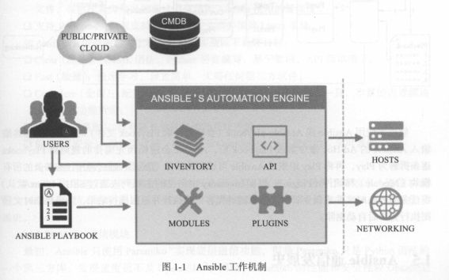
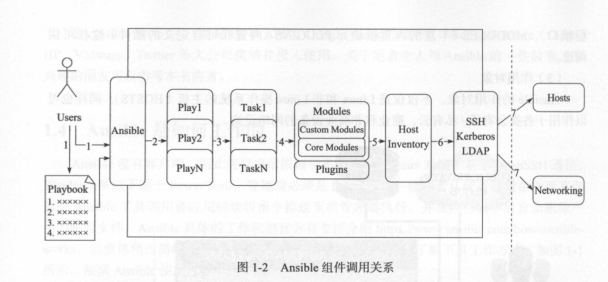
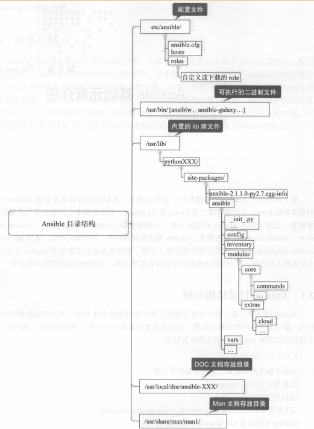

## 序言

- Ansible官方地址： https://docs.ansible.com/

## 简介

### Ansible是如何工作的

Ansible没有客户端，因此底层通信依赖于系统软件，Linux系统下基于OpenSSH通信，Windows系统下基于PowerShell，管理端必须是Linux系统，使用者认证通过之后在管理节点通过Ansible工具调用各应用模块将指令推送至被管理端执行，并在执行完毕后自动删除产生的临时文件。根据Ansible使用过程中的不同角色，我们将其分为：

- 使用者
- Ansible工具集
- 作用对象

1）使用者

​	如图1-1中Ansible工作机制所示，Ansible使用者来源于多种维度，图中为我们展示了4种方式：



第一种方式：CMDB（Configuration Management Database，配置管理数据库），CMDB存储和管理着企业IT架构中的各项配置信息，是构建ITIL项目的核心工具，运维人员可以组合CMDB和Ansible，通过CMDB直接下发指令调用Ansible工具完成操作者所希望达成的目标；

第二种方式：PUBLIC/PRIVATE方式，Ansible除了丰富的内置模块外，同时提供丰富的API语言接口，如PHP、Python、PERL等多种当下流行语言，基于PUBLIC（公有云）/PRIVATE（私有云），Ansible一API调用的方式运行；

第三种方式：USERS直接使用Ad-Hoc临时命令调用Ansible工具集来完成任务执行；

第四种方式：USERS预先编写好的ANSIBLE PLAYBOOKS，通过执行Playbooks中预先编排好的任务集按序完成任务执行。

2）Ansible工具集

ansible命令时Ansible的核心工具，ansible命令并非自身完成所有的功能集，其只是Ansible执行任务的调用入口，大家可以理解为“总指挥”，所有命令的执行通过其“调兵遣将”最终完成。ansible命令共有哪些兵将可供使唤呢？图片中间框有INVENTORY（命令执行的目标对象配置文件）、API（供第三方程序调用的应用程序编程接口）、MODULES（丰富的内置模块）、PLUGINS（内置和可自定义的插件）这些可供调遣。

3）作用对象

Ansible的作用对象，不仅仅是Linux和非Linux操作系统的主机（HOSTS），同样也可以作用于各类公有云/私有云,商业和非商业设备的网络设施。

​	同样，如果我们按Ansible工具集的组成来讲，由图1-1可以看出Ansible主要由6部分组成。

- ANSIBLE PLAYBOOKS：任务剧本（任务集），编排定义Ansible任务集的配置文件，由Ansible顺序依次执行，通常是JSON格式的YML文件；
- INVENTORY：Ansible管理主机的清单；
- MODULES：Ansible执行命令的功能模块，多数为内置的核心模块，也可自定义；
- PLUGINS：模块功能的补充，如连接类型插件、循环插件、变量插件、过滤插件等，该功能不常用；
- API：供第三方程序调用的应用程序编程接口；
- ANSIBLE：该部分图中表示的不明显，组合INVENTORY、API、MODULES、PLUGINS的中间部分大家可以理解为是Ansible命令工具，其为核心执行工具；

Ansible执行任务这些组件相互调用关系如图1-2所示：



使用者使用Ansible或Ansible-playbook（会额外读取Playbook文件）时，在服务器终端输入Ansible的Ad-Hoc命令集或Playbook后，Ansible会遵循预先编排的规则将Playbooks逐条拆解为Play，再将Play组织成Ansible可识别的任务（Task），随后调用任务涉及的所有模块（Module）和插件（Plugin），根据Inventory中定义的主机列表通过SSH（Linux默认）将任务集以临时文件或命令的形式传输到远程客户端执行并返回执行结果，如果是临时文件则执行完毕后自动删除。

### Ansible目录文件介绍

```
# rpm -ql ansible
```

该命令输出内容较多，大致分为如下几类：

- 配置文件目录/etc/ansible/
- 执行文件目录/usr/bin/
- Lib库依赖目录/usr/lib/pythonX.X/site-packages/ansible/
- Help文档目录/usr/share/doc/ansible-X.X.X
- Man文档目录/usr/share/man/man1/
  整体目录结构可参照下图



其中，如下目录运维常要配置，需熟练掌握。

1）配置文件目录/etc/ansible/，主要功能为：Inventory主机信息配置、Ansible工具功能配置等。所有Ansible的配置均存放在该目录下，运维日常的所有配置类操作也均基于此目录进行。

2）执行文件目录/usr/bin，主要功能为：Ansible系列命令默认存放目录。Ansible所有的可执行文件均 存放在该目录下。

### Ansible配置文件解析

Inventory用于定义Ansible的主机列表配置，Ansible的自身配置文件只有一个，即ansible.cfg，Ansible安装好后它默认存放于/etc/ansible/目录下。ansible.cfg配置文件可以存在于多个地方，Ansible读取配置文件的顺序依次是当前命令执行目录--》用户家目录下的.ansible.cfg--》/etc/ansible.cfg，先找到哪个就用哪个的配置。其ansile.cfg配置的所有内容均可通过参数的形式传递或定义在Playbooks中。

大多数为注释行默认配置项。该文件遵循INI格式，分为如下几类配置。

## 常用模块

ansible 默认提供了很多模块来供我们使用。在 Linux 中，我们可以通过 ansible-doc -l 命令查看到当前 ansible 都支持哪些模块，通过 ansible-doc -s 模块名 又可以查看该模块有哪些参数可以使用。 
官网文档：<http://docs.ansible.com/ansible/latest/list_of_all_modules.html>

### ping模块

检查指定节点机器是否还能连通，用法很简单，不涉及参数，主机如果在线，则回复pong 

```
# ansible erp -m ping
192.168.10.6 | SUCCESS => {
    "changed": false, 
    "ping": "pong"
}
192.168.10.7 | SUCCESS => {
    "changed": false, 
    "ping": "pong"
}
```

### raw模块

与shell模块功能相同,推荐优先使用raw模块

```
# ansible 10.1.1.113 -m raw -a 'hostname|tee'
```

### yum模块

这个模块是RedHat / CentOS作为远端节点的OS的时候，用的最多的。Yum是啥就不多说了，RedHat / CentOS包管理工具 

使用`yum’软件包管理器管理软件包，其选项有： 
– config_file：yum的配置文件 （optional） 
– disable_gpg_check：关闭gpg_check （optional） 
– disablerepo：不启用某个源 （optional） 
– enablerepo：启用某个源（optional） 
– name：要进行操作的软件包的名字，默认最新的程序包，指明要安装的程序包，可以带上版本号，也可以传递一个url或者一个本地的rpm包的路径 
– state：状态（present，absent，latest），表示是安装还卸载 
   present:默认的，表示为安装 
   lastest: 安装为最新的版本 
   absent：表示删除 

```
# ansible test -m yum -a ‘name=httpd state=latest’ 
# ansible test -m yum -a ‘name=”@Development tools” state=present’ 
# ansible test -m yum -a ‘name=http://nginx.org/packages/centos/6/noarch/RPMS/nginx-release-centos-6-0.el6.ngx.noarch.rpm state=present’
```

### synchronize模块

– 使用rsync同步文件，将主控方目录推送到指定节点的目录下，其参数如下： 
– delete： 删除不存在的文件，delete=yes 使两边的内容一样（即以推送方为主），默认no 
– src： 要同步到目的地的源主机上的路径; 路径可以是绝对的或相对的。如果路径使用”/”来结尾，则只复制目录里的内容，如果没有使用”/”来结尾，则包含目录在内的整个内容全部复制 
– dest：目的地主机上将与源同步的路径; 路径可以是绝对的或相对的。 
– dest_port：默认目录主机上的端口 ，默认是22，走的ssh协议。 
– mode: push或pull，默认push，一般用于从本机向远程主机上传文件，pull 模式用于从远程主机上取文件。 
– rsync_opts：通过传递数组来指定其他rsync选项。

将主控方/root/a目录推送到指定节点的/tmp目录下

```
# ansible 10.1.1.113 -m synchronize -a 'src=/root/a dest=/tmp/ compress=yes'
```

copy模块

在远程主机执行复制操作文件。 src:指定源文件路径，可以是相对路径，也可以是绝对路径，可以是目录(并非是必须的，可以使用content，直接生成文件内容)

​    dest=:指定目标文件路径，只能是绝对路径，如果src是目录，此项必须是目录

​    owner:指定属主

​    group:指定属组

​    mode:指定权限,可以以数字指定比如0644

​    content:代替src，直接往dest文件中写内容，可以引用变量，也可以直接使用inventory中的主机变量

​    backup:在覆盖之前将原文件备份，备份文件包含时间信息。有两个选项：yes|no

​    force:

​        yes:默认项，如果目标主机包含该文件，但内容不同，则强制覆盖

​        no:则只有当目标主机的目标位置不存在该文件时，才复制

​    directory_mode：递归的设定目录的权限，默认为系统默认权限

复制本地文件到远程主机并对原文件进行备份

```
# ansible erp -m copy -a 'src=/tmp/abc.txt dest=/tmp/ backup=yes'
```

向远程主机的文件中写内容，会把原内容覆盖掉

```
# ansible erp -m copy -a 'content="\nMy age is 26" dest=/tmp/abc.txt'
```

### user模块

name:指定用户名

​    password:设定用户密码，password参数需要接受md5加密后的值

​    state:用户状态，默认为present

​        present:表示添加用户

​        absent:表示删除用户

​    update_password:修改用户密码

​        always:新密码和旧密码不同时进行修改

​        on_create:为新创建的用户指定密码

​    createhome:创建家目录

​        yes:默认项，即创建用户默认是有家目录的

​        no:创建用户时不创建家目录

​    remove:

​        yes:删除用户家目录，需要指定此参数

​        no:默认项，删除用户时默认不删除用户的家目录

​    system:

​        yes:默认创建为普通用户，而非系统用户

​    如果不指定默认生成的选项有：

​        home:创建家目录

​        shell:创建默认的shell为/bin/bash

​        system:默认创建为普通用户，而非系统用户，指定是用yes

增加一个用户

```
# ansible erp -m user -a 'name=liuwei1 system=yes password=$1$Q0WiDLXN$agpzPdHVa6.LbdMLsUXqI/ state=present'
```

更新用户密码

```
# ansible erp -m user -a 'name=liuwei1 update_password=always password=$1$pfBO1D1D$UfxpHN4OlUbT8dWLe8te7.'
```

service模块

用于管理服务，记得针对Centos7就不要使用这个模块了。 
– arguments：给命令行提供一些选项 
– enabled：是否开机启动 yes|no, 要求状态（state）和启用（enabled）中至少有一个。 
– name：必选项，服务名称 
– runlevel：运行级别 
– sleep：如果执行了restarted，在则stop和start之间沉睡几秒钟 
– state：对当前服务执行启动，停止、重启、重新加载等操作（started,stopped,restarted,reloaded）

```
# ansible erp -m service -a 'enabled=on name=httpd state=started'
```

### get_url模块

该模块主要用于从http、ftp、https服务器上下载文件（类似于wget），主要有如下选项： 
– sha256sum：下载完成后进行sha256 check； 
– timeout：下载超时时间，默认10s 
– url：下载的URL 
– url_password、url_username：主要用于需要用户名密码进行验证的情况 
– dest：将文件下载到哪里的绝对路径。如果dest是目录，则使用服务器提供的文件名，或者如果没有提供，将使用远程服务器上的URL的基本名称。 
– headers：以格式“key：value，key：value”为请求添加自定义HTTP标头。

```
# ansible 10.1.1.113 -m get_url -a 'url=http://10.1.1.116/favicon.ico dest=/tmp'
```

file模块

file模块主要用于远程主机上的文件操作，file模块包含如下选项： 
– force：需要在两种情况下强制创建软链接，一种是源文件不存在但之后会建立的情况下；另一种是目标软链接已存在,需要先取消之前的软链，然后创建新的软链，有两个选项：yes|no 
– group：定义文件/目录的属组 
– mode：定义文件/目录的权限 
– owner：定义文件/目录的属主 
– path：必选项，定义文件/目录的路径 
– recurse：递归的设置文件的属性，只对目录有效 
– src：要被链接的源文件的路径，只应用于state=link的情况 
– dest：被链接到的路径，只应用于state=link的情况 
– state： 
   directory：如果目录不存在，创建目录 
   file：即使文件不存在，也不会被创建 
   link：创建软链接 
   hard：创建硬链接 
   touch：如果文件不存在，则会创建一个新的文件，如果文件或目录已存在，则更新其最后修改时间 
   absent：删除目录、文件或者取消链接文件file模块主要用于远程主机上的文件操作，file模块包含如下选项： 
– force：需要在两种情况下强制创建软链接，一种是源文件不存在但之后会建立的情况下；另一种是目标软链接已存在,需要先取消之前的软链，然后创建新的软链，有两个选项：yes|no 
– group：定义文件/目录的属组 
– mode：定义文件/目录的权限 
– owner：定义文件/目录的属主 
– path：必选项，定义文件/目录的路径 
– recurse：递归的设置文件的属性，只对目录有效 
– src：要被链接的源文件的路径，只应用于state=link的情况 
– dest：被链接到的路径，只应用于state=link的情况 
– state： 
   directory：如果目录不存在，创建目录 
   file：即使文件不存在，也不会被创建 
   link：创建软链接 
   hard：创建硬链接 
   touch：如果文件不存在，则会创建一个新的文件，如果文件或目录已存在，则更新其最后修改时间 
   absent：删除目录、文件或者取消链接文件

新建一个文件

```
# ansible erp -m file -a 'path=/tmp/liuwei.txt state=touch'
```

新建一个目录

```
# ansible erp -m file -a 'path=/tmp/liuwei state=directory'
```

删除文件或者目录

```
# ansible erp -m file -a 'path=/tmp/liuwei.txt state=absent'
```

递归设置文件的属主或者属组

```
# ansible erp -m file -a 'path=/tmp/liuwei owner=root group=root recurse=yes'
```

为文件设置软连接

```
# ansible erp -m file -a 'src=/tmp/liuwei state=link path=/tmp/liuzhengwei'
```

### unarchive模块

用于解压文件，模块包含如下选项： 
– copy：在解压文件之前，是否先将文件复制到远程主机，默认为yes。若为no，则要求目标主机上压缩包必须存在。 
– creates：指定一个文件名，当该文件存在时，则解压指令不执行 
– dest：远程主机上的一个路径，即文件解压的绝对路径。 
– group：解压后的目录或文件的属组 
– list_files：如果为yes，则会列出压缩包里的文件，默认为no，2.0版本新增的选项 
– mode：解压后文件的权限 
– src：如果copy为yes，则需要指定压缩文件的源路径 
– owner：解压后文件或目录的属主

```
- unarchive: src=foo.tgz dest=/var/lib/foo - unarchive: src=/tmp/foo.zip dest=/usr/local/bin copy=no - unarchive: src="https://example.com/example.zip" dest=/usr/local/bin copy=no
```

### command模块和shell

作用：用于在各被管理节点运行指定的命令

shell和command的区别：shell模块可以特殊字符，而command是不支持

显示节点的日期

```
# ansible erp -m command -a 'date'
```

删除各节点的``/tmp/test``目录

```
# ansible erp -m shell -a 'rm -rf /tmp/test'
```

### cron任务计划模块

tate:

​        present:创建任务

​        absent:删除任务

​    backup:对远程主机上的原任务计划内容修改之前做备份

​    job:要执行的任务

​    name:该任务的描述(必须项)

​    user:以哪个用户的身份运行

​    minute：分钟（0-59，*，*/2，……），不写默认为*

​    hour：小时（0-23，*，*/2，……），不写默认为*

​    day：日（1-31，*，*/2,……），不写默认为*

​    month：月（1-12，*，*/2，……），不写默认为*

​    weekday：周（0-7，\*，……），不写默认为*

每隔10分钟同步一下时间

```
#ansible web -m cron -a 'name="sync time from ntpserver" minute=*/10 job="/usr/sbin/ntpdate 3.cn.pool.ntp.org"'
```

### script模板

在远程主机执行本地脚本

```
# ansible erp -m script -a '/tmp/a.sh'
```

### setup模板

收集可用的facts,收集每个节点的相关信息：架构信息，IP,时间，域名，网卡，MAC，主机名，CPU等信息。

这些收集的信息，可以作为变量。

```
# ansible erp -m setup
```

### lineinfile模板

path:指定要修改的配置文件

​    regexp:匹配要修改的内容

​    line:要增加或者修改的内容

​    state:

​        absent:表示删除，当匹配到时进行删除

​        present:表示增加，当匹配到时进行修改，当没有匹配到时在最后增加一行，默认为此项

​    backrefs:

​        no:表示如果没有匹配到，则增加line；如果匹配成功，则替换line；

​        yes:表示如果没有匹配到，则不变line；如果匹配成功，则替换line；

​    backup:  

​        no:表示如果没有匹配到，则增加line；如果匹配成功，则替换line；不备份原文件

​        yes:表示如果没有匹配到，则增加line；如果匹配成功，则替换line；备份原文件

​    insertafter(匹配的是此行):

​        在匹配到的行之后添加一行

​    insertbefore(匹配的是此行)：

​        在匹配到的行之前添加一行

替换存在的行：

```
#ansible oms -m lineinfile -a 'path=/etc/sudoers regexp="SYSTEM,SOFTWARE" line="STAPLES_ADMIN ALL=(ROOT) NOPASSWD:NETWORKING,LOCATE,STORAGE,DELEGATING,DRIVERS,SYSTEM,SOFTWARE,SERVICES,PROCESSES,FILE" backrefs=no'
```

匹配到的行后增加一行：

```
#ansible oms -m lineinfile -a 'dest=/etc/sudoers insertafter="Cmnd_Alias SYSTEM = /usr/sbin/reboot, /usr/sbin/halt, /usr/bin/ansible, /usr/bin/ssh" line="Cmnd_Alias FILE = /bin/mkdir,/bin/touch,/usr/bin/vim"'
```

删除匹配到的行

```
#ansible oms -m lineinfile -a 'path=/etc/sudoers state=absent regexp="PROCESSES,FILE"'
```


## 常见问题

### ansible使用密码登录

ssh第一次连接的时候一般会提示输入yes 进行确认为将key字符串加入到 ~/.ssh/known_hosts 文件中。

而本机的~/.ssh/known_hosts文件中并有fingerprint key串

解决方法：在ansible.cfg文件中更改下面的参数：

\#host_key_checking = False 将#号去掉即可