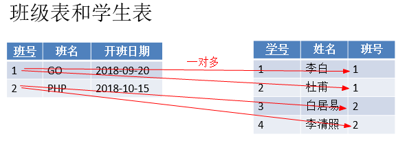
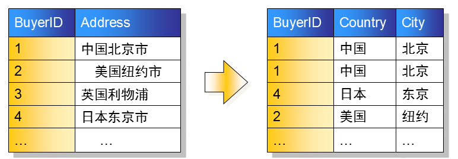
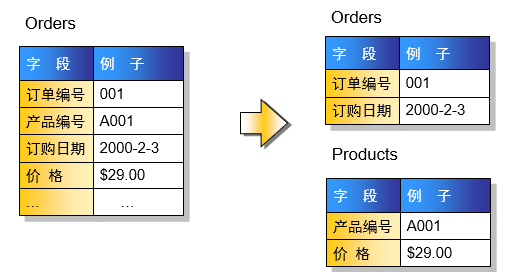
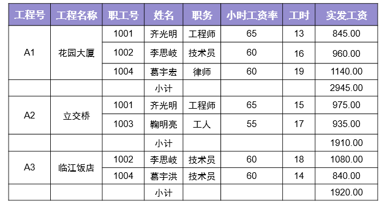
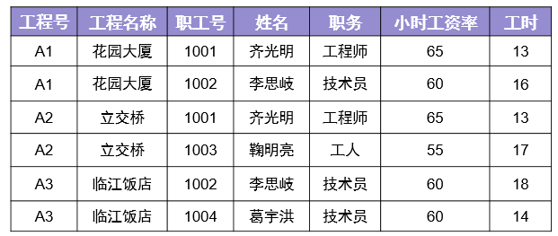
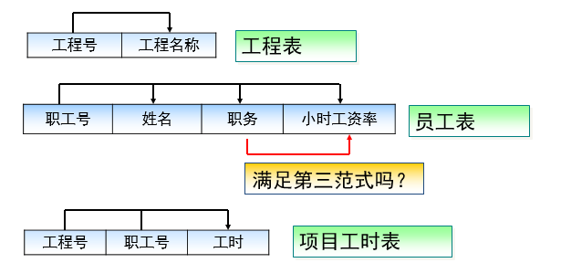

## 1  数据库基本概念

1、关系：两个表的公共字段

2、行：也称记录，也称实体

3、列：也称字段，也称属性

```
就表结构而言，表分为行和列；
就表数据而言，分为记录和字段；
就面向对象而言，一个记录就是一个实体，一个字段就是一个属性。
```

4、数据冗余：相同的数据存储在不同的地方

 ```
脚下留心：
1、冗余只能减少，不能杜绝。
2、减少冗余的方法是分表
3、为减少数据查找的麻烦，允许数据有一定的冗余
 ```

5、数据完整性：正确性+准确性=数据完整性

```
正确性：数据类型正确
准确性：数据范围要准确
```

思考：学生的年龄是整型，输入1000岁，正确性和准确性如何？

答：正确的，但不准确

思考：年龄是整形的，收入了字符串，正确性和准确性如何？

答：不正确

 

## 2  实体和实体之间的关系

1、一对一

2、一对多 （多对一）

3、多对多 


### 2.1 一对多 1：N

1、主表中的一条记录对应从表中的多条记录。

2、一对多和多对一是一样的

 

***

如何实现一对多？

答：主键和非主键建关系

问题：说出几个一对多的关系？

答：班级表和学生表、      班主表和学生表


### 2.2 一对一（1:1）

1、主表中的一条记录对应从表中的一条记录

  

如何实现一对一？

主键和主键建关系就能实现一对一。

```
思考：一对一两个表完全可以用一个表实现，为什么还要分成两个表？

答：在字段数量很多情况下，数据量也就很大，每次查询都需要检索大量数据，这样效率低下。我们可以将所有字段分成两个部分，“常用字段”和“不常用字段”，这样对大部分查询者来说效率提高了。【表的垂直分割】
```


### 2.3 多对多（N：M）

主表中的一条记录对应从表中的多条记录，从表中的一条记录对应主表中的多条记录

班级和讲师的关系

 


如何实现多对多？

答：建立第三张表来保存关系。

问题：说出几个多对多的关系？

1、科目表和学生表的关系		2、商品表和订单表         3、游戏目录表和玩家表


## 3 数据库设计的步骤

  


### 3.1 数据库设计具体步骤

1、     收集信息：与该系统有关人员进行交流、坐谈，充分理解数据库需要完成的任务

2、     标识对象（实体－Entity）标识数据库要管理的关键对象或实体 

3、     标识每个实体的属性（Attribute）

4、     标识对象之间的关系（Relationship）

5、     将模型转换成数据库

6、     规范化

### 3.2 绘制E-R图

  E-R（Entity－Relationship）实体关系图 

E-R图的语法

 

绘制E-R图

 

 

### 3.3 将E-R图转成表

1、     实体转成表，属性转成字段

2、     如果没有合适的字段做主键，给表添加一个自动增长列做主键。


### 3.4 例题

1、项目需求

```
BBS论坛的基本功能：
用户注册和登录，后台数据库需要存放用户的注册信息和在线状态信息；
用户发贴，后台数据库需要存放贴子相关信息，如贴子内容、标题等；
用户可以对发帖进行回复；
论坛版块管理：后台数据库需要存放各个版块信息，如版主、版块名称、贴子数等；
```

2、标识对象

	参与的对象有：用户、发的帖子、跟帖、板块

3、标识对象的属性

 

4、建立关系，绘制E-R图

 

5、将E-R图转出表结构


## 4 数据规范化

Codd博士定义了6个范式来规范化数据库，范式由小到大来约束，范式越高冗余越小，但表的个数也越多。实验证明，三范式是性价比最高的。 

### 4.1 第一范式：确保每列原子性

第一范式确保每个字段不可再分

  

思考：如下表设计是否合理？

 

不合理。不满足第一范式，上课时间可以再分

 


思考：地址包含省、市、县、地区是否需要拆分？

答：如果仅仅起地址的作用，不需要统计，可以不拆分；如果有按地区统计的功能需要拆分。

在实际项目中，建议拆分。

 

### 4.2 第二范式：非键字段必须依赖于键字段

一个表只能描述一件事

  

思考：如下表设计是否合理？

 


### 4.3 第三范式：消除传递依赖

在所有的非键字段中，不能有传递依赖

  

下列设计是否满足第三范式？

  

不满足，因为语文和数学确定了，总分就确定了。

```
多学一招：上面的设计不满足第三范式，但是高考分数表就是这样设计的，为什么？

答：高考分数峰值访问量非常大，这时候就是性能更重要。当性能和规范化冲突的时候，我们首选性能。这就是“反三范式”。
```

### 4.4 数据库设计的例题

1、需求

```
公司承担多个工程项目，每一项工程有：工程号、工程名称、施工人员等
公司有多名职工，每一名职工有：职工号、姓名、性别、职务（工程师、技术员）等
公司按照工时和小时工资率支付工资，小时工资率由职工的职务决定（例如，技术员的小时工资率与工程师不同）
```

2、工资表

 

3、将工资表转成数据库表

 

4、这个表存在的问题

	A：新人入职需要虚拟一个项目
	
	B：职务更改，小时工资率可能会忘记更改，造成数据不完整
	
	C：有人离职，删除记录后，工程也没有了

5、规范化表

	第一步：这个表满足第一范式
	
	第二步：这个表不是描述了一件事情

 


	第三步：是否满足第三范式

 

更改如下：

 

 

## 5 查询语句

```mysql
语法：select [选项] 列名 [from 表名] [where 条件]  [group by 分组] [order by 排序][having 条件] [limit 限制]
```

### 5.1 字段表达式

```mysql
mysql> select '锄禾日当午';
+------------+
| 锄禾日当午          |
+------------+
| 锄禾日当午          |
+------------+

mysql> select 10*10;
+-------+
| 10*10 |
+-------+
|   100 |
+-------+
```

通过as给字段取别名

```mysql
mysql>  select '锄禾日当午' as content;
+------------+
| content    |
+------------+
| 锄禾日当午          |
+------------+
1 row in set (0.00 sec)

mysql> select 10*10 as result;
+--------+
| result |
+--------+
|    100 |
+--------+
1 row in set (0.00 sec)
```

多学一招：as可以省略

 ```mysql
mysql> select 10*10  result;
+--------+
| result |
+--------+
|    100 |
+--------+
1 row in set (0.00 sec)
 ```

### 5.2 from子句

from：来自，from后面跟的是数据源。数据源可以有多个。返回笛卡尔积。

插入测试表

```mysql
mysql> create table t1(
    -> id int,
    -> name varchar(10)
    -> );
Query OK, 0 rows affected (0.05 sec)

mysql> create table t2(
    -> field1 varchar(10),
    -> field2 varchar(10)
    -> );
Query OK, 0 rows affected (0.00 sec)

mysql> insert into t1 values (1,'tom'),(2,'berry');
Query OK, 2 rows affected (0.00 sec)
Records: 2  Duplicates: 0  Warnings: 0

mysql> insert into t2 values ('333','333'),('444','444');
Query OK, 2 rows affected (0.02 sec)
Records: 2  Duplicates: 0  Warnings: 0
```

测试多个数据源

```mysql
mysql> select * from t1,t2;              # 返回笛卡尔积
+------+-------+--------+--------+
| id   | name  | field1 | field2 |
+------+-------+--------+--------+
|    1 | tom   | 333    | 333    |
|    2 | berry | 333    | 333    |
|    1 | tom   | 444    | 444    |
|    2 | berry | 444    | 444    |
+------+-------+--------+--------+
4 rows in set (0.00 sec)
```

### 5.3 dual表

dual表是一个伪表。在有些特定情况下，没有具体的表的参与，但是为了保证select语句的完整又必须要一个表名，这时候就使用伪表。

 ```mysql
mysql> select 10*10 as result from dual;  #dual表是用来保证select语句的完整性。
+--------+
| result |
+--------+
|    100 |
+--------+
 ```

### 5.4 where子句

where后面跟的是条件，在数据源中进行筛选。返回条件为真记录

MySQL支持的运算符

1. `>`	大于
2. `<`小于
3. `>=`
4. `<=`
5. `=`
6. `!=`
7. and    与
8. or      或
9. not   非

```mysql
mysql> select * from stu where stusex='男';		# 查找性别是男的记录
mysql> select * from stu where stuage>=20;		# 查找年龄不低于20的记录
```

思考：如下代码输出什么

```mysql
select * from stu where 1      # 返回所有数据库
select * from stu where 0		#返回空记录
```

思考：如何查找北京和上海的学生

```mysql
mysql> select * from stu where stuaddress='上海' or stuaddress='北京';
+--------+---------+--------+--------+---------+------------+------+------+
| stuNo  | stuName | stuSex | stuAge | stuSeat | stuAddress | ch   | math |
+--------+---------+--------+--------+---------+------------+------+------+
| s25301 | 张秋丽        | 男       |     18 |       1 | 北京           |   80 | NULL |
| s25302 | 李文才       | 男       |     31 |       3 | 上海          |   77 |   76 |
| s25303 | 李斯文       | 女      |     22 |       2 | 北京           |   55 |   82 |
| s25320 | Tom     | 男       |     24 |       8 | 北京           |   65 |   67 |
+--------+---------+--------+--------+---------+------------+------+------+
```

### 5.5  in | not in

 上面的查询上海和北京的学生的SQL可以通过in语句来实现

```mysql
mysql> select * from stu where stuaddress in ('北京','上海');
```

练习：

1、查找学号是s25301,s25302,s25303的学生

```mysql
mysql> select * from stu where stuno in ('s25301','s25302','s25303');
```

2、查找年龄是18,19,20的学生

 ```mysql
mysql> select * from stu where stuage in(18,19,20);
 ```

3、查找不是北京和上海的学生

 ```mysql
mysql> select * from stu where stuaddress not in ('北京','上海');
 ```

### 5.6  between…and|not between…and

查找某个范围的记录

1、查找年龄在18~20之间的学生

```mysql
mysql> select * from stu where stuage>=18 and stuage<=20;   # 方法一

mysql> select * from stu where stuage between 18 and 20;   # 方法二
```

2、查找年龄不在18~20之间的学生

```mysql
mysql> select * from stu where stuage<18 or stuage>20;		#方法一

mysql> select * from stu where not (stuage>=18 and stuage<=20);

mysql> select * from stu where stuage not between 18 and 20;
```

### 5.7 is null | is not null

 脚下留心：查询一个为空的字段不能用等于，必须用is null

查找缺考的学生

 ```mysql
mysql> select * from stu where ch is null or math is null; # 查找缺考的人
+--------+----------+--------+--------+---------+------------+------+------+
| stuNo  | stuName  | stuSex | stuAge | stuSeat | stuAddress | ch   | math |
+--------+----------+--------+--------+---------+------------+------+------+
| s25301 | 张秋丽         | 男       |     18 |       1 | 北京           |   80 | NULL |
| s25304 | 欧阳俊雄        | 男       |     28 |       4 | 天津           | NULL |   74 |
+--------+----------+--------+--------+---------+------------+------+------+
 ```

查找参加考试的学生

```mysql
mysql> select * from stu where ch is not null and math is not null;
```

### 5.8 聚合函数

1. sum()  	   求和

2. avg()          求平均值

3. max()        求最大值

4. min()          求最小值

5. count()      求记录数


 ```mysql
#求语文总分、语文平均分、语文最高分、语文最低分、总人数

mysql> select sum(ch) '语文总分',avg(ch) '语文平均分', max(ch) '语文最高分',min(ch) '语文最低分',count(*) '总人数' from stu;
+----------+------------+------------+------------+--------+
| 语文总分        | 语文平均分          | 语文最高分          | 语文最低分          | 总人数       |

+----------+------------+------------+------------+--------+
|      597 |    74.6250 |         88 |         55 |      9 |
+----------+------------+------------+------------+--------+
1 row in set (0.00 sec)
 ```

### 5.9 通配符

1. _  [下划线]   表示任意一个字符

2. %  表示任意字符


练习

1、满足“T_m”的有（A、C）

A：Tom         B：Toom       C：Tam         D：Tm     E：Tmo

2、满足“T_m_”的有（B、C  ）

A:Tmom   B:Tmmm  C:T1m2    D:Tmm     E:Tm

3、满足“张%”的是（A、B、C、D）

A:张三     B：张三丰     C：张牙舞爪      D：张      E：小张

4、满足“%诺基亚%”的是（A、B、C、D）

A：诺基亚2100   B：2100诺基亚   C：把我的诺基亚拿过来   D：诺基亚

### 5.10 模糊查询（like）

```mysql
# 查找姓张的同学
mysql> select * from stu where stuname like '张%';
+--------+---------+--------+--------+---------+------------+------+------+
| stuNo  | stuName | stuSex | stuAge | stuSeat | stuAddress | ch   | math |
+--------+---------+--------+--------+---------+------------+------+------+
| s25301 | 张秋丽        | 男       |     18 |       1 | 北京           |   80 | NULL |
+--------+---------+--------+--------+---------+------------+------+------+
1 row in set (0.00 sec)
#例题
mysql> select * from stu where stuname like 'T_m';
+--------+---------+--------+--------+---------+------------+------+------+
| stuNo  | stuName | stuSex | stuAge | stuSeat | stuAddress | ch   | math |
+--------+---------+--------+--------+---------+------------+------+------+
| s25320 | Tom     | 男       |     24 |       8 | 北京           |   65 |   67 |
+--------+---------+--------+--------+---------+------------+------+------+
1 row in set (0.00 sec)
```

### 5.11 order by排序

asc：升序【默认】

desc：降序

```mysql
mysql> select * from stu order by ch desc;		# 语文成绩降序排列

mysql> select * from stu order by math asc;     # 数学成绩升序排列

mysql> select * from stu order by math;       # 默认升序排列
```

多列排序

```mysql
#年龄升序,成绩降序
mysql> select *,(ch+math) as '总分' from stu order by stuage asc,(ch+math) desc;
```

思考如下代码表示什么含义

```mysql
select * from stu order by stuage desc,ch desc;     #年龄降序，语文降序
select * from stu order by stuage desc,ch asc;		#年龄降序，语文升序
select * from stu order by stuage,ch desc;          #年龄升序、语文降序
select * from stu order by stuage,ch; 				#年龄升序、语文升序
```

### 5.12 group by 【分组查询】

将查询的结果分组，分组查询目的在于统计数据。

 ```mysql
# 按性别分组，显示每组的平均年龄
mysql> select avg(stuage) as '年龄',stusex from stu group by stusex;
+---------+--------+
| 年龄        | stusex |
+---------+--------+
| 22.7500 | 女      |
| 25.4000 | 男       |
+---------+--------+
2 rows in set (0.00 sec)
# 按地区分组，每个地区的平均年龄
mysql> select avg(stuage) as '年龄',stuaddress from stu group by stuaddress;
+---------+------------+
| 年龄        | stuaddress |
+---------+------------+
| 31.0000 | 上海          |
| 21.3333 | 北京           |
| 27.0000 | 天津           |
| 23.0000 | 河北          |
| 23.0000 | 河南           |
+---------+------------+
5 rows in set (0.00 sec)
 ```

```
脚下留心：
1、如果是分组查询，查询字段必须是分组字段和聚合函数。
2、查询字段是普通字段，只取第一个值
```

 

通过group_concat()函数将同一组的值连接起来显示

 ```mysql
mysql> select group_concat(stuname),stusex from stu group by stusex;
+-------------------------------------+--------+
| group_concat(stuname)               | stusex |
+-------------------------------------+--------+
| 李斯文,诸葛丽丽,梅超风,Tabm                           | 女      |
| 张秋丽,李文才,欧阳俊雄,争青小子,Tom                          | 男       |
+-------------------------------------+--------+
2 rows in set (0.00 sec)
 ```

```
多学一招：【了解】
1、分组后的结果默认会按升序排列显示
2、也是可以使用desc实现分组后的降序
```

 

  

多列分组

 ```mysql
mysql> select stuaddress,stusex,avg(stuage) from stu group by stuaddress,stusex;
+------------+--------+-------------+
| stuaddress | stusex | avg(stuage) |
+------------+--------+-------------+
| 上海          | 男       |     31.0000 |
| 北京           | 女      |     22.0000 |
| 北京           | 男       |     21.0000 |
| 天津           | 男       |     27.0000 |
| 河北          | 女      |     23.0000 |
| 河南           | 女      |     23.0000 |
+------------+--------+-------------+
6 rows in set (0.00 sec)
 ```

### 5.13 having条件

```
思考：数据库中的表是一个二维表，返回的结果是一张二维表，既然能在数据库的二维表中进行查询，能否在结果集的二维表上继续进行查询？

答：可以，having条件就是在结果集上继续进行筛选。
```

例题

```mysql
mysql> select * from stu where stusex='男';   # 从数据库中查找
+--------+----------+--------+--------+---------+------------+------+------+
| stuNo  | stuName  | stuSex | stuAge | stuSeat | stuAddress | ch   | math |
+--------+----------+--------+--------+---------+------------+------+------+
| s25301 | 张秋丽         | 男       |     18 |       1 | 北京           |   80 | NULL |
| s25302 | 李文才        | 男       |     31 |       3 | 上海          |   77 |   76 |
| s25304 | 欧阳俊雄        | 男       |     28 |       4 | 天津           | NULL |   74 |
| s25318 | 争青小子        | 男       |     26 |       6 | 天津           |   86 |   92 |
| s25320 | Tom      | 男       |     24 |       8 | 北京           |   65 |   67 |
+--------+----------+--------+--------+---------+------------+------+------+
5 rows in set (0.00 sec)

mysql> select * from stu having stusex='男';   # 从结果集中查找
+--------+----------+--------+--------+---------+------------+------+------+
| stuNo  | stuName  | stuSex | stuAge | stuSeat | stuAddress | ch   | math |
+--------+----------+--------+--------+---------+------------+------+------+
| s25301 | 张秋丽         | 男       |     18 |       1 | 北京           |   80 | NULL |
| s25302 | 李文才        | 男       |     31 |       3 | 上海          |   77 |   76 |
| s25304 | 欧阳俊雄        | 男       |     28 |       4 | 天津           | NULL |   74 |
| s25318 | 争青小子        | 男       |     26 |       6 | 天津           |   86 |   92 |
| s25320 | Tom      | 男       |     24 |       8 | 北京           |   65 |   67 |
+--------+----------+--------+--------+---------+------------+------+------+
5 rows in set (0.00 sec)
```

思考如下语句是否正确 

  

having和where的区别：

where是对原始数据进行筛选，having是对记录集进行筛选。 

### 5.14 limit

语法：limit 起始位置，显示长度

```mysql
mysql> select * from stu limit 0,2;    # 从0的位置开始，取两条数据
+--------+---------+--------+--------+---------+------------+------+------+
| stuNo  | stuName | stuSex | stuAge | stuSeat | stuAddress | ch   | math |
+--------+---------+--------+--------+---------+------------+------+------+
| s25301 | 张秋丽        | 男       |     18 |       1 | 北京           |   80 | NULL |
| s25302 | 李文才       | 男       |     31 |       3 | 上海          |   77 |   76 |
+--------+---------+--------+--------+---------+------------+------+------+
2 rows in set (0.00 sec)
 
mysql> select * from stu limit 2,2;    # 从2的位置开始，取两条数据
+--------+----------+--------+--------+---------+------------+------+------+
| stuNo  | stuName  | stuSex | stuAge | stuSeat | stuAddress | ch   | math |
+--------+----------+--------+--------+---------+------------+------+------+
| s25303 | 李斯文        | 女      |     22 |       2 | 北京           |   55 |   82 |
| s25304 | 欧阳俊雄        | 男       |     28 |       4 | 天津           | NULL |   74 |
+--------+----------+--------+--------+---------+------------+------+------+
```

起始位置可以省略，默认是从0开始

```mysql
mysql> select * from stu limit 2;
+--------+---------+--------+--------+---------+------------+------+------+
| stuNo  | stuName | stuSex | stuAge | stuSeat | stuAddress | ch   | math |
+--------+---------+--------+--------+---------+------------+------+------+
| s25301 | 张秋丽        | 男       |     18 |       1 | 北京           |   80 | NULL |
| s25302 | 李文才       | 男       |     31 |       3 | 上海          |   77 |   76 |
+--------+---------+--------+--------+---------+------------+------+------+
2 rows in set (0.00 sec)
```

例题：找出班级总分前三名

 ```mysql
mysql> select *,(ch+math) total from stu order by total desc limit 0,3;
+--------+----------+--------+--------+---------+------------+------+------+-------+
| stuNo  | stuName  | stuSex | stuAge | stuSeat | stuAddress | ch   | math | total |
+--------+----------+--------+--------+---------+------------+------+------+-------+
| s25318 | 争青小子        | 男       |     26 |       6 | 天津           |   86 |   92 |   178 |
| s25321 | Tabm     | 女      |     23 |       9 | 河北          |   88 |   77 |   165 |
| s25302 | 李文才        | 男       |     31 |       3 | 上海          |   77 |   76 |   153 |
+--------+----------+--------+--------+---------+------------+------+------+-------+
 ```

多学一招：limit在update和delete语句中也是可以使用的。

### 5.15 查询语句中的选项

查询语句中的选项有两个：

1、     all：显示所有数据 【默认】

2、     distinct：去除结果集中重复的数据

 ```mysql
mysql> select distinct stuaddress from stu;
+------------+
| stuaddress |
+------------+
| 上海          |
| 天津           |
| 河南           |
| 河北          |
| 北京           |
+------------+
5 rows in set (0.00 sec)
 ```

## 6 union（联合）

插入测试数据

```mysql
mysql> create table GO1(
    -> id int primary key,
    -> name varchar(20));
Query OK, 0 rows affected (0.06 sec)

mysql> insert into Go1 values (1,'李白'),(2,'张秋丽');
Query OK, 2 rows affected (0.02 sec)
Records: 2  Duplicates: 0  Warnings: 0
```

### 6.1 union的使用

作用：将多个select语句结果集纵向联合起来

```mysql
select 语句 union [选项] select 语句 union [选项] select 语句;
```

```mysql
mysql> select stuno,stuname from stu union select id,name from Go1;
+--------+----------+
| stuno  | stuname  |
+--------+----------+
| s25301 | 张秋丽         |
| s25302 | 李文才        |
| s25303 | 李斯文        |
| s25304 | 欧阳俊雄        |
| s25305 | 诸葛丽丽         |
| s25318 | 争青小子        |
| s25319 | 梅超风        |
| s25320 | Tom      |
| s25321 | Tabm     |
| 1      | 李白         |
| 2      | 张秋丽         |
+--------+----------+
```

例题：查询上海的男生和北京的女生

```mysql
mysql> select stuname,stuaddress,stusex from stu where (stuaddress='上海' and stusex='男') or (stuaddress='北京' and stusex='女');
+---------+------------+--------+
| stuname | stuaddress | stusex |
+---------+------------+--------+
| 张秋丽        | 上海          | 男       |
| 梅超风       | 北京           | 女      |
+---------+------------+--------+
2 rows in set (0.00 sec)

mysql> select stuname,stuaddress,stusex from stu where stuaddress='上海' and stusex='男' union select stuname,stuaddress,stusex from stu where stuaddress='北京' and stusex='女';
+---------+------------+--------+
| stuname | stuaddress | stusex |
+---------+------------+--------+
| 张秋丽        | 上海          | 男       |
| 梅超风       | 北京           | 女      |
+---------+------------+--------+
2 rows in set (0.02 sec)
```

### 6.2 union的选项

union的选项有两个

1、     all：显示所有数据

2、     distinct：去除重复的数据【默认】

 ```mysql
mysql> select name from go1 union select stuname from stu;
+----------+
| name     |
+----------+
| 李白         |
| 张秋丽         |
| 李文才        |
| 李斯文        |
| 欧阳俊雄        |
| 诸葛丽丽         |
| 争青小子        |
| 梅超风        |
| Tom      |
| Tabm     |
+----------+
 ```

默认是去重复的

 ```mysql
mysql> select name from go1 union all select stuname from stu;  # all不去重复记录
+----------+
| name     |
+----------+
| 李白         |
| 张秋丽         |
| 张秋丽         |
| 李文才        |
| 李斯文        |
| 欧阳俊雄        |
| 诸葛丽丽         |
| 争青小子        |
| 梅超风        |
| Tom      |
| Tabm     |
+----------+
 ```

### 6.3 union的注意事项

1、     union两边的select语句的字段个数必须一致 

2、     union两边的select语句的字段名可以不一致，最终按第一个select语句的字段名。

 3、     union两边的select语句中的数据类型可以不一致。

 

## 7 多表查询分类

将多个表的数据横向的联合起来。
1、	内连接
2、	外连接
	a)	左外连接
	b)	右外连接
3、	交叉连接
4、	自然连接

### 7.1 内连接【inner join】

```mysql
select 列名 from 表1 inner join 表2 on 表1.公共字段=表2.公共字段;
```

```mysql
select 列名 from 表1,表2 where 表1.公共字段=表2.公共字段
```

```
思考：select * from 表1 inner join 表2 on 表1.公共字段=表2.公共字段和select * from 表2 inner join 表1 on 表1.公共字段=表2.公共字段是否一样？
```

```
多学一招：三个表的内连接如何实现？
```

### 7.2 左外连接【left join】

以左边的表为标准，如果右边的表没有对应的记录，用NULL填充。

```mysql
select 列名 from 表1 left join 表2 on 表1.公共字段=表2.公共字段;
```


```
思考：select * from 表1 left join 表2 on 表1.公共字段=表2.公共字段和select * from 表2 left join 表1 on 表1.公共字段=表2.公共字段是否一样？
```

### 7.3 右外连接【right join】

以右边的表为标准，如果右边的表没有对应的记录，用NULL填充。

```mysql
select 列名 from 表1 right join 表2 on 表1.公共字段=表2.公共字段
```


```
思考：select * from 表1 left join 表2 on 表1.公共字段=表2.公共字段和select * from 表2 right join 表1 on 表1.公共字段=表2.公共字段是否一样？
```


### 7.4 交叉连接【cross join】

1、如果没有连接表达式返回的是笛卡尔积


2、如果有连接表达式等价于内连接

### 7.5 自然连接【natural】

自动的判断连接条件，它是过同名字段来判断的
自然连接又分为：
1、	自然内连接		natural join
2、	自然左外连接		natural left join
3、	自然右外连接		natural right join

自然连接结论：
1、	表连接通过同名的字段来连接的
2、	如果没有同名的字段返回笛卡尔积
3、	会对结果进行整理，整理的规则如下
	a)	连接字段保留一个
	b)	连接字段放在最前面

### 7.6 using()

1、用来指定连接字段。
2、using()也会对连接字段进行整理，整理方式和自然连接是一样

## 8 子查询

1. 语法：select 语句 where 条件 (select … from 表)

2. 外面的查询称为父查询，括号中的查询称为子查询
3. 子查询为父查询提供查询条件

### 8.1 例题


脚下留心：上面的例题，子查询只能返回一个值。如果子查询返回多个值就不能用“=”了

### 8.2	in|not in子查询

用于子查询的返回结果多个值。

### 8.3	exists和not exists

1、	如果有人超过80分就显示所有的学生

2、	如果没有人超过80分就显示所有的学生

### 8.4	子查询分类

1、	标量子查询：子查询返回的结果就一个
2、	列子查询：子查询返回的结果是一个列表
3、	行子查询：子查询返回的结果返回一行

4、	表子查询：子查询返回的结果当成一个表

脚下留心：from后面是一个表，如果子查询的结果当成表来看，必须将子查询的结果取别名。


## 9  补充技术

### 9.1  insert…select…

选择一个表的数据插入到另外的表中。


### 9.2 on duplicate key update

在插入数据的时候，如果插入的数据不满足主键约束或唯一约束则执行更新操作。 
