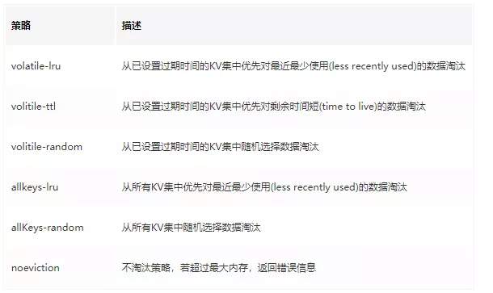
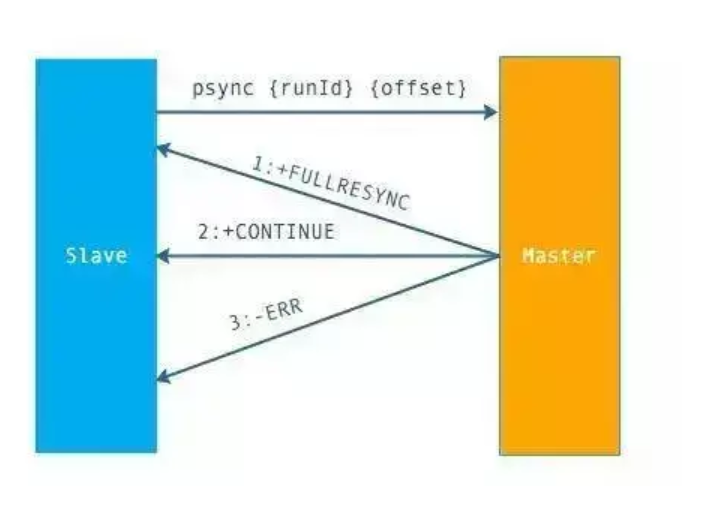
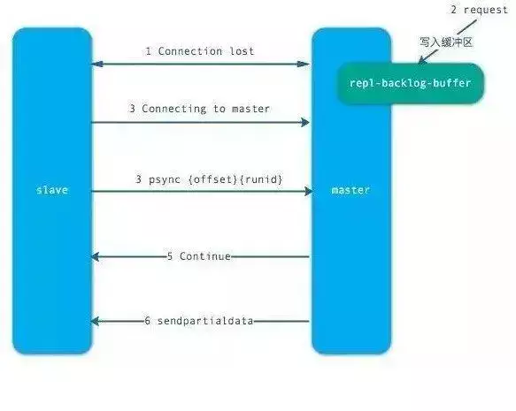
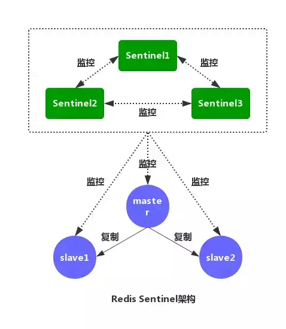

## Redis是什么

Redis（Remote Dictionary Server）是C语言开发的一个开源的（遵从BSD协议）高性能键值对（key-value）的内存数据库，可以用作数据库、缓存、消息中间件。它是一种NoSQL（not-only sql，泛指非关系型数据库）的数据库。

Reidis作为一个内存数据库：

* 性能优秀，数据在内存中，读写速度非常快，支持并发10W QPS
* 单进程单线程，是线程安全的，采用IO多路复用机制
* 丰富的数据类型，支持字符串（strings）、散列（hashes）、列表（lists）、集合（sets）、有序集合（sorted sets）
* 支持数据持久化，可以将内存中数据保存在磁盘中，重启时加载
* 主从复制，哨兵，集群
* 可以用作分布式锁
* 可以作为消息中间件使用，支持发布订阅

## 五种类型

1. **string是redis最基本的类型，可以理解成与memcache一模一样的类型，一个key对应一个value。**value不仅是string，也可以是数字。string类型是二进制安全的，意思是redis的string类型可以包含任何数据，比如jpg图片或者序列化的对象。string类型的值最大能存储512M。
2. **Hash是一个键值（key-value）的集合。**redis的hash是一个string的key和value的映射表，Hash特别适合存储对象。常用命令：hget、hset、hgetall等。
3. **list列表是简单的字符串列表，按照插入顺序排序。**可以添加一个元素到列表的头部（左边）或者尾部（右边）。常用命令：Ipush、rpush、lpop、lrange（获取列表片段）等。
4. **set是string类型的无序集合。**集合是通过hashtable实现的。set中的元素是没有顺序的，而且是没有重复的。常用命令：sdd、spop、smembers、sunion等。
5. **zset和set一样是string类型元素的集合，且不允许重复的元素。zset是有序集合。**常用命令：zadd、zrange、zrem、zcard等

## 为什么单线程的redis这么快

* Redis完全基于内存，绝大部分请求是纯粹的内存操作，非常迅速，数据存在内存中，类似于HashMap，HashMap的优势就是查找和操作的复杂度是O(1)
* 数据结构简单，对数据操作也简单
* 采用单线程，避免了不必要的上下文切换和竞争条件，不存在多线程导致的CPU切换，不用去考虑各种锁的问题，不存在加锁释放锁操作，没有死锁问题导致的性能消耗
* 使用多路复用IO模型，非阻塞IO

## Redis相比memcached有哪些优势

* 存储方式：memecache会把数据全部存在内存之中，断电后会挂掉，数据不能超过内存大小。redis有部分数据存在硬盘上，这样能保证数据的持久性。
* 数据支持类型：memcache对数据类型的支持简单，只支持简单的key-value，而redis支持五种数据类型。
* 使用底层模型不同：它们之间底层实现方式以及与客户端之间通信的应用协议不一样。redis直接自己构建了VM机制，因为一般的系统调用系统函数的话，会浪费一定的时间去移动和请求。
* value的大小：redis可以达到1GB，而memcache只有1MB。

## Redis的淘汰策略

补充一下：Redis4.0加入了LFU(least frequency use)淘汰策略，包括volatile-lfu和allkeys-lfu，通过统计访问频率，将访问频率最少，即最不经常使用的KV淘汰。

## Redis提供了哪几种持久化方式

* RDB：在指定的时间间隔能对你的数据进行快照存储
* AOF：记录每次对服务器写的操作，当服务器重启时，会重新执行这些命令来恢复原始的数据，AOF命令以redis协议追加保存每次写的操作到文件末尾。redis还能对AOF文件进行后台重写，使得AOF文件的体积不至于过大

如果你只希望你的数据在服务器运行的时候存在,你也可以不使用任何持久化方式。

你也可以同时开启两种持久化方式, 在这种情况下, 当redis重启的时候会优先载入AOF文件来恢复原始的数据,因为在通常情况下AOF文件保存的数据集要比RDB文件保存的数据集要完整。

## 如何选择合适的持久化方式

一般来说，如果想达到足以媲美postgresql的数据安全性，应该同时使用两种持久化功能；

如果非常关心你的数据，但仍然可以承受数分钟以内的数据丢失，那么你可以只使用RDB持久化。

AOF将Redis执行的每一条命令追加到磁盘中，处理巨大的写入会降低Redis的性能，不知道你是否可以接受。

有很多用户都只使用AOF持久化，但并不推荐这种方式：因为定时生成RDB快照（snapshot）非常便于进行数据库备份， 并且 RDB 恢复数据集的速度也要比AOF恢复的速度要快。

## 主从复制简介及过程

主从配置结合哨兵模式能解决单点故障问题，提高redis可用性。从节点仅提供读操作，主节点提供写操作。对于读多写少的状况，可给主节点配置多个从节点，从而提高响应效率。

主从复制的过程：

* 从节点执行slave of\[master IP]\[master prot]，保存主节点信息
* 从节点中的定时任务发现从节点信息，建立和主节点的socket连接
* 从节点发送Ping信号，主节点返回Pong，两遍能互相通信
* 连接建立后，主节点将所有数据发送给从节点（数据同步）
* 主节点把当前的数据同步给从节点后，便完成了复制的建立过程。接下来，主节点就会持续的把写命令发送给从节点，保证主从数据一致性。

## 数据同步的过程

`redis2.8`之前使用`sync [runid] [offset]`同步命令；

`redis2.8`之后使用`psync [runid] [offset]`命令。

两者不同：`sync`命令仅支持全量复制过程，`psync`支持全量和部分复制。介绍同步之前，先介绍几个概念：

* `runid`：每个redis节点启动都会生成唯一uuid，每次redis重启后，`runid`都会发生变化。
* `offset`：主节点和从节点都各自维护自己的主从复制偏移量offset，当主节点有写入命令时，`offset=offset+命令的字节长度`。从节点在收到主节点发送的命令后，也会增加自己的offset，并把自己的offset发送给主节点。这样，主节点同时保持自己的offset和从节点的offset，通过对比offset来判断主从节点数据是否一致。
* `repl_backlog_size`：保存在主节点上的一个固定长度的先进先出队列，默认大小是1MB。
  * 主节点发送数据给从节点工程中，主节点还会进行一些写操作，这时候的数据存储在复制缓冲区中。从节点同步主节点数据完成后，主节点将缓冲区的数据继续发送给从节点，用于部分复制。
  * 主节点响应写命令时，不但会把命令发送给从节点，还会写入复制积压缓冲区，用于复制命令丢失的数据补救。

上面是psync的执行流程：

从节点发送`psync [runid] [offset]` 命令，主节点有三种响应：

* FULLRESYNC：第一次连接，进行全量复制
* CONTINUE：进行部分复制
* ERR：不支持psync命令，进行全量复制

## 全量复制和部分复制的过程

上面是全量复制的流程。主要有以下几步：

* 从节点发送psync ？ -1命令（因为第一次发送，不知道主节点的runid，所以为？，因为是第一次复制，所以offset=-1）。
* 主节点发现从节点是第一次复制，返回FULLRESYNC {runId} {offset}，runId是主节点的runId，offset是主节点目前的offset。
* 从节点接收主节点信息后，保存info中。
* 主节点在发送FULLRESYNC后，启动bgsave命令，生产RDB文件（数据持久化）。
* 主节点发送RDB文件给从节点。到从节点加载数据完成这段期间主节点的写命令放入缓冲区。
* 从节点清理自己的数据库数据。
* 从节点加载RDB文件，将数据保存到自己的数据库中。如果从节点开启了AOF，从节点会异步重写AOF文件。

关于部分复制有以下几点说明：

* 部分复制主要是Redis针对全量复制的过高开销做出的一种优化措施，使用`psync [runId] [offset]`命令实现。当从节点正在复制主节点时，如果出现网络闪断或者命令丢失等异常情况时，从节点会向主节点要求补发丢失的命令数据，主节点的复制积压缓冲区将这部分直接发送给从节点，这样就可以保持主从节点复制的一致性。补发的这部分数据一般远远小于全量数据。
* 主从连接中断期间主节点依然响应命令，但因复制连接中断命令无法发送给从节点，不过主节点内的复制积压缓冲区依然可以保存最近一段时间的写命令数据。
* 当主从连接恢复后，由于从节点之前保存了自己复制的偏移量和主节点的运行ID。因此会把他们当做psync参数发送给主节点，要求进行部分复制。
* 主节点接收到psync命令后首先核对参数runId是否与自身一致，如果一致，说明之前复制的是当前主节点；之后根据参数offset在复制积压缓冲区中查找，如果offset之后的数据存在，则对从节点发送+continue命令，表示可以进行部分复制。因为缓冲区大小固定，若发生缓冲溢出，则进行全量复制。
* 主节点根据偏移量把复制积压缓冲区里的数据发送给从节点，保证主从复制进入正常状态。

## Redis有哪几种数据淘汰策略

* noeviction:返回错误当内存限制达到并且客户端尝试执行会让更多内存被使用的命令（大部分的写入指令，但DEL和几个例外） 

* allkeys-lru: 尝试回收最少使用的键（LRU），使得新添加的数据有空间存放。

* volatile-lru: 尝试回收最少使用的键（LRU），但仅限于在过期集合的键,使得新添加的数据有空间存放。

* allkeys-random: 回收随机的键使得新添加的数据有空间存放。

* volatile-random: 回收随机的键使得新添加的数据有空间存放，但仅限于在过期集合的键。

* volatile-ttl: 回收在过期集合的键，并且优先回收存活时间（TTL）较短的键,使得新添加的数据有空间存放。

## 为什么Redis需要把所有数据放到内存中

Redis为了达到最快的读写速度将数据都读到内存中，并通过异步的方式将数据写入磁盘。所以redis具有快速和数据持久化的特征。如果不将数据放在内存中，磁盘I/O速度为严重影响redis的性能。在内存越来越便宜的今天，redis将会越来越受欢迎。 如果设置了最大使用的内存，则数据已有记录数达到内存限值后不能继续插入新值。

## 哨兵有哪些功能

如图，是Redis Sentinel（哨兵）的架构图。Redis Sentinel（哨兵）主要功能包括主节点存活检测、主从运行情况检测、自动故障转移、主从切换。Redis Sentinel最小配置是一主一从。

Redis的Sentinel系统可以用来管理多个Redis服务器，该系统可以执行以下四个任务：

* 监控：不断检查主服务器和从服务器是否正常运行。
* 通知：当被监控的某个redis服务器出现问题，Sentinel通过API脚本向管理员或者其他应用程序发出通知。
* 自动故障转移：当主节点不能正常工作时，Sentinel会开始一次自动的故障转移操作，它会将与失效主节点是主从关系的其中一个从节点升级为新的主节点，并且将其他的从节点指向新的主节点，这样就避免了人工干预。
* 配置提供者：在Redis Sentinel模式下，客户端应用在初始化时连接的是Sentinel节点集合，从中获取主节点的信息。

## Redis如何设置密码及验证密码

设置密码：config set requirepass 123456

 授权密码：auth 123456

## Redis哈希槽的概念

Redis集群没有使用一致性hash,而是引入了哈希槽的概念，Redis集群有16384个哈希槽，每个key通过CRC16校验后对16384取模来决定放置哪个槽，集群的每个节点负责一部分hash槽。

## Redis集群之间是如何复制的

异步复制

## Redis集群如何选择数据库

Redis集群目前无法做数据库选择，默认在0数据库。