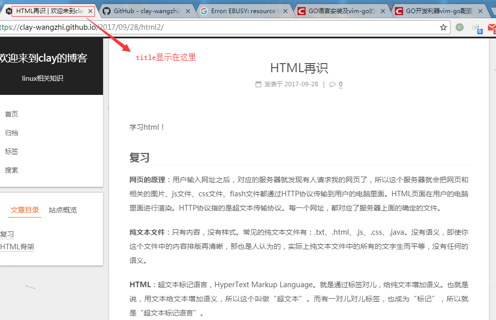

本节介绍的内容有HTML初始、HTML骨架、HTML的基本语法特性、h和p标签、图片、超级链接。

## HTML初识

### 网页的原理

用户输入网址之后，对应的服务器就发现有人请求我的网页了，所以这个服务器就会把网页和相关的图片、js文件、css文件、flash文件都通过HTTP协议传输到用户的电脑里面。HTML页面在用户的电脑里面进行渲染。HTTP协议指的是超文本传输协议。每一个网址，都对应了服务器上面的确定的文件。

### 纯文本文件

只有内容，没有样式。常见的纯文本文件有：.txt、.html、.js、.css、.java。没有语义，即使你这个文件中的内容排版再清晰，那也是人认为的，实际上纯文本文件中的所有的文字生而平等，没有任何的语义。

### HTML

超文本标记语言，HyperText Markup Language。就是通过标签对儿，给纯文本增加语义。也就是说，用文本给文本增加语义，所以这个叫做“超文本”。而有一对儿对儿标签，也成为“标记”，所以就是“超文本标记语言”。

### .html

.html网页的格式，现在的业界的标准，网页技术严格的三层分离：**html**就是负责描述页面的语义；css负责描述页面的样式；js负责描述页面的动态效果的。

## HTML骨架

复制

```
<!DOCTYPE html><html lang="en"><head>	<meta charset="UTF-8">	<title>Document</title></head><body>	</body></html>
```

### 文档声明头

任何一个标准的HTML页面，第一行一定是一个以

复制

```
<!DOCTYPE ...
```

### 字符集

复制

```
<meta charset="UTF-8">
```

字符集用meta标签定义，meta表示“元”。“元”配置，就是表示基本的配置项目。

**charset**就是charactor set“字符集”的意思。

中文能够使用的字符集两种：

第一种：UTF-8

复制

```
<meta charset="UTF-8">
```

第二种：gb2312

复制

```
<meta charset="gb2312">
```

也可以写成gbk

复制

```
<meta charset="gbk">
```

规模： UTF-8（字全） > gb2312（只有汉字）

**我们用meta标签可以声明当前这个html文档的字库，但是一定要和保存的类型一样，否则乱码！（重点）**

当我们不设置的时候，sublime默认类型就是UTF-8。而一旦更改为gb2312的时候，就一定要记得设置一下sublime的保存类型： 文件→ set File Encoding to →Chinese Simplified(GBK)

记住两者匹配：

注意，由于UTF-8里面保存了世界上所有人类语言，所以描述一个汉字需要的码更多。

**UTF-8里面存储一个汉字3个字节。而gb2312中存储一个汉字2个字节。**

**保存大小： UTF-8（更臃肿、加载更慢） > gb2312 （更小巧，加载更快）**

总结：

UTF-8 字多，有各种国家的语言，但是保存尺寸大，文件臃肿；

gb2312字少，只用中文和少数外语和符号，但是尺寸小，文件小巧。

### title标签

复制

```
<title>网页的标题</titile>
```

title也是有助于SEO搜索引擎优化的



## HTML的基本语法特性

### HTML对换行不敏感，对tab不敏感

HTML只在乎标签的嵌套结构，嵌套的关系。谁嵌套了谁，谁被谁嵌套了，和换行、tab无关。

换不换行、tab不tab，都不影响页面的结构。

所以：

复制

```
	<div><h3></h3>	<p></p>	</div>
```

完全等价于：

复制

```
<div>	<h3></h3>	<p></p></div>
```

就是说，**HTML不是依靠缩进来表示嵌套的，就是看标签的包裹关系。但是，我们发现有良好的缩进，代码更易读。要求大家都正确缩进标签。**

### 空白折叠现象

**HTML中所有的文字之间，如果有空格、换行、tab都将被折叠为一个空格显示。**

代码：里面有空格、缩进、换行

复制

```
<p>clay		wangzhi</p>
```


### 标签要严格封闭

标签不封闭是灾难的：

复制

```
<title>欢迎<title>
```

HTML、CSS就是写代码，不能算“编程”，因为这里面没有业务逻辑，加减乘除，与或非。

说白了，就是用代码画画。

## h和p标签

### h系列

复制

```
<h1> 到 <h6> 都是标签：<h1></h1>一级标题<h2></h2>二级标题……<h6></h6>六级标题
```

h标签没有嵌套关系的。由于h3跟着一个h2，所以，我们自己就知道了这个h3是h2子标题。

h是容器级的标签。理论上里面可以放置p、ul，只是法律上的允许，在语义上，不要这么写。

### p标签

段落，是英语**p**aragraph“段落”缩写。

HTML标签是分等级的，HTML将所有的标签分为两种：**容器级、文本级**。

顾名思义，**容器级的标签，里面可以放置任何东西；文本级的标签里面，只能放置文字、图片、表单元素**。

p标签是一个文本级标签。从学习p的第一天开始，就要死死记住：p里面只能放文字、图片、表单元素。其他的一律不能放。

Chrome浏览器是世界上HTML5支持最好的浏览器。提供了非常好的开发工具，非常适合我们开发人员使用。审查元素功能的快捷键是F12。

Chrome的英语原意“硅”，是谷歌公司的产品，所以也叫作谷歌浏览器。

## 图片

### 能用的图片类型

页面上可以插入图片，能够插入的图片类型是：jpg(jpeg)、gif、png、bmp。类型和类型之间有什么区别。

不能往网页中插入的图片格式是：psd、ai。

### 语法

HTML页面不是直接插入图片，而是插入图片的引用地址，所以也要把图片上传到服务器上。

插入方法：

复制

```

```

img是英语**im**a**g**e“图片”的简写

src 是英语**s**ou**rc**e“资源”的简写，千万不要写成scr。

**src是img标签的属性，baby.jpg是这个属性的值。**

这个标签和我们之前学的，都不一样，因为这个标签不是“对儿”。**自封闭标签，也称为单标签。**

为什么？原因很简单，如果是对儿，里面就要有内容，表示给这个内容增加语义。比如

复制

```
"<h1>哈哈哈哈，我是主标题啦！！！</h1>"
```

图片就是一个图片，不需要给什么文字增加语义，所以就是自己一个人活得挺好：

复制

```
""
```

meta也是自封闭标签：

复制

```
<meta charset="UTF-8" />
```

### alt属性

alt属性：

复制

```

```

alt是英语alternate“替代”的意思，就表示不管因为什么原因，当这个图片无法被显示的时候，出现的替代文字（有的浏览器不支持）。

## 超级链接

### 基本写法

一个网站，是由很多html网页组成的，html网页之间能够通过超级链接互相跳转，从而形成了“网”。

语法：

复制

```
<a href="1.html">结婚照</a>
```

效果图：


a是英语anchor“锚”的意思，就好像这个页面往另一个页面扔出了一个锚。是一个文本级的标签。

href是英语**h**ypertext **ref**erence超文本地址的缩写。读作“喝瑞夫”。

### a标签的另外两个属性

title 悬停文本

复制

```
<a href="09_img.html" title="很好看哦">结婚照</a>
```


target 是否在新窗口中打开

target实际上是“目标”的意思。

复制

```
<a href="09_img.html" title="很好看哦" target="_blank">结婚照</a>
```

blank就是“空白”的意思，就表示新建一个空白窗口。

也就是说，如果不写target=”_blank”那么就是在相同的标签页打开，如果写了，就是在新的空白标签页中打开。

完整的超级链接：

复制

```
<a href="1.html" title="悬停文本" target="_blank">链接的内容</a>
```

### 页面内的锚点

页面当中可以有锚点，所谓的锚点，就是一个小标记，这个小标记是用户不可察觉的，用户不知道这里有一个标记。

锚点用name属性来设置，一个a标签如果name属性（或者id属性），那么就是页面的一个锚点。

复制

```
<a name="wdzp">我的作品</a>或者：<a id="wdzp">我的作品</a>
```

页面内锚点

复制

```
<body>	<a href="#gzjy">点击我就查看工作经验</a>	<a href="#wdzp">点击我就查看我的作品</a>	<h1>个人简介</h1>	<h2>基本信息</h2>	<p>基本信息</p>	<h2><a id="gzjy">工作经验</a></h2>	<p>工作经验</p>	<h2><a name="wdzp">我的作品</a></h2>	<p>作品展示</p></body>
```

跨页面锚点

复制

```
<body>	<a href="11_页面内锚点.html#gzjy">查看小明同学的工作经验</a></body>
```

### a是一个文本级的标签

比如一个段落中的所有文字都能够被点击，那么应该：

p包裹a：

复制

```
<p>	<a href="">段落</a></p>
```

而不是a包裹p：

复制

```
<a href="">	<p>		段落	</p></a>
```

a的语义要小于p，a就是可以当做文本来处理，所以p里面相当于放的就是纯文字。