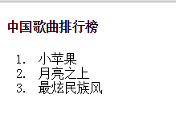
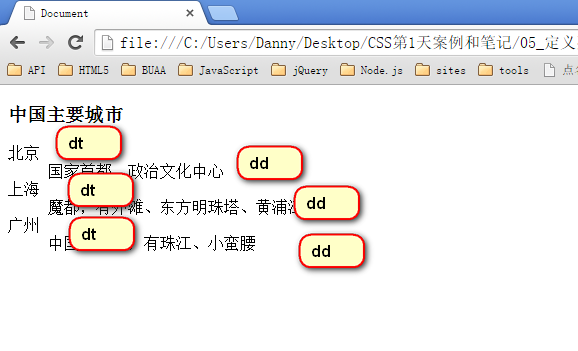

学习CSS！

yeah，今天要开始学习CSS了，本节内容有列表、div和span、表单。

<!--more-->

## 列表

列表有3种

### 无序列表

无序列表，用来表示一个列表的语义，并且每个项目和每个项目之间，是不分先后的。

ul就是英语**u**nordered **l**ist，“无序列表”的意思。

li 就是英语list **i**tem ，“列表项”的意思。

你会发现，这是我们学习的第一个**“组标签”，就是要么不写，要么就要写一组**。

```
<ul>
	<li>上海</li>
	<li>北京</li>
	<li>深圳</li>
</ul>
```

也就是说，**所有的li不能单独存在，必须包裹在ul里面；反过来说，ul的“儿子”不能是别的东西，只能有li**。

但是<font color=#ff0000>**li是一个容器级标签，li里面什么都能放**</font>，比如：

```html
<body>
	<h3>习大大专著</h3>
	<ul>
		<li>
			<h4>习近平谈治国理政</h4>
			<p>¥49.00</p>
			<p>《习近平谈治国理政》谈中国、论世界，为各国读者开启了一扇观察和感知中国的窗口。阅读这本书，可以了解以习近平同志为总书记的党中央治国理念和执政方略，品味悠长醇厚的中国历史文化，感受当</p>
		</li>
		<li>
			<h4>习近平用典</h4>
			<p>¥23.60</p>
			<p>人民日报社社长杨振武主持编写并作序，人民日报社副总编辑卢新宁组织撰写解读文字，旨在对习近平总书记重要讲话（文章）引用典故的现实意义进行解读，对典故的背景义</p>
		</li>
		<li>
			<h4>摆脱贫困</h4>
			<p>26.00</p>
			<p>追本溯源 融会贯通	深入学习贯彻习近平总书记系列重要讲话精神	推动学习贯彻向广度深度拓展	习近平总书记**部个人专著	时隔22年后重印发行</p>
		</li>
	</ul>
</body>
```

甚至于可以再放一个ul：

```html
<body>
	<h3>去超市要买的东西</h3>
	<ul>
		<li>
			吃的
			<ul>
				<li>饼干</li>
				<li>面包</li>
				<li>
					巧克力
					<ul>
						<li>德芙</li>
						<li>费列罗</li>
					</ul>
				</li>
			</ul>
		</li>
		<li>
			用的
			<ul>
				<li>笔记本</li>
				<li>圆珠笔</li>
			</ul>
		</li>
		<li>
			喝的
			<ul>
				<li>牛奶</li>
				<li>可乐</li>
			</ul>
		</li>
	</ul>
</body>
```

### 有序列表

**o**rdered **l**ist  有序列表，用ol表示

```html
<body>
	<h4>中国歌曲排行榜</h4>
	<ol>
		<li>小苹果</li>
		<li>月亮之上</li>
		<li>最炫民族风</li>
	</ol>
</body>
```

浏览器会自动增加阿拉伯序号：



也就是说，ol和ul就是语义不一样，怎么使用都是一样的。

ol里面只能有li，li必须被ol包裹。li是容器级。

 

ol这个东西用的不多，如果想表达顺序，大家一般也用ul：

```html
<body>
	<h4>中国歌曲排行榜</h4>
	<ul>
		<li>1. 小苹果</li>
		<li>2. 月亮之上</li>
		<li>3. 最炫民族风</li>
	</ul>
</body>
```

### 定义列表

定义列表也是一个组标签，不过比较复杂，出现了三个标签：

dl表示definition list 定义列表

dt表示definition title    定义标题

dd表示definition description 定义表述词儿

dt、dd只能在dl里面；dl里面只能有dt、dd

```html
body>
	<h3>中国主要城市</h3>
	<dl>
		<dt>北京</dt>
		<dd>国家首都，政治文化中心</dd>
		<dd>污染很严重，PM2.0天天报表</dd>
	</dl>

	<dl>
		<dt>上海</dt>
		<dd>魔都，有外滩、东方明珠塔、黄浦江</dd>
	</dl>

	<dl>
		<dt>广州</dt>
		<dd>中国南大门，有珠江、小蛮腰</dd>
	</dl>
</body>
```

表达的语义是两层：

1) 是一个列表，列出了北京、上海、广州三个项目

2）每一个词儿都有自己的描述项。

dd是描述dt的。



## div和span

div和span是非常重要的标签，div的语义是division“分割”； span的语义就是span“范围、跨度”。

```html
<body>
	<div>
		<h3>中国主要城市</h3>
		<ul>
			<li>北京</li>
			<li>上海</li>
			<li>广州</li>
		</ul>
	</div>

	<div>
		<h3>美国主要城市</h3>
		<ul>
			<li>纽约</li>
			<li>洛杉矶</li>
			<li>华盛顿</li>
			<li>西雅图</li>
		</ul>
	</div>
</body>
```

div在浏览器中，默认是不会增加任何的效果改变的，但是语义变了，div中的所有元素是一个小区域。

<font color=#ff0000>**div标签是一个容器级标签，里面什么都能放，甚至可以放div自己**</font>。


<font color=#ff0000>**span也是表达“小区域、小跨度”的标签，但是是一个“文本级”的标签**</font>。

就是说，span里面只能放置文字、图片、表单元素。 span里面不能放p、h、ul、dl、ol、div。

span里面是放置小元素的，div里面放置大东西的：

```html
<p>
		简介简介简介简介简介简介简介简介
		<span>
			<a href="">详细信息</a>
			<a href="">购买</a>
		</span>
</p>
```

div标签是最最重要的布局标签。

```html
<!DOCTYPE html>
<html lang="en">
<head>
	<meta charset="UTF-8">
	<title>Document</title>
<head>
	<style type="text/css">
		.header{
			width: 980px;
			height:100px;
			margin: 0 auto;
 
			margin-bottom: 10px;
		}
		.content{
			width: 980px;
			height: 400px;
 
			margin: 0 auto;
			margin-bottom: 10px;
		}
		.footer{
			width: 980px;
			height:100px;
			margin: 0 auto;
			background-color: yellow;
			margin-bottom: 10px;
		}
		.logo{
			float: left;
			width: 200px;
			height: 60px;
			background-color: red;
		}
		.nav{
			float: right;
			width: 600px;
			height: 60px;
			background-color: blue;
		}
		.guanggao{
			float: left;
			width: 250px;
			height: 400px;
			background-color: darkblue;
		}
		.dongxi{
			float: right;
			width: 690px;
			height: 400px;
			background-color: skyblue;
		}
	</style>
</head>
<body>
	<div class="header">
		<div class="logo">这就是logo</div>
		<div class="nav">导航条</div>
	</div>
	<div class="content">
		<div class="guanggao">广告</div>
		<div class="dongxi">卖的东西</div>
	</div>
	<div class="footer">页脚</div>
</body>
</html>

```

所以，我们亲切的称呼**这种模式叫做“div+css”。div标签负责布局，负责结构，负责分块。css负责样式。**

## 表单

表单就是收集用户信息的，就是让用户填写的、选择的。

```html
<div>
		<h3>欢迎注册本网站</h3>
		<form>
			所有的表单内容，都要写在form标签里面
		</form>
</div>

```

form是英语表单的意思。form标签里面有action属性和method属性，action属性就是表示，表单将提交到哪里。method属性表示用什么HTTP方法提交，有get、post两种。

### 文本框

```html
<input type="text">

```

input表示“输入”，指的是这是一个“输入小部件”，

type表示“类型”，

text表示“文本”，指的是类型是一个文本框的输入小部件。

这是一个自封闭标签。


value表示“值”，value属性就是默认有的值，文本框中已经被填写好了：

```html
<p>
		请输入您的姓名:
		<input type="text" value="默认有的值，(*^__^*) 嘻嘻……" />
</p>

```


### 密码框

也就是说，input标签很神奇，又是文本框，又是密码框。

到底是啥？看type属性的值是什么，来决定。

如果type=”text”  文本框

如果type=”password” 密码框

```html
<p>
		请输入您的密码：
		<input type="password" />
</p>

```


### 单选按钮

只能选一个，术语叫做“互斥”。

```html
<p>
		请选择你的性别：
		<input type="radio" name="xingbie" /> 男
		<input type="radio" name="xingbie" /> 女
</p>			

```

radio是“收音机”的意思，input的type的值，如果是radio就是单选按钮。

非常像以前的收音机，按下去一个按钮，其他的就抬起来了。所以叫做radio。


单选按钮，天生是不能互斥的，如果想互斥，必须要有相同的name属性。name就是“名字”。

默认被选择，就应该书写checked=”checked”

```html
<input type="radio" name="sex" checked="checked">

```

### 复选框

也是input标签，type是checkbox。

```html
<p>
		请选择你的爱好：
		<input type="checkbox" name="aihao"/> 睡觉
		<input type="checkbox" name="aihao"/> 吃饭
		<input type="checkbox" name="aihao"/> 足球
		<input type="checkbox" name="aihao"/> 篮球
		<input type="checkbox" name="aihao"/> 乒乓球
		<input type="checkbox" name="aihao"/> 打豆豆
</p>

```


复选框，最好也是有相同的name（虽然他不需要互斥，但是也要有相同的name）

### 下拉列表

select就是“选择”，option“选项”。

select标签和ul、ol、dl一样，都是组标签。

```html
<p>
		请选择你的籍贯：
		<select>
			<option>北京</option>
			<option>河北</option>
			<option>河南</option>
			<option>山东</option>
			<option>山西</option>
			<option>湖北</option>
			<option>安徽</option>
		</select>
</p>

```

### 多行文本框（文本域）

text就是“文本”，area就是“区域”。

```html
<p>
		签名：
		<textarea rows="4" cols="80"></textarea>
</p>

```

这个标签，是个标签对儿。对儿里面不用写东西。如果写的话，就是这个框的默认文字。

cols属性表示columns“列”，rows属性表示rows“行”。

值就是一个数，表示多少行，多少列。

### 三种按钮

按钮也是input标签，一共有三种按钮：

**普通按钮：**

```html
<p>
		普通按钮：
		<input type="button" value="我是一个普通按钮" />
</p>

```

button就是英语“按钮”的意思。value就是“值”的意思，按钮上面显示的文字。


**提交按钮：**

```html
<p>
		提交按钮：
		<input type="submit" />
</p>

```

ubmit就是英语“提交”的意思。这个按钮不需要写value自动就有“提交”文字。

这个按钮点击，表单真的能提交。这个表单就会被提交到，form标签的action属性中的那个页面中去。

**重置按钮**

```html
<p>
		重置按钮
		<input type="reset" />
</p>

```

reset就是“复位”的意思。

### label标签

```html
<input type="radio" name="sex" id="nan" /> <label for="nan">男</label>
<input type="radio" name="sex" id="nv"  /> <label for="nv">女</label>
```

input元素要有一个id，然后label标签就有一个for属性，和id相同，就表示绑定了，这个label和input就有绑定关系了。

复选框也有label：

```html
<input type="checkbox" id="kk" />
<label for="kk">10天内免登陆</label>  
```

什么表单元素都有label。