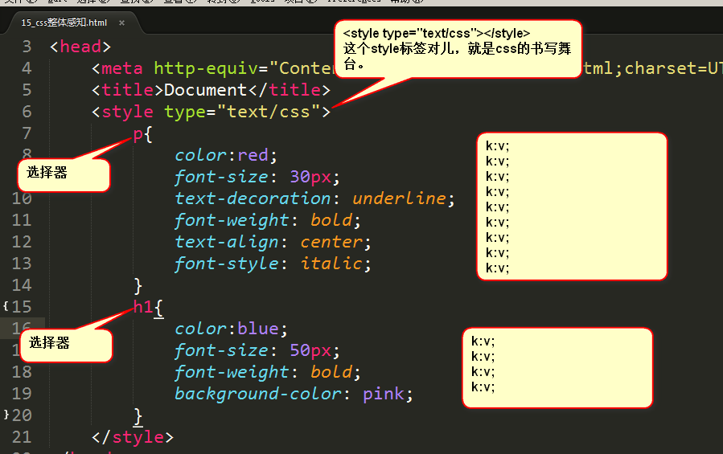
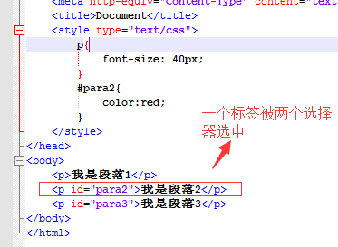

今天来接着来学习CSS，go！本节内容有CSS整体感知、常见属性、选择器。


css是**c**ascading **s**tyle **s**heet 层叠式样式表的简写。



我们写css的地方是style标签，就是“样式”的意思，写在head里面。

css也可以写在单独的文件里面，现在我们先写在style标签里面。

复制

```
<style type="text/css"></style>
```

**css对换行不敏感，对空格也不敏感。但是一定要有标准的语法。冒号，分号都不能省略。**

语法：

复制

```
选择器{    k:v;    k:v;}选择器{    k:v;    k:v;}
```

## 一些常见的属性

> 字符颜色：

复制

```
color:red
```

color属性的值，可以是英语单词，比如red、blue、yellow等等；也可以是rgb、十六进制，不要着急，后几天讲。

sublime中的快捷键是c，然后tab

> 字号大小：

复制

```
font-size:40px
```

font就是“字体”，size就是“尺寸”。px是“像素”。

单位必须加，不加不行。

sublime中的快捷键是fos，然后tab

> 背景颜色：

复制

```
background-color:blue
```

background就是“背景”。

sublime中的快捷键是bgc，然后tab

> 加粗：

复制

```
font-weight:bold
```

font是“字体” weight是“重量”的意思，bold粗。

sublime中的快捷键是fwb，然后tab

> 不加粗

复制

```
font-weight:normal;
```

normal就是正常的意思

sublime中的快捷键是fwn，然后tab

> 斜体：

复制

```
font-style:italic;
```

italic就是“斜体”

sublime中的快捷键是fsi，然后tab

> 不斜体：

复制

```
font-style:normal;
```

sublime中的快捷键是fsn，然后tab

> 下划线：

复制

```
text-decoration:underline;
```

decoration就是“装饰”的意思。

sublime中的快捷键是tdu，然后tab

> 没有下划线

复制

```
text-decoration:none;
```

sublime中的快捷键是tdn，然后tab

css没啥难的，就是要把属性给记忆准确。

## 基础选择器

css怎么学？很简单有两个知识部分：

1）选择器，怎么选；

2）属性，样式是什么

### 标签选择器

1）所有的标签，都可以是选择器。比如ul、li、label、dt、dl、input

2）无论这个标签藏的多深，一定能够被选择上

3）选择的所有，而不是一个。

标签选择器，选择的是页面上所有这种类型的标签，所以经常描述“共性”，无法描述某一个元素的“个性“

### id选择器

复制

```
<p id="para1">我是段落1</p>
```

css:

复制

```
#para1{	color:green;		}
```

id选择器的选择符是“#”。

任何的HTML标签都可以有id属性。表示这个标签的名字。

这个标签的名字，可以任取，但是：

1） 只能有字母、数字、下划线

2） 必须以字母开头

3） 不能和标签同名。比如id不能叫做body、img、a

一个HTML页面，不能出现相同的id，哪怕他们不是一个类型。比如页面上有一个id为pp的p，一个id为pp的div，是非法的！



一个标签可以被多个css选择器选择，共同作用，这就是“层叠式”的第一层含义。

### 类选择器

**.就是类的符号**。类的英语叫做class。

所谓的类，就是class属性，class属性和id非常相似，任何的标签都可以携带class属性。**class属性可以重复**。

复制

```
<h3>我是一个h3啊</h3><h3 class="teshu">我是一个h3啊</h3><h3>我是一个h3啊</h3><p>我是一个段落啊</p><p class="teshu">我是一个段落啊</p><p class="teshu">我是一个段落啊</p>
```

CSS

复制

```
.teshu{    color:red;}
```

**同一个标签，可能同时属于多个类，用空格隔开**

## CSS高级选择器

### 后代选择器

复制

```
.div p{    color:red;}
```

空格就表示后代，.div p 就是.div1的后代所有的p。

强调一下，选择的是后代，不一定是儿子。

### 交集选择器

复制

```
h3.special{    color:red;}
```

选择的元素是同时满足两个条件：必须是h3标签，然后必须是special标签。

**交集选择器没有空格**。

交集选择器，我们一般都是以标签名开头，比如div.haha 比如p.special。

### 并集选择器（分组选择器）

复制

```
h3,li{    color:red;}
```

用逗号就表示并集。

### 通配符*

*就表示所有元素

复制

```
*{    color:red;}
```

效率不高，如果页面上的标签越多，效率越低，所以页面上不能出现这个选择器。