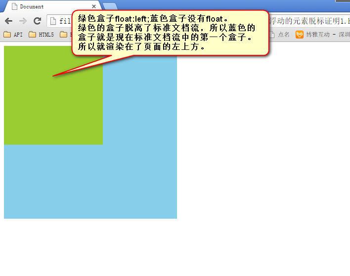
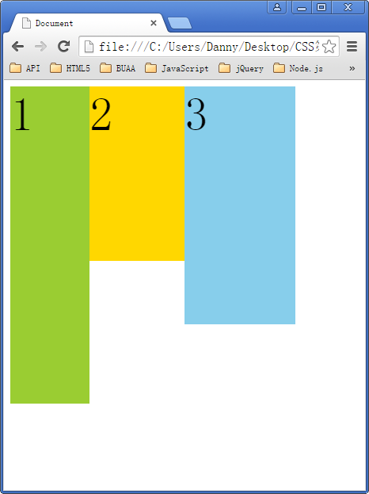

今天继续学习CSS，go！本节内容有css性质、盒模型、标准文档流、浮动。


1）继承性。有一些属性给祖先元素，所有的后代元素都集成上了。哪些属性能继承：color、font-、text-、line-

2）层叠性。层叠性是一种能力，就是处理冲突的能力。当不同选择器，对一个标签的同一个样式，有不同的值，听谁的？这就是冲突。css有着严格的处理冲突的机制：

- 选择上了，数权重，(id的数量，类的数量，标签的数量)。如果权重一样，谁写在后面听谁的。

- 没有选择上，通过继承影响的，就近原则，谁描述的**近**听谁的。如果描述的一样近，比如选择器权重，如果权重再一样重，谁写在后面听谁的。

## 盒模型

### 盒子中的区域

一个盒子中主要的属性就5个：width、height、padding、border、margin。

- width是“宽度”的意思，CSS中width指的是内容的宽度，而不是盒子的宽度。

- height是“高度”的意思，CSS中height指的是内容的高度，而不是盒子的高度

- padding是“内边距”的意思

- border是“边框”

- margin是“外边距”

### padding

小属性：

复制

```
padding-top: 30px;padding-right: 20px;padding-bottom: 40px;padding-left: 100px;
```

top上、right右、bottom下、left左。

这种属性，就是复合属性。比如不写padding-left那么就是没有左内边距。

快捷键就是pdt、pdr、pdb、pdl 然后按tab。

综合属性：

如果写了4个值

复制

```
padding:30px 20px 40px 100px;
```

上、右、下、左

### border

就是边框。边框有三个要素：粗细、线型、颜色。

按3要素拆开：

复制

```
border-width:10px;    → 边框宽度border-style:solid;     → 线型border-color:red;      → 颜色。
```

### margin

#### margin的塌陷现象

**标准文档流中，竖直方向的margin不叠加，以较大的为准。**

如果不在标准流，比如盒子都浮动了，那么两个盒子之间是没有塌陷现象的。

#### 盒子居中margin:0 atuo;

margin的值可以为auto，表示自动。当left、right两个方向，都是auto的时候，盒子居中了。

注意：

1） 使用margin:0 auto; 的盒子，必须有width，有明确的width

2） 只有标准流的盒子，才能使用margin:0 auto; 居中。

也就是说，当一个盒子浮动了、绝对定位了、固定定位了，都不能使用margin:0auto;

3） margin:0 auto;是在居中盒子，不是居中文本。

文本的居中，要使用

复制

```
text-align:center
```

#### 善于使用父亲的padding，而不是儿子的margin

如果父亲没有border，那么儿子的margin实际上踹的是“流”，踹的是这“行”。所以，父亲整体也掉下来了

这个p有一个margin-top踹父亲，试图将自己下移

复制

```
<div>    <p></p></div>
```

结果：

儿子用margin-top踹父亲，父亲没有border，结果父亲也下来了。

儿子用margin-top踹父亲，但父亲有border，达到了我们的目的。

**margin**这个属性，本质上描述的是兄弟和兄弟之间的距离； 最好不要用这个marign，表达父子之间的距离。

所以，我们一定要善于使用父亲的

padding，而不是儿子的margin。

## 标准文档流

宏观的讲，我们的web页面和photoshop等设计软件有本质的区别：web页面的制作，是个“流”，必须从上而下，像“织毛衣”。而设计软件，想往哪里画个东西，都能画。

我们要看看标准流有哪些微观现象：

1）空白折叠现象：

比如，如果我们想让img标签之间没有空隙，必须紧密连接：

复制

```

```

2）高矮不齐，底边对齐；

3）自动换行，一行写不满，换行写。

### 块级元素和行内元素

标签分为两种等级：

1）块级元素

- 霸占一行，不能与其他任何元素并列
- 能接受宽、高
- 如果不设置宽度，那么宽度将默认变为父亲的100%

2）行内元素

- 与其他行内元素并排
- 不能设置宽、高。默认的宽度，就是文字的宽度。

在HTML中，我们已经将标签分过类，当时分为了：文本级、容器级。

文本级：p、span、a、b、i、u、em

容器级：div、h系列、li、dt、dd

CSS的分类和上面的很像，就p不一样：

所有的文本级标签，都是行内元素，除了p，p是个文本级，但是是个块级元素。

所有的容器级标签都是块级元素。


### 块级元素和行内元素的相互转换

块级元素可以设置为行内元素

行内元素可以设置为块级元素

复制

```
div{    display:inline;    background-color:pink;    width:500px;    height:500px;}
```

display是“显示模式”的意思，用来改变元素的行内、块级性质

inline就是“行内”。

一旦，给一个标签设置`display:inline`

那么，这个标签将立即变为行内元素。此时它和一个span无异：

- 此时这个div不能设置宽度、高度
- 此时这个div可以和别人并排了

同样的道理

复制

```
span{    display:block;    width:200px;    height:200px;    background-color:pink;}
```

block”是“块”的意思

让标签变为块级元素。此时这个标签，和一个div无异：

- 此时这个span能够设置宽度、高度
- 此时这个span必须霸占一行了，别人无法和他并排
- 如果不设置宽度，将撑满父亲

标准流里面限制非常多，标签的性质恶心。比如，我们现在就要并排、并且就要设置宽高。

所以，移民！脱离标准流！

css中一共有三种手段，使一个元素脱离标准文档流：

1） 浮动

2） 绝对定位

3） 固定定位

## 浮动

### 浮动的性质

浮动是css里面布局用的最多的属性。

复制

```
.box1{    float:left;}.box2{    float:left;}
```

两个元素并排了，并且两个元素都能够设置宽度、高度了（这在刚才的标准流中，不能实现）。

浮动想学好，一定要知道三个性质。

#### 浮动的元素脱标

证明1：



证明2：

一个span标签不需要转成块级元素，就能够设置宽度、高度了。所以能够证明一件事儿，就是所有标签已经不区分行内、块了。也就是说，**一旦一个元素浮动了，那么，将能够并排了，并且能够设置宽高了。无论它原来是个div还是个span**。

复制

```
span{    float:left;    width:200px;    height:200px;    background-color:orange;}
```

#### 浮动的元素相互贴靠

如果有足够空间，那么3号就会靠着2哥。如果没有足够的空间，那么3号会靠着1号大哥。如果没有足够的空间靠着1号大哥，自己去贴左墙。



#### 浮动的元素有“字围”效果

复制

```
	<style type="text/css">		div{			float: left;		}	</style></head><body>	<div>			</div>	<p>		文字文字文字文字文字文字文字文字文字文字文字文字文字文字文字文字文字文字文字文字文字文字文字文字文字文字文字文字文字文字文字文字文字文字文字文字文字文字文字文字文字文字文字文字文字文字文字文字文字文字文字文字文字文字文字文字文字文字文字文字文字文字文字文字文字文字文字文字文字文字文字文字文字文字文字文字文字文字文字文字文字文字文字文字文字文字文字文字文字文字文字文字文字文字文字文字文字文字文字文字文字文字文字文字	</p>
```

让div浮动，p不浮动，效果如图，div挡住了p，但是p中的文字不会被挡住，形成“字围”效果


关于浮动我们要强调一点，浮动这个东西，我们在初期一定要遵循一个原则：

永远不是一个东西单独浮动，浮动都是一起浮动，要浮动，大家都浮动。

### 浮动的清除

来看一个实验：现在有两个div，div身上没有任何属性。每个div中都有li，这些li都是浮动的。

复制

```
	<style type="text/css">		li{			float: left;			width: 100px;		}	</style></head><body>	<div>		<ul>			<li>HTML</li>			<li>CSS</li>			<li>JS</li>			<li>设计模式</li>		</ul>	</div>	<div>		<ul>			<li>学习方法</li>			<li>英语水平</li>			<li>面试技巧</li>		</ul>	</div></body>
```

我们本以为这些li，会分为两排，但是，第二组中的第1个li，去贴靠第一组中的最后一个li了。


原因就是因为div没有高度，不能给自己浮动的孩子们，一个容器。

#### 给浮动的元素的祖先加高度

如果一个元素要浮动，那么它的祖先元素一定要有高度。**高度的盒子，才能关住浮动。**

#### clear:both

网页制作中，高度height很少出现。为什么？因为能被内容撑高！那也就是说，刚才我们讲解的方法1，工作中用的很少。

复制

```
clear:both
```

clear就是清除，both指的是左浮动、右浮动都要清除。意思就是：清除别人对我的影响。

这种方法有一个非常大的、致命的问题，margin失效了。

#### overflow:hidden

overflow就是“溢出”的意思， hidden就是“隐藏”的意思。

本意就是清除溢出到盒子外面的文字。但是，前端开发工程师又发现了，它能做偏方

一个父亲不能被自己浮动的儿子，撑出高度。但是，只要给父亲加上overflow:hidden;
那么，父亲就能被儿子撑出高了。这是一个偏方。