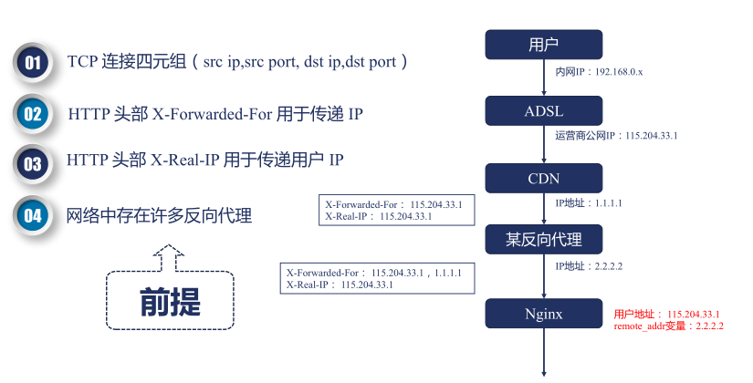

配置文件详解

```nginx
user nginx;
worker_processes  8;
worker_cpu_affinity auto;
#worker_cpu_affinity 00000001 00000010 00000100 00001000 00010000 00100000 01000000 10000000;
error_log  /var/log/nginx/error.log  error;
pid        /var/run/nginx.pid;
worker_rlimit_nofile 65535;

events {
    use epoll;
    worker_connections  20480;
}

http {
    include       mime.types;
    default_type  application/octet-stream;
    log_format  main  '$remote_addr:$remote_port - $remote_user [$time_local]  $host "$request" '
                      '$status $body_bytes_sent "$http_referer" '
                      '"$http_user_agent" "$http_x_forwarded_for"';
    log_format  prod '$remote_addr|$remote_user|[$time_local]|$request|'
                     '$status|$body_bytes_sent|$http_referer|'
                     '$http_user_agent|$request_time|$host|$upstream_addr|$upstream_response_time';
    
    access_log  /var/log/nginx/access.log  prod;
    
    charset  utf-8;
    fastcgi_intercept_errors on;
    server_names_hash_bucket_size 256;
    client_header_buffer_size 32k;
    large_client_header_buffers 4 128k;

    server_tokens off;
    sendfile on;
    tcp_nopush on;
    tcp_nodelay on;
    #支持ssi包含文件
    ssi on;
    ssi_silent_errors on;
#   ssi_types text/html;

    keepalive_timeout  90;
    client_header_timeout 10;
    client_body_timeout 20;
    
    client_max_body_size 200m;
    client_body_buffer_size  128k;

    limit_req_zone $binary_remote_addr zone=one:10m rate=10000r/s;
    limit_conn_zone $binary_remote_addr zone=addr:10m;

    # include /etc/nginx/gzip.conf;
    gzip on;
	gzip_buffers 4 8k;
	gzip_comp_level 6;
	gzip_disable "MSIE [1-6]\.";
	gzip_http_version 1.1;
	gzip_min_length 1000;
	gzip_proxied any;
	gzip_vary on;
	gzip_types text/plain text/css application/javascript application/x-javascript text/xml application/xml application/xml+rss text/javascript application/json image/jpeg image/gif image/png image/jpg;
    

    # include /etc/nginx/proxy.conf;
    proxy_connect_timeout 90;
	proxy_read_timeout 90;
	proxy_send_timeout 90;
	proxy_buffer_size 32k;
	proxy_buffers 4 64k;
	proxy_busy_buffers_size 128k;
    
    
    # include /etc/nginx/backend.conf;
    upstream my_server_pool {
        server 192.168.1.109:80 weight=1 max_fails=2 fail_timeout=30;
        server 192.168.1.108:80 weight=2 max_fails=2 fail_timeout=30;
    }
    
    include /etc/nginx/conf.d/h5.conf;
}
```

## 1 样例文件解释

```nginx
# 运行Nginx进程的用户
user nginx;
# Nginx开启的进程数，通常设置成和cpu的数量相等
worker_processes  8;
worker_cpu_affinity auto;
# 也可以指定哪个cpu分配给哪个进程
# worker_cpu_affinity 00000001 00000010 00000100 00001000 00010000 00100000 01000000 10000000;

# 定义存储某类型的全局错误的日志位置
# nginx日志分为很多级别 [debug | info | notice | warn | error | crit | alert | emerg]
error_log  /var/log/nginx/error.log  error;
# 指定进程ID（pid）存放的路径 
pid        /var/run/nginx.pid;
# 一个nginx进程打开的最多文件描述符数目，理论值应该是系统的最多打开文件数（ulimit -n）与nginx进程数相除，但是nginx分配请求并不是那么均匀，所以最好与ulimit -n的值保持一致。
worker_rlimit_nofile 65535;

#定义白名单ip列表变量
geo $whiteip_list {     
    default 1;
    127.0.0.1 0;
    192.168.0.167 0;
    192.168.0.48 0;
}

#用map指令映射将白名单列表中客户端请求ip为空串 
map $whiteip_list $limit {
    1 $binary_remote_addr;
    0 "";
}

#当某个IP访问example.com这个域名时，此IP得并发连接超过10，则会报503（Service Temporarily Unavailable），
#表示服务暂时不可用，此时会返回给用户我们事先定义好错误页面。由“limit_conn conn_ip 10;”实现。
limit_conn_zone $limit zone=conn_ip:10m;
#当访问example.com这个域名的连接总数超过1000时，同样会报503，返回定义好的错误页面。
#由“limit_conn conn_server 1000;”实现
limit_conn_zone $limit zone=conn_server:10m;
#当达到最大限制连接数后，记录日志的等级
limit_conn_log_level info;  #[info | notice | warn | error(默认)]
#当超过限制时，返回的状态码（默认是503），code值只能设置在400到599之间
limit_conn_status 503;

#利用令牌桶原理，来限制用户的连接频率
#rate每个IP平均处理的请求频率为每秒一次，此值可以设置成每秒处理请求数或者每分钟处理请求数，但必须是整数。
#所以如果你需要指定每秒处理少于1个的请求，2秒处理一个请求，可以使用 “30r/m”。
limit_req_zone  $limit zone=req_ip:10m rate=10r/s;


events {
    # 使用epoll的I/O模型，用这个模型来高效处理异步事件
    use epoll;
    # 每个进程允许的最多连接数，理论上每台nginx服务器的最大连接数为worker_processes*worker_connections。
    worker_connections  20480;
}


http {
    # 引入文件 mime.types，是一个文件扩展名与文件类型的映射表
    include       mime.types;
    # 指定默认MIME类型为二进制字节流(即下载文件)  
    default_type  application/octet-stream;
    # 定义输出日志的格式
    # 1.$remote_addr 与$http_x_forwarded_for(反向代理服务器) 用以记录客户端的ip地址；
    # 2.$remote_user ：用来记录客户端用户名称；
    # 3.$time_local ：用来记录访问时间与时区；
    # 4.$request  ：用来记录请求的url与http协议
    # 5.$status ：用来记录请求状态； 
    # 6.$body_bytes_sent ：记录发送给客户端文件主体内容大小；
    # 7.$http_referer ：用来记录从那个页面链接访问过来的；
    # 8.$http_user_agent ：记录客户端浏览器的相关信息
    # 9.$request_time ：整个请求的总时间
    # 10.$host变量的值按照如下优先级获得：请求行中的host.请求头中的Host头部.与一条请求匹配的server name.
    # 11.$upstream_addr ：后台upstream的地址，即真正提供服务的主机地址，如10.10.10.100:80
    # 12.$upstream_response_time ：请求过程中，upstream响应时间    
    log_format  main  '$remote_addr - $remote_user [$time_local] "$request" '
                      '$status $body_bytes_sent "$http_referer" '
                      '"$http_user_agent" "$http_x_forwarded_for"';

    log_format  prod '$remote_addr|$remote_user|[$time_local]|$request|'
                     '$status|$body_bytes_sent|$http_referer|'
                     '$http_user_agent|$request_time|$host|$upstream_addr|$upstream_response_time';
    
    # 指定access_log的存放路径、格式和缓存大小
    access_log  /var/log/nginx/access.log  prod;
    
    # 指定编码格式，若网页格式与此不同，将被自动转码
    charset  utf-8;
    # 允许nginx使用error_page处理错误信息，传递4xx和5xx错误信息到客户端
    fastcgi_intercept_errors on;
    
    server_names_hash_bucket_size 256;
    client_header_buffer_size 32k;
    large_client_header_buffers 4 128k;

    # 用户认证
    # yum install httpd-tools               #适用centos
    # sudo apt-get install apache2-utils    #适用ubuntu
    # 生成用户密码文件
    # htpasswd -c /data/.htpasswd user1 
    auth_basic  "User Login";
    auth_basic_user_file  /data/.htpasswd;

    # 隐藏nginx版本号
    server_tokens off;
     # sendfile 指令用于指定 Nginx 是否调用Linux 的 sendfile 函数（zero copy 方式）来输出文件，提高文件传输效率 
    sendfile on;
    # 告诉nginx在一个数据包里发送所有头文件，而不一个接一个的发送。就是说数据包不会马上传送出去，等到数据包最大时，一次性的传输出去，这样有助于解决网络堵塞。
    tcp_nopush on;
    # 不缓存data-sends（关闭 Nagle 算法），这个能够提高高频发送小数据报文的实时性
    tcp_nodelay on;
    #支持ssi包含文件
    ssi on;
    ssi_silent_errors on;
#   ssi_types text/html;
    
    # 启用目录浏览
    # autoindex on;
    # 显示出文件的确切／大概大小：on确切大小，单位是bytes；off大概大小，单位是kB或者MB或者GB
    # autoindex_exact_size off;
    # off显示的文件时间为GMT时间，on显示的文件时间为文件的服务器时间
    # autoindex_localtime on; 

     # 指定客户端连接保持活动的超时时间（单位：秒），超过时间，服务器会关闭连接,太短或者太长都不一定合适，当然，最好是根据业务自身的情况来动态地调整该参数
    keepalive_timeout  90;
    # 客户端向服务端发送一个完整的 request header 的超时时间。如果客户端在指定时间内没有发送一个完整的 request header，Nginx 返回 HTTP 408（Request Timed Out）。
    client_header_timeout 10;
    # 指定客户端与服务端建立连接后发送 request body 的超时时间。如果客户端在指定时间内没有发送任何内容，Nginx 返回 HTTP 408（Request Timed Out）。
    client_body_timeout 20;

    # 客户端请求单个文件的最大字节数,这个参数的设置限制了上传文件的大小。
    client_max_body_size 200m;
    # 当客户端以POST方法提交一些数据到服务端时，会先写入到client_body_buffer中，如果buffer写满会写到临时文件里，建议调整为128k
    client_body_buffer_size  128k;
    

    #利用令牌桶原理，来限制用户的连接频率
	#rate每个IP平均处理的请求频率为每秒一次，此值可以设置成每秒处理请求数或者每分钟处理请求数，但必须是整数。
	#所以如果你需要指定每秒处理少于1个的请求，2秒处理一个请求，可以使用 “30r/m”。
    limit_req_zone $binary_remote_addr zone=one:10m rate=10000r/s;
    limit_conn_zone $binary_remote_addr zone=addr:10m;
    
    # include /etc/nginx/gzip.conf;
    gzip on;
	gzip_buffers 4 8k;
	gzip_comp_level 6;
	gzip_disable "MSIE [1-6]\.";
	gzip_http_version 1.1;
	gzip_min_length 1000;
	gzip_proxied any;
	gzip_vary on;
	gzip_types text/plain text/css application/javascript application/x-javascript text/xml application/xml application/xml+rss text/javascript application/json image/jpeg image/gif image/png image/jpg;

    #FastCGI相关参数是为了改善网站的性能：减少资源占用，提高访问速度。
    fastcgi_connect_timeout 300;
    fastcgi_send_timeout 300;
    fastcgi_read_timeout 300;
    fastcgi_buffer_size 64k;
    fastcgi_buffers 4 64k;
    fastcgi_busy_buffers_size 128k;
    fastcgi_temp_file_write_size 128k;

    # include /etc/nginx/proxy.conf;
    #反向代理
    # nginx跟后端服务器连接超时时间(代理连接超时)
	proxy_connect_timeout 90;
    # 连接成功后，后端服务器响应时间(代理接收超时)
	proxy_read_timeout 90;
    # 后端服务器数据回传时间(代理发送超时)
	proxy_send_timeout 90;
    # 设置代理服务器（nginx）保存用户头信息的缓冲区大小
	proxy_buffer_size 32k;
    # proxy_buffers缓冲区
	proxy_buffers 4 64k;
    # 高负荷下缓冲大小（proxy_buffers*2）
	proxy_busy_buffers_size 128k;
    # 设定缓存文件夹大小，大于这个值，将从upstream服务器传
    proxy_temp_file_write_size 64k;
    
    
    #反向代理缓存目录
    proxy_cache_path /data/proxy/cache levels=1:2 keys_zone=cache_one:500m inactive=1d max_size=1g;
    #levels=1:2 设置目录深度，第一层目录是1个字符，第2层是2个字符
    #keys_zone:设置web缓存名称和内存缓存空间大小
    #inactive:自动清除缓存文件时间。
    #max_size:硬盘空间最大可使用值。
    #指定临时缓存文件的存储路径(路径需和上面路径在同一分区)
    proxy_temp_path /data/proxy/temp

    # include /etc/nginx/backend.conf;  
    # 负载均衡服务器池
    upstream my_server_pool {
        #调度算法
        #1.轮循（默认）（weight轮循权值）
        #2.ip_hash：根据每个请求访问IP的hash结果分配。（会话保持）
        #3.fair:根据后端服务器响应时间最短请求。（upstream_fair模块）
        #4.url_hash:根据访问的url的hash结果分配。（需hash软件包）
        #参数：
        #down：表示不参与负载均衡
        #backup:备份服务器
        #max_fails:允许最大请求错误次数
        #fail_timeout:请求失败后暂停服务时间。
        server 192.168.1.109:80 weight=1 max_fails=2 fail_timeout=30;
        server 192.168.1.108:80 weight=2 max_fails=2 fail_timeout=30;
    }
    
    # 指明包含进来的其他配置文件
    include /etc/nginx/conf.d/h5.conf;
    # 虚拟主机定义
    server {
        # 监听端口
        listen       80; 
        #listen     443;
        # 访问域名
        server_name  example.com;

        # 编码格式，若网页格式与此不同，将被自动转码
        #charset utf-8;

        # 虚拟主机访问日志定义
        #access_log  logs/host.access.log  main;

        # 申请的证书zip包中一般含有如下三个文件：
        # SSL 凭证(例如: ssl_certificate.crt,或称最终实体凭证, 公钥凭证或身份验证凭证)
        # 中继CA凭证(例如: IntermediateCA.crt, 或称信任链凭证或SSL凭证的签名者/发行人)
        # 私钥文件(例如: private.key, 生成凭证签章要求(CSR)的时候建立的)
        #
        # nginx的配置特殊地方: 需要合并SSL凭证和中继CA凭证, 即:
        #   cat ssl_certificate.crt IntermediateCA.crt >> your_domain_name.crt
        # 注意：-----END CERTIFICATE----------BEGIN CERTIFICATE-----需要调整为：
        #   -----END CERTIFICATE-----
        #   -----BEGIN CERTIFICATE-----
        # 否则启动时出错，即SSL: error:0906D066:PEM routines:PEM_read_bio:bad end line
        #
        ssl on;  
        #虚拟主机的证书文件  
        ssl_certificate /etc/ssl/your_domain_name.crt; #合并SSL凭证和中继CA凭证的文件
        #虚拟主机私钥文件  
        ssl_certificate_key /etc/ssl/your_domain_name.key; #私钥文件

        # 匹配URL
        location / {
            # 定义默认网站根目录位置
            root   html;
            # 定义首页索引文件的名称，按以下顺序匹配
            index  index.html index.htm index.php;

            #反向代理缓存设置命令(proxy_cache zone|off,默认关闭所以要设置)
            proxy_cache cache_one;
            #对不同的状态码缓存不同时间
            proxy_cache_valid 200 304 12h;
            #设置以什么样参数获取缓存文件名
            proxy_cache_key $host$uri$is_args$args;
            #后7端的Web服务器可以通过X-Forwarded-For获取用户真实IP
            proxy_set_header Host $host;
            proxy_set_header X-Real-IP $remote_addr; 
            proxy_set_header X-Forwarded-For $proxy_add_x_forwarded_for;
            #nginx反向代理隐藏响应头，多个代理情况下也可以写到http段里面
            proxy_hide_header X-Application-Context;
            #代理设置
            proxy_pass   http://my_server_pool; 
            #文件过期时间控制
            expires    1d;

            #限制某个IP来源的连接并发数，此处为10个
            limit_conn conn_ip 10;
            #限制某个虚拟服务器的总连接数，此处为1000个
            limit_conn conn_server 1000;
            #限制带宽, 每个连接只允许最大5kb/s的速度进行下载
            limit_rate 5k;

            #burst=5这个配置的意思是设置一个大小为5的缓冲区，当有大量请求（爆发）过来时，
            #超过了访问频次限制的请求可以先放到这个缓冲区内，如果此缓冲区也满了则会返回503
            #nodelay 如果设置此参数，超过访问频次而且缓冲区也满了的时候就会直接返回503，如果没有设置，则所有请求会等待排队
            limit_req zone=req_ip burst=5;
            #limit_req zone=req_ip burst=5 nodelay;
        }

        location /download {
            #限制IP访问
            deny 192.168.0.2；
            allow 192.168.0.0/24;
            allow 192.168.1.1;
            deny all;
        }

        #静态文件，nginx自己处理
        location ~ ^/(images|javascript|js|css|flash|media|static)/ {
            access_log off;  #关闭access_log，即不记录访问日志
            #过期30天，静态文件不怎么更新，过期可以设大一点，
            #如果频繁更新，则可以设置得小一点。
            expires 30d;
        }

        # 发生 404 错误时返回 404.html页面
        #error_page  404              /404.html;

        # redirect server error pages to the static page /50x.html
        #
        # 发生 50x 错误时使用 50x.html
        error_page   500 502 503 504  /50x.html;
        location = /50x.html {
            root   html;
        }

        # 将 PHP 脚本请求全部转发给 FastCGI（127.0.0.1:9000）处理
        # pass the PHP scripts to FastCGI server listening on 127.0.0.1:9000
        #
        location ~ \.php$ {
            fastcgi_pass   127.0.0.1:9000;
            fastcgi_index  index.php;
            fastcgi_param  SCRIPT_FILENAME  $document_root$fastcgi_script_name;
            # 引入文件，fastcgi的默认配置参数
            include        fastcgi_params;
        }
    }
}
```

## 2 配置CPU参数

Nginx默认没有开启利用多核cpu，我们可以通过增加worker_cpu_affinity配置参数来充分利用多核cpu的性能。cpu是任务处理，计算最关键的资源，cpu核越多，性能就越好。

### 2.1 nginx worker_processes

worker_processes最多开启8个，8个以上性能就不会再提升了，而且稳定性会变的更低，因此8个进程够用了；

### 2.2 nginx worker_cpu_affinity

cpu有多少个核？就有几位数，1代表内核开启，0代表内核关闭；

例如：我有一个服务器是最低配，8核CPU，nginx配置信息则如下：

```nginx
worker_processes 8;
worker_cpu_affinity 00000001 00000010 00000100 00001000 00010000 00100000 01000000 10000000;
```

上面的配置表示：8核CPU，开启8个进程。

> 我其实把`nginx worker_cpu_affinity`参数通常设置为`auto`

###  2.3 实例

**2核CPU，开启2个进程**

```nginx
worker_processes 2;
worker_cpu_affinity 01 10;
```

**2核CPU，开启4进程**

```nginx
worker_processes 4;
worker_cpu_affinity 01 10 01 10;
```

**2核CPU，开启8进程**

```nginx
worker_processes 8;
worker_cpu_affinity 01 10 01 10 01 10 01 10;
```

**8核CPU，开启2进程**

```nginx
worker_processes 2;
worker_cpu_affinity 10101010 01010101;
```

> 10101010表示开启了第2,4,6,8内核，01010101表示开始了1,3,5,7内核；
>
> 如果多个CPU内核的利用率都相差不多，证明nginx己经成功的利用了多核CPU。
>
> 测试结束后，CPU内核的负载应该都同时降低。

## 3 Module ngx_http_gzip_module

该`ngx_http_gzip_module`模块是一个使用“gzip”方法压缩响应的过滤器。这通常有助于将传输数据的大小减少一半甚至更多。

> 使用SSL / TLS协议时，压缩的响应可能会受到 [BREACH](https://en.wikipedia.org/wiki/BREACH)攻击。

在实际的应用中我们发现压缩的比率往往在 3 到 10 倍，也就是本来 50k 大小的页面，采用压缩后实际传输的内容大小只有 5 至 15k 大小，这可以大大节省服务器的网络带宽，同时如果应用程序的响应足够快时，网站的速度瓶颈就转到了网络的传输速度上，因此内容压缩后就可以大大的提升页面的浏览速度。

### 3.1 Example Configuration

```
gzip on;
gzip_buffers 4 8k;
gzip_comp_level 6;
gzip_disable "MSIE [1-6]\.";
gzip_http_version 1.1;
gzip_min_length 1000;
gzip_proxied any;
gzip_vary on;
gzip_types text/plain text/css application/javascript application/x-javascript text/xml application/xml application/xml+rss text/javascript application/json image/jpeg image/gif image/png image/jpg;
```

### 3.2 Directives

**gzip**

```
Syntax:	gzip on | off;
Default: gzip off;
Context:	http, server, location, if in location
```

启用或禁用gzipping响应。

**gzip_buffers**

```
Syntax:	gzip_buffers number size;
Default: gzip_buffers 32 4k|16 8k;
Context:	http, server, location
```

设置用于压缩响应的缓冲区`*number*`和`*size*`。默认情况下，缓冲区大小等于一个内存页面。这是4K或8K，具体取决于平台。

**gzip_comp_level**

```
Syntax:	gzip_comp_level level;
Default: gzip_comp_level 1;
Context:	http, server, location
```

设置`level`响应的gzip压缩。可接受的值范围为1到9。

推荐6压缩级别(级别越高,压的越小,越浪费CPU计算资源)

**gzip_disable**

```
Syntax:	gzip_disable regex ...;
Default: —
Context:	http, server, location
```

对具有与任何指定正则表达式匹配的“User-Agent”标头字段的请求禁用gzipping响应。

特殊掩码“ `msie6`”（0.7.12）对应于正则表达式“ `MSIE [4-6]\.`”，但效果更快。

**gzip_http_version**

```
Syntax:	gzip_http_version 1.0 | 1.1;
Default: gzip_http_version 1.1;
Context:	http, server, location
```

设置压缩响应所需的最低HTTP请求版本。

99.99%的浏览器基本上都支持gzip解压了，所以可以不用设这个值,保持系统默认即可。

**gzip_min_length**

```
Syntax:	gzip_min_length length;
Default: gzip_min_length 20;
Context:	http, server, location
```

设置将被gzip压缩的响应的最小长度。长度仅由“Content-Length”响应头字段确定。

**gzip_proxied**

```
Syntax:	gzip_proxied off | expired | no-cache | no-store | private | no_last_modified | no_etag | auth | any ...;
Default: gzip_proxied off;
Context:	http, server, location
```

根据请求和响应启用或禁用对代理请求的响应的gzipping。请求被代理的事实由“Via”请求头字段的存在确定。该指令接受多个参数：

* `off`：禁用所有代理请求的压缩，忽略其他参数;
* `expired`：如果响应头包含“Expires”字段，其值为禁用缓存，则启用压缩;
* `no-cache`：如果响应头包含带有“ `no-cache`”参数的“Cache-Control”字段，则启用压缩;
* `no-store`：如果响应头包含带有“ `no-store`”参数的“Cache-Control”字段，则启用压缩;
* `private`：如果响应头包含带有“ `private`”参数的“Cache-Control”字段，则启用压缩;
* `no_last_modified`：如果响应头不包含“Last-Modified”字段，则启用压缩;
* `no_etag`：如果响应头不包含“ETag”字段，则启用压缩;
* `auth`：如果请求标头包含“授权”字段，则启用压缩;
* `any`：为所有代理请求启用压缩。

**gzip_types**

```
Syntax:	gzip_types mime-type ...;
Default:	
gzip_types text/html;
Context:	http, server, location
```

除了“ `text/html`” 之外，还允许对指定的MIME类型进行gzipping响应。特殊值“ `*`”匹配任何MIME类型。

> 图片类型的文件压缩比例很小，可以不忽略不计，所以图片不建议压缩

**gzip_vary**

```
Syntax:	gzip_vary on | off;
Default:	
gzip_vary off;
Context:	http, server, location
```

如果指令[gzip](http://nginx.org/en/docs/http/ngx_http_gzip_module.html#gzip)， [gzip_static](http://nginx.org/en/docs/http/ngx_http_gzip_static_module.html#gzip_static)或[gunzip](http://nginx.org/en/docs/http/ngx_http_gunzip_module.html#gunzip) 处于活动状态， 则启用或禁用插入“Vary：Accept-Encoding”响应头字段 。

### 3.3 常见问题

**调用接口时，返回json乱码的问题**

原因：

gzip是nginx的压缩格式。（gzip是浏览器可接受的压缩格式） 但是我们调用接口并没有通过浏览器。所以没有办法对返回的结果进行解压。

解决办法：

* 在响应的`location`中关闭gzip
* 或者让后端改代码，增加判断，然后用gzip流的方式进行解压读取

## 2 HTTP模块

### 配置块的嵌套

```nginx
http {
    upstream {...}
    split_clients {...}
    map {...}
    geo {...}
    server {
        if () {...}
        location {
            limit_except {...}
        }
        location {
            location {
                
            }
        }
    }
    server {
    }
}
```

### 指令的合并

* 值指令：存储配置项的值
  * 可以合并
  * 示例：root，access_log，gzip
* 动作类指令：指定行为
  * 不可以合并
  * 示例：rewrite，proxy_pass
  * 生效阶段：server_rewrite阶段，rewrite阶段，content阶段

**存储值的指令继承规则：向上覆盖**

* 子配置不存在时，直接使用父配置块
* 子配置存在时，直接覆盖父配置块

```nginx
server {
    listen 8080;
    root /home/geek/nginx/html;
    access_log logs/geek.access.log main;
    location /test {
        root /home/geek/nginx/test;
        access_log logs/access.test.log main;
    }
    location /dlib {
        alias dlib/;
    }
    location / {
    }
}
```


### Listen 指令

#### Example Configuration


#### Directives


### 正则表达式


### server_name指令

* 指令后可以跟多个域名，第一个是主域名
* *泛域名：进支持在最前或最后（`server_name *.baiud.com;`）
* 正则表达式：加`~`前缀 (`server_name  www.taohui.tech ~^www\d+\.taohui\.tech$;`)

**用正则表达式创建变量：用小括号()**

示例

```nginx
server {
    server_name ~^(www\.)?(.+)$;
    location / {
        root /sites/$2;
    }
}
server {
    server_name ~^(www\.)?(?<domain>.+)$;
    locatoin / {
        root /sites/$domain;
    }
}
```

**其他**

* .taohui.tech 可以匹配 taohui.tech *.taohui.tech
* _ 匹配所有
* “” 匹配没有传递Host头部

#### 匹配顺序

1）精准匹配

2）*在前的泛域名

3）*在后的泛域名

4）按文件中的顺序匹配正则表达式域名

5）default server 匹配第1个，listen指定default

### HTTP请求处理时的11个阶段


### 用户ip

如何拿到真实的用户ip地址？



拿到真实用户ip后如何使用？

基于变量：如binary_remote_addr、remote_addr这样的变量，其值就为真实的IP！这样做连接限制（limit_conn模块）才有意义！

### realip模块

* 默认不会编译进Nginx，通过`--with-http_reaip_module`启用功能
* 功能：修改客户端地址
* 指令：set_real_ip_from、real_ip_header、real_ip_recursive
* 变量：reaip_remote_addr、reaip_remote_port

#### Directives


### Module ngx_http_log_module

##### Example Configuration

```nginx
log_format compression '$remote_addr - $remote_user [$time_local] '
                       '"$request" $status $bytes_sent '
                       '"$http_referer" "$http_user_agent" "$gzip_ratio"';

access_log /spool/logs/nginx-access.log compression buffer=32k;
```

##### Directives

###### [access_log](http://nginx.org/en/docs/http/ngx_http_log_module.html#access_log)

```
Syntax:	access_log path [format [buffer=size] [gzip[=level]] [flush=time] [if=condition]];
		access_log off;
Default:	access_log logs/access.log combined;
Context:	http, server, location, if in location, limit_except
```

###### [log_format](http://nginx.org/en/docs/http/ngx_http_log_module.html#log_format)

```
Syntax:	log_format name [escape=default|json|none] string ...;
Default:	log_format combined "...";
Context:	http
```


### Rewrite模块

#### return指令

```
Syntax:	return code [text];
		return code URL;
		return URL;
Default:	—
Context:	server, location, if
```

**返回状态码**

* nginx自定义
  * 444：关闭连接
* HTTP1.0标准
  * 301：http1.0永久重定向
  * 302：临时重定向，禁止被缓存
* HTTP1.1标准
  * 303：临时重定向，允许改变方法，禁止被缓存
  * 307：临时重定向，不允许改变方式，禁止被缓存
  * 308：永久重定向，不允许改变方法

**示例**

```nginx
server {
    server_name wiki.clay-wangzhi.com;
    listen 8080;
    
    root html/;
    error_page 404/403.html;
    return 403;
    location / {
        return 404 "find nothing!";
    }
}
```

return指令与errror_page，后续补充

#### rewrite指令

```
Syntax:	rewrite regex replacement [flag];
Default:	—
Context:	server, location, if
```

**功能**

* 将regex指定的url替换成replacement这个新的url

  可以使用正则表达式及变量提取

* 当replacement以http://或者https://或者$schema开头，则直接返回302重定向

* 替换后的url根据flag指定的方式进行处理

  如果在同一级配置块中存在多个rewrite规则，那么会自下而下逐个检查；被某条件规则替换完成后，会重新一轮的替换检查，因此，隐含有循环机制；[flag]所表示的标志位用于控制此循环机制；

  * last：
    * 浏览器地址栏URL地址不变
    * 用replacement这个URI进行新的location匹配，重写完成后停止对当前URI在当前location中后续的其它重写操作，而后对新的URI启动新一轮重写检查；提前重启新一轮循环；
  * beak：
    * 浏览器地址栏URL地址不变
    * break指令停止当前脚本指令的执行，等价于独立的break指令,重写完成后停止对当前URI在当前location中后续的其它重写操作，而后直接跳转至重写规则配置块之后的其它配置；结束循环；

  * redirect：
    * 浏览器地址会显示跳转后的URL地址
    * 返回302临时重定向，
  * permanent：
    *  浏览器地址会显示跳转后的URL地址
    * 返回301永久重定向

**示例1**

```nginx
        root html/;
        location /first {
            rewrite /first(.*) /second$1 last;
            return 200 'first!';
        }

        location /second {
            rewrite /second(.*) /third$1 break;
            return 200 'second!';
        }

        location /third {
            return 200 'third!';
        }
```

访问/first/1.txt的结果为：`html/third/1.txt`的内容

访问/second/1.txt的结果为：`html/third/1.txt`的内容

访问/third/1.txt的结果为：`third`的内容

**示例**2

```nginx
# http://www.test.com/test/abc/1.html ⇒ http://www.test.com/ccc/bbb/2.html
location /test {
    rewrite .* /ccc/bbb/2.html permanent;
}

# http://www.test.com/2015/ccc/bbb/2.html ==> http://www.test.com/2014/ccc/bbb/2.html
location /2015 {
    rewrite ^/2015/(.*)$ /2014/$1 permanent;
}

# http://www.test.com/2015/ccc/bbb/2.html  ==> http://jd.com/index.php
location /2015 {
    if ($host ~* test.com) {
        rewrite .* http://www.jd.com/index.php permanent;
    }
}

# http://www.test.com/kkk/1.html ==> http://jd.com/kkk/1.html
location / {
    root html;
    index index.html index.htm;
    if ($host ~* test.com) {
        rewrite .* http://www.jd.com/$request_uri permanent;
    }
}

# 有时候在访问一个二级子目录时会出现目录后的/无法补齐，如：
#  elinks --dump www.test.com/www  无法访问
#  elinks --dump www.test.com/www/可以访问 
if (-d $request_filename) {
    rewrite ^(.*)([^/])$ http://$host$1$2/ permanent;
}
# ^/(.*)([^/])$表示以/符号开始并紧跟着任何字符，同时不是以/为结束的字符串，在我的url中，(.*)表示的ww，([^/])表示的w

# http://www.test.com/login/robin.html     ==>  http://www.test.com/reg/login.php?user=robin
location /login {
    rewrite ^/login/(.*)\.html$ /reg/login.php?user=$1 permanent;
}

# http://www.test.com/uplook/10-10-10.html  ==>  http://www.test.com/uplook/10/10/10.html 
location /uplook {
    rewrite ^/uplook/([0-9]+)-([0-9]+)-([0-9]+)\.html$ /uplook/$1/$2/$3.html permanent;
}

# set 指令是用于定义一个变量，并且赋值。应用于server,location,if环境。
# http://robin.test.com ==> http://www.test.com/robin
# http://zorro.test.com ==> http://www.test.com/zorro
if ($host ~* "^www.test.com$") {
    break;
}
if ($host ~* "^(.*)\.test\.com$") {
    set $user $1;
    rewrite .* http://www.test.com/$user permanent;
}
```

#### rewrite_log

```
Syntax:	rewrite_log on | off;
Default:	rewrite_log off;
Context:	http, server, location, if
```

#### if

```
Syntax:	if (condition) { ... }
Default:	—
Context:	server, location
```

规则：条件condition为真，则执行大括号内的指令；遵循值指令的继承规则

**if指令的条件表达式**

* 检查变量为空或者值是否为0，直接使用
* 将变量与字符串做匹配，使用=或者!=
* 将变量与正则表达式做匹配
  * 大小写敏感，~或者!~
  * 大小写不敏感，~*或者~~*
* 检查文件是否存在，使用-f或者!-f
* 检查目录是否存在，使用-d或者!-d
* 检查文件、目录、软连接是否存在，使用-e或者!-e
* 检查是否为可执行文件，使用-x或者!-x

**示例**

```nginx
if ($http_user_agent ~ MSIE) {
    rewrite ^(.*)$ /msie/$1 break;
}
if ($http_cookie ~* "id=([^;]+)(?:;|$)") {
    set $id $1;
}
if ($repuest_method = POST) {
    return 405;
}
if ($slow) {
    limit_rate 10k;
}
if ($invalid_referer) {
    return 403;
}
```

### try_files指令

```
Syntax:	try_files file ... uri;
try_files file ... =code;
Default:	—
Context:	server, location
```

**示例**

```nginx
try_files $uri $uri/ /test/;
```

功能：依次试图访问多个url对应的文件（由root或者alias指令指定），当文件存在是直接返回文件内容，如果所有文件都不存在，则按最后一个URL结果或者code返回

## 4 location模块

### 4.1 匹配模式优先级

```
location = /uri 　　　=开头表示精确匹配，只有完全匹配上才能生效。
location ^~ /uri 　　^~ 开头对URL路径进行前缀匹配，并且在正则之前。无正则普通匹配（^ 表示“非”，~ 表示“正则”，字符意思是：不要继续匹配正则）
location ~ pattern 　~开头表示区分大小写的正则匹配。!~为区分大小写不匹配的正则
location ~* pattern 　~*开头表示不区分大小写的正则匹配。!~*为不区分大小写不匹配的正则
location /uri 　　　　不带任何修饰符，也表示前缀匹配，但是在正则匹配之后。
location / 　　　　　通用匹配，任何未匹配到其它location的请求都会匹配到，相当于switch中的default。
```

注意：
前缀匹配，如果有包含关系时，按最大匹配原则进行匹配。比如在前缀匹配：location /dir1与location /dir1/dir2，如有请求http://localhost/dir1/dir2/file将最终匹配到location /dir1/dir2

优先级：
(location =) > (location 完整路径) > (location ^~ 路径) > (location ~,~* 正则顺序) > (location 部分起始路径) > (/)

> 上述的优先级不完全正确

具体规则：

等号类型（=）的优先级最高。一旦匹配成功，则不再查找其他location的匹配项

剩下的几种匹配优先级略复杂，具体可以参考Nginx文档（http://nginx.org/en/docs/http/ngx_http_core_module.html#location）

* ^~和普通匹配。

  使用前缀匹配，不支持正则表达式，如果有多个location匹配成功的话，不会终止匹配过程，会记忆表达式最长的那个。

* 如果上一步得到的最长的location为^~类型，则表示阻断正则表达式，不再匹配正则表达式

* 如果上一步得到的最长的location不是^~类型，继续匹配正则表达式，只要有一个正则成功，则使用这个正则的location，立即返回结果，并结束解析过程

**“最长”命中**

^~和普通命中，都是优先使用匹配最长的结果，示例如下：

**例子1**

```nginx
location /test_1 {
    return 400;
}
location ^~ /test {
    return 401;
}
```

如上如果path为/test_1，返回的是400，说明^~优先级并不比普通匹配高

**例子2**

```nginx
location /test_1 {
    return 400;
}
location ^~ /test {
    return 401;
}
location ~ /test {
    return 402;
}
```

如上如果path为/test_1，返回的是402，此时^~和普通匹配只记住了最长一个location /test_1，不会阻止正则

如果path为/test，返回401，此时^~和普通匹配只记住了最长一个location ^~ /test，会阻止正则

### 4.2 路径替换

**规则**

配置proxy_pass时，可以实现URL路径的部分替换。

proxy_pass的目标地址，默认不带/，表示只代理域名，url和querystring部分不会变（把请求的path拼接到proxy_pass目标域名之后作为代理的URL）。

如果在目标地址后增加/，则表示把path中location匹配成功的部分剪切掉之后再拼接到proxy_pass目标地址。

比如请求 /a/b.html

```nginx
location /a {
    proxy_pass http://server;
}
```

```nginx
location /a/ {
    proxy_pass http://server/;
}
```

如上两个匹配成功后，实际代理的目标url分别是

http://server/a/b.html (把/a/b.html拼接到http://server之后)

http://server/b.html (把/a/b.html的/a/去掉之后，拼接到http://server/之后)

> 通过 Nginx Server 访问 `http://nginx/nginx_location/some/path`
>
> `proxy_pass`直接映射到主机的 `/test`
>
> 建议location和proxy_pass后面都加上/，否则容易引起混乱。
>
> | location           | proxy_pass            | 实际访问目标                   |
> | ------------------ | --------------------- | ------------------------------ |
> | `/nginx_location/` | `http://server/test/` | `http://server/test/some/path` |

**要求**

注意的是，对于location为正则表达式的匹配，proxy_pass的目标地址不可以带/

比如，如下配置会报错：

```nginx
location ~ /abc(.*) {
    proxy_pass   http://127.0.0.1/;
}
```

如果是正则表达式，想要实现proxy_pass的路径替换，可以使用如下方式：

```nginx
location ~ /abc(.*) {
    proxy_pass   http://127.0.0.1/$1;
}
```

## 5 root和alias的使用

nginx指定文件路径有两种方式root和alias，

root与alias主要区别在于nginx如何解释location后面的uri，

这会使两者分别以不同的方式将请求映射到服务器文件上。


### 5.1 最基本的区别

alias 指定的目录是准确的，给location指定一个目录。

root 指定目录的上级目录，并且该上级目录要含有locatoin指定名称的同名目录。

以root方式设置资源路径：

```
语法: root path;
配置块: http、server、location、if
```

以alias 方式设置资源路径

```
语法: alias path;
配置块: location
```

Example:

```
location /img/ {
	alias /var/www/image/;
}
#若按照上述配置的话，则访问/img/目录里面的文件时，ningx会自动去/var/www/image/目录找文件
location /img/ {
	root /var/www/image;
}
#若按照这种配置的话，则访问/img/目录下的文件时，nginx会去/var/www/image/img/目录下找文件
```


注意： 

```
1.使用alias时，目录名后面一定要加”/“。
2.使用alias标签的目录块中不能使用rewrite的break。
3.alias在使用正则匹配时，必须捕捉要匹配的内容并在指定的内容处使用。
4.alias只能位于location块中
```

所以使用nginx设置root时要注意一个问题，就是如果该root设置的前端目录不是根目录，那么在写root的绝对地址时，要把前端目录的部分省略掉。
我们用设置虚拟目录指向的alias来和root比较一下就非常明显了

```
location /abc/ {   alias /home/html/abc/; }  
```

在这段配置下，http://test/abc/a.html就指定的是 /home/html/abc/a.html。这段配置亦可改成

```
location /abc/ {   root /home/html/;} 
```

可以看到，使用root设置目录的绝对路径时，少了/abc,也就是说，使用root来设置前端非根目录时，nginx会组合root和location的路径,即 /home/html/abc/。

## 5 rewrite指令

rewrite功能就是，使用nginx提供的全局变量或自己设置的变量，结合正则表达式和标志位实现url重写以及重定向。
rewrite只能放在server{},location{},if{}中，并且只能对域名后边的除去传递的参数外的字符串起作用，
例如 http://seanlook.com/a/we/index.php?id=1&u=str 只对/a/we/index.php重写。
语法rewrite regex replacement [flag] 。执行顺序是：

```
1.执行server块的rewrite指令
2.执行location匹配
3.执行选定的location中的rewrite指令
```

rewrite指令的最后一项参数为flag标记，支持flag标记有：

```
1.last  相当于apache里面的[L]标记，浏览器地址栏URL地址不变。若不指明last或者break，默认是last。
    会转到匹配新的location，其他的rewrite语句和其他语句不会执行
2.break  本条规则匹配完成后，继续完成本location中非rewrite的语句，而不跳转到新的location，
    浏览器地址栏URL地址不变
3.redirect  返回302临时重定向，浏览器地址会显示跳转后的URL地址。
4.permanent  返回301永久重定向， 浏览器地址会显示跳转后的URL地址。
```

因为301和302不能简单的只返回状态码，还必须有重定向的URL，这就是return指令无法返回301, 302的原因了。
这里last和break区别有点难以理解：

```
last 一般写在server和if中，而break一般使用在location中
last 不终止重写后的url匹配，即新的url会再从server走一遍匹配流程，而break终止重写后的匹配
break和last 都能组织继续执行后面的rewrite指令
```

例如：

```
server {
   listen 80 default_server;
   server_name example.com;
   root www;

   location /break/ {
       rewrite ^/break/(.*) /test/$1 break;
       echo "break page";
   } 

   location /last/ {
        rewrite ^/last/(.*) /test/$1 last;
        echo "last page";
   }    

   location /test/ {
      echo "test page";
   }
}
```

请求1：http://example.com/break/***，输出"break page”
请求2：http://example.com/last/***，输出"test page”

## 6 if判断指令

语法为 if(condition) {…}，对给定的条件 condition 进行判断。如果为真，大括号内的 rewrite 指令将被执行，
if 条件(conditon)可以是如下任何内容：

```
当表达式只是一个变量时，如果值为空或任何以 0 开头的字符串都会当做 false
直接比较变量和内容时，使用 = 或 !=
~ 正则表达式匹配，~* 不区分大小写的匹配，!~ 区分大小写的不匹配
-f 和 !-f 用来判断是否存在文件
-d 和 !-d 用来判断是否存在目录
-e 和 !-e 用来判断是否存在文件或目录
-x 和 !-x 用来判断文件是否可执行
```

## 7 全局变量

```
$args ： #这个变量等于请求行中的参数，同$query_string
$content_length ： 请求头中的Content-length字段。
$content_type ： 请求头中的Content-Type字段。
$document_root ： 当前请求在root指令中指定的值。
$host ： 请求主机头字段，否则为服务器名称。
$http_user_agent ： 客户端agent信息
$http_cookie ： 客户端cookie信息
$limit_rate ： 这个变量可以限制连接速率。
$request_method ： 客户端请求的动作，通常为GET或POST。
$remote_addr ： 客户端的IP地址。
$remote_port ： 客户端的端口。
$remote_user ： 已经经过Auth Basic Module验证的用户名。
$request_filename ： 当前请求的文件路径，由root或alias指令与URI请求生成。
$scheme ： HTTP方法（如http，https）。
$server_protocol ： 请求使用的协议，通常是HTTP/1.0或HTTP/1.1。
$server_addr ： 服务器地址，在完成一次系统调用后可以确定这个值。
$server_name ： 服务器名称。
$server_port ： 请求到达服务器的端口号。
$request_uri ： 包含请求参数的原始URI，不包含主机名，如：”/foo/bar.php?arg=baz”。
$uri ： 不带请求参数的当前URI，$uri不包含主机名，如”/foo/bar.html”。
$document_uri ： 与$uri相同。
```

## 8 linux内核参数优化（网络模块）

在Linux下调整内核参数，可以直接编辑配置文件`/etc/sysctl.conf`，然后执行`sysctl -p`命令生效

文件内容如下：

```
net.ipv4.ip_forward = 1
net.ipv4.conf.default.rp_filter = 1
net.ipv4.conf.default.accept_source_route = 0
kernel.sysrq = 0
kernel.core_uses_pid = 1
kernel.msgmnb = 65536
kernel.msgmax = 65536
kernel.shmmax = 68719476736
kernel.shmall = 268435456
net.core.wmem_default = 8388608
net.core.rmem_default = 8388608
net.core.rmem_max = 16777216
net.core.wmem_max = 16777216
net.core.somaxconn = 262144
net.core.netdev_max_backlog = 262144
net.ipv4.tcp_max_orphans = 262144
net.ipv4.tcp_max_tw_buckets = 6000
net.ipv4.tcp_tw_recycle = 0
net.ipv4.tcp_timestamps = 1
net.ipv4.tcp_tw_reuse = 1
net.ipv4.tcp_syncookies = 1
net.ipv4.tcp_max_syn_backlog = 30000
net.ipv4.tcp_syn_retries = 1
net.ipv4.tcp_synack_retries = 1
net.ipv4.ip_local_port_range = 1024 65000
net.ipv4.tcp_fin_timeout = 30
net.ipv4.tcp_keepalive_time = 30
net.ipv4.tcp_sack = 1
net.ipv4.tcp_window_scaling = 1
net.ipv4.tcp_rmem = 4096 87380 4194304
net.ipv4.tcp_wmem = 4096 65536 4194304
net.ipv4.tcp_mem = 524288 699050 1048576
vm.swappiness = 0
vm.min_free_kbytes = 65536
```

* net.core.somaxconn = 262144

  web应用中listen函数的backlog默认会给我们内核参数的net.core.somaxconn限制到128，而nginx定义的NGX_LISTEN_BACKLOG默认为511，所以有必要调整这个值。

* net.core.netdev_max_backlog = 262144

  每个网络接口接收数据包的速率比内核处理这些包的速率快时，允许送到队列的数据包的最大数目。

* net.ipv4.tcp_max_orphans = 262144

  系统中最多有多少个TCP套接字不被关联到任何一个用户文件句柄上。如果超过这个数字，孤儿连接将即刻被复位并打印出警告信息。这个限制仅仅是为了防止简单的DoS攻击，不能过分依靠它或者人为地减小这个值，更应该增加这个值(如果增加了内存之后)。

  

*  net.ipv4.tcp_max_tw_buckets = 6000

  对于tcp连接，服务端和客户端通信完后状态变为timewait，假如某台服务器非常忙，连接数特别多的话，那么这个timewait数量就会越来越大。

  毕竟它也是会占用一定的资源，所以应该有一个最大值，当超过这个值，系统就会删除最早的连接，这样始终保持在一个数量级。
  这个数值就是由net.ipv4.tcp_max_tw_buckets这个参数来决定的。

  CentOS7.6版本，默认为16384，可以使用sysctl -a |grep tw_buckets来查看它的值，可以适当把它调低，比如调整到6000，毕竟这个状态的连接太多也是会消耗资源的。

  但不要把它调到几十、几百这样，因为这种状态的tcp连接也是有用的，如果同样的客户端再次和服务端通信，就不用再次建立新的连接了，用这个旧的通道，省时省力。

* net.ipv4.tcp_tw_recycle = 0

  启用TIME-WAIT状态sockets快速回收功能;用于快速减少在TIME-WAIT状态TCP连接数。1表示启用;0表示关闭。但是要特别留意的是：这个选项一般不推荐启用，因为在NAT(Network Address Translation)网络下，会导致大量的TCP连接建立错误，从而引起网站访问故障。

  实际上，net.ipv4.tcp_tw_recycle功能的开启，要需要net.ipv4.tcp_timestamps（一般系统默认是开启这个功能的）这个开关开启后才有效果；
  当tcp_tw_recycle 开启时（tcp_timestamps 同时开启，快速回收 socket 的效果达到），对于位于NAT设备后面的 Client来说，是一场灾难！
  会导致到NAT设备后面的Client连接Server不稳定（有的 Client 能连接 server，有的 Client 不能连接 server）。

* net.ipv4.tcp_tw_reuse = 1

  开启重用功能，允许将TIME-WAIT状态的sockets重新用于新的TCP连接。这个功能启用是安全的，一般不要去改动！

* net.ipv4.tcp_syncookies = 1

  tcp三次握手中，客户端向服务端发起syn请求，服务端收到后，也会向客户端发起syn请求同时连带ack确认，
  假如客户端发送请求后直接断开和服务端的连接，不接收服务端发起的这个请求，服务端会重试多次，
  这个重试的过程会持续一段时间（通常高于30s），当这种状态的连接数量非常大时，服务器会消耗很大的资源，从而造成瘫痪，
  正常的连接进不来，这种恶意的半连接行为其实叫做syn flood攻击。
  设置为1，是开启SYN Cookies，开启后可以避免发生上述的syn flood攻击。
  开启该参数后，服务端接收客户端的ack后，再向客户端发送ack+syn之前会要求client在短时间内回应一个序号，
  如果客户端不能提供序号或者提供的序号不对则认为该客户端不合法，于是不会发ack+syn给客户端，更涉及不到重试。

* net.ipv4.tcp_max_syn_backlog = 30000

  该参数定义系统能接受的最大半连接状态的tcp连接数。客户端向服务端发送了syn包，服务端收到后，会记录一下，
  该参数决定最多能记录几个这样的连接。在CentOS7，默认是256，当有syn flood攻击时，这个数值太小则很容易导致服务器瘫痪，
  实际上此时服务器并没有消耗太多资源（cpu、内存等），所以可以适当调大它，比如调整到30000。

* net.ipv4.tcp_syn_retries = 1

  该参数适用于客户端，它定义发起syn的最大重试次数，默认为6，建议改为1。

* net.ipv4.tcp_synack_retries = 1

  该参数适用于服务端，它定义发起syn+ack的最大重试次数，默认为5，建议改为1，可以适当预防syn flood攻击。

* net.ipv4.ip_local_port_range = 1024 65000

  该参数定义端口范围，系统默认保留端口为1024及以下，以上部分为自定义端口。这个参数适用于客户端，
  当客户端和服务端建立连接时，比如说访问服务端的80端口，客户端随机开启了一个端口和服务端发起连接，
  这个参数定义随机端口的范围。默认为32768 61000，建议调整为1025 65000。

* net.ipv4.tcp_fin_timeout = 30

  如果套接字由本端要求关闭，这个参数 决定了它保持在FIN-WAIT-2状态的时间。对端可以出错并永远不关闭连接，甚至意外当机。缺省值是60秒。2.2 内核的通常值是180秒，你可以按这个设置，但要记住的是，即使你的机器是一个轻载的WEB服务器，也有因为大量的死套接字而内存溢出的风险，FIN- WAIT-2的危险性比FIN-WAIT-1要小，因为它最多只能吃掉1.5K内存，但是它们的生存期长些。

* net.ipv4.tcp_keepalive_time = 30

  tcp连接状态里，有一个是established状态，只有在这个状态下，客户端和服务端才能通信。正常情况下，当通信完毕，
  客户端或服务端会告诉对方要关闭连接，此时状态就会变为timewait，如果客户端没有告诉服务端，
  并且服务端也没有告诉客户端关闭的话（例如，客户端那边断网了），此时需要该参数来判定。
  比如客户端已经断网了，但服务端上本次连接的状态依然是established，服务端为了确认客户端是否断网，
  就需要每隔一段时间去发一个探测包去确认一下看看对方是否在线。这个时间就由该参数决定。它的默认值为7200秒，建议设置为30秒。

>  参考链接：
>
>  https://jasonhzy.github.io/2017/09/03/nginx/
>
>  https://blog.csdn.net/tzy233/article/details/79780444
>
>  https://blog.csdn.net/Powerful_Fy/article/details/102845921
>
>  https://www.linuxidc.com/Linux/2018-01/150100.htm
>
>  https://www.jianshu.com/p/73e2cd39722c
>
>  https://www.cnblogs.com/my_life/articles/7070805.html
>
>  https://www.jianshu.com/nb/27610173
>
>  http://nginx.org/en/docs/http/ngx_http_core_module.html#variables
>
>  http://nginx.org/en/docs/

