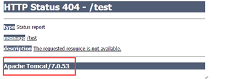
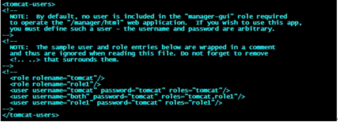

## tomcat安全配置

### 版本安全

升级当前tomcat版本为最新稳定版本。

在升级版本中，需要注意两点：

* 尽量避免跨大版本的升级

* 将当前老版本的server.xml , catalina.sh, web.xml和tomcat-users.xml进行备份，然后部署完新的tomcat

  后，将这些配置文件覆盖过去。

### 隐藏版本信息

当tomcat出现404或其它错误时，就会显示当前版本信息，为避免针对某一版本的攻击，我们应该将其隐藏或伪装

[](http://images2015.cnblogs.com/blog/883007/201703/883007-20170309115430953-532111596.png)

版本信息的显示是由一个jar包控制的，该jar包存放在tomcat安装目录下的lib目录下，名称为catalina.jar.

1. 通过jar xf命令解压这个jar包会得到两个目录META-INF和org, 通过修改

`org/apache/catalina/util/ServerInfo.properties`文件中的`serverinfo`字段来实现更改tomcat版本信息：

```
[root@localhost ~]# cat org/apache/catalina/util/SererInfo.properties | grep -v '^$|#'
server.info=Apache Tomcat/7.0.53
server.number=7.0.53.0
serer.built=Mar 25 2014 06:20:16
```

2. 当然还有另外一种方法来隐藏或伪装版本信息，这两种方法本质是一样的：

```
[root@localhost ~]# cd /usr/local/apache-tomcat-7.0.53/lib
[root@localhost lib]# mkdir -p org/apache/catalina/util
[root@localhost lib]# cd org/apache/catalina/util
[root@localhost util]# vim ServerInfo.properties
server.info=nolinux        # 如果想修改成其它版本号，把这个地方的值改成其它值就行了
```

修改完成之后，重启tomcat即可看到效果！

## tomcat的配置优化

### 优化web.xml

servlet与其它适用于整个Web应用程序设置的配置文件，必须符合servlet规范的标准格式。通过它可以配置你

web应用的相关选项，tomcat在启动的时候会读取这个文件，完成你开发的系统的一些初始化操作。


它可以做如下事情：

- 提供基于servlet的相关配置
- 增加监听器，监控session或在tomcat启动时，加载一些你希望加载的资源。比如创建数据库连接池等
- 设置session过期时间，tomcat默认是30分钟
- 更改应用的默认页面，通常为index.html/index.jsp等
- 增加过滤器， 做一些你希望的过滤操作，比如敏感词汇的过滤
- 增加一些jstl（标准标签库）的定义，方便在jsp中直接include进来
- struts, spring或hibernate的一些配置等

由于在生产环境中，tomcat不会直接对公网提供服务，前端肯定有apache或nginx，因此，默认主页或自定义错

误页，我们都在前端的apache或nginx中完成；另外也有可能是由程序员在项目内的WEB-INF/web.xml中去做定

义。

在tomcat新版本中，默认已经禁止列目录功能。


下面是几种觉的功能，在web.xml中的表现形式：

**站点默认主页：**

[](http://images2015.cnblogs.com/blog/883007/201703/883007-20170309115432156-510569139.png)

**自定义错误页：**

[](http://images2015.cnblogs.com/blog/883007/201703/883007-20170309115433391-770310217.png)

**定义会话超时时间：**

[](http://images2015.cnblogs.com/blog/883007/201703/883007-20170309115434406-473133402.png)

**禁止列目录：**

[](http://images2015.cnblogs.com/blog/883007/201703/883007-20170309115436219-420524753.png)

 

### 优化 tomcat-user.xml

该文件中包含用户名，角色及密码。 负责提供webapps下manager项目的登录认证管理。

在生产环境中，我们需要将该文件全部注释。

[](http://images2015.cnblogs.com/blog/883007/201703/883007-20170309115437938-14814663.png)

###  优化server.xml

* maxThreads连接数限制：

  maxThreads是tomcat所能接受的最大连接数。 一般设置不要超过8000， 如果你的网站访问量非常大可使用

  多个tomcat实例的方法，即在一个服务器上启动多个tomcat，然后做负载均衡。

* tomcat和php不同，php可以按照cpu和内存的情况去配置连接数，所以上万很正常。 但java还需要注意jvm
* 的参数配置。如果不注意就会因为jvm参数过小而崩溃。

* 不要多个虚拟主机：

  强烈建议不要使用tomcat的虚拟主机功能，推荐一个tomcat实例启动一个站点。即，可以启动多个tomcat，而不是一个tomcat里包含多个虚拟主机。 因为tomcat是多线程，共享内存，任何一个虚拟主机中的应用崩溃，都会影响到所有的应用程序。

* 压缩传输：

  tomcat也支持gzip压缩功能。 可以在server.xml配置文件中的Connector节点中配置如下参数，来实现对指定资源类型进行压缩。

  

  ```
  compression="on"             # 打开压缩功能 
  compressionMinSize="50"      # 启用压缩的输出内容大小，默认为2KB 
  noCompressionUserAgents="gozilla, traviata"      # 对于以下的浏览器，不启用压缩 
  compressableMimeType="text/html,text/xml,text/javascript,text/css,text/plain"　# 哪些资源类型需要压缩
  ```

  要注意的是，对于文本信息比如txt, html, css,javascript进行压缩，效果非常好。而对文件，图片，视频不要压缩。

* Connector 连接器的配置

  bio、nio 和 apr，三种方式性能差别很大，apr 的性能最优， bio 的性能最差。而 Tomcat 7 使用的 Connector 默认就启用的 Apr 协议，但需要系统安装 Apr 库，否则就会使用 bio 方式。

配置文件样例，connector连接器设置为bio

```
   <Executor name="tomcatThreadPool" namePrefix="catalina-exec-"
        maxThreads="2000" minSpareThreads="4"/>
        
    <Connector executor="tomcatThreadPool"
         port="8080" protocol="org.apache.coyote.http11.Http11NioProtocol" 
               connectionTimeout="20000" 
               redirectPort="8443"
         	   maxHeaderCount="64"  
               maxParameterCount="64"  
               maxHttpHeaderSize="8192"  
               URIEncoding="UTF-8"  
               useBodyEncodingForURI="false"  
               maxThreads="2048"  
               minSpareThreads="12"  
               acceptCount="2048"  
               connectionLinger="-1"  
               keepAliveTimeout="60"  
               maxKeepAliveRequests="32"  
               maxConnections="1000"  
               acceptorThreadCount="1"  
               pollerThreadCount="2"  
               selectorTimeout="1000"  
               enableLookups="false"
               useSendfile="true"  
               selectorPool.maxSelectors="128"  />
```


###  管理AJP端口

AJP是为tomcat与HTTP服务器之间通信而定制的协议，能提供较高的通信速度和效率。如果前端是apache的话，

会使用到AJP这个连接器，如果是nginx，就用不上了，因此需要注销掉：

```
<!--
    <Connector port="8009" protocol="AJP/1.3" redirectPort="8443" />
-->
```


### 更改关闭tomcat实例的指令

server.xml中定义了可以直接关闭tomcat实例的管理端口。 我们通过 telnet连接上该端口之后，输入shutdown

即可关闭。值得注意的是，虽然实例关闭了，但是进程还是存在的。由于默认的端口和指令都很简单，默认端口是

8005， 指令为SHUTDOWN. 因此我们要改得复杂一点（当然，新版本的tomcat管理端口监听在127.0.0.1）：

```
<Server port="8005" shutdown="9SDKJ29jksjf23sjf0LSDF92JKS9DKkjsd">
```

### 更改tomcat服务监听端口

```
<Connector port="8080" address="172.16.100.1" />
```

### 关闭war自动部署

```
<Host name="localhost"  appBase=""
      unpackWARs="false" autoDeploy="false">
```

### 禁用tomcat管理页面

删除webapps目录下的所有文件，还涉及到管理页面的2个配置文件host-manager.xml和manager.xml也要删

除，这两个文件在tomcat安装 目录下的conf/Catalina/localhost目录下。

### 使用普通用户启动tomcat

在启动之前需要将tomcat安装目录下所有文件的属主和属组都设置为指定的用户。

 

## tomcat生产服务器性能优化

###  tomcat内存优化

tomcat内存优化主要是对tomcat启动参数优化，我们可以在tomcat启动脚本catalina.sh中设置JAVA——OPTS参

数。

```
JAVA_OPTS='-server -Xms2048m -Xmx2048m -XX:PermSize=256M -XX:MaxNewSize=256m -XX:MaxPermSize=256m'
```

参数说明：

```
-server  启用jdk 的 server 版；  
-Xms    java虚拟机初始化时的最小内存；  
-Xmx   java虚拟机可使用的最大内存；  
-XX:PermSize    内存永久保留区域  
-XX:MaxPermSize   内存最大永久保留区域
```

-Xmx 默认为物理内存的1/4， 实际建议不大于4GB；一般建议设置-Xms = -Xmx

-server  一定要作为第一个参数，在多个cpu时性能 佳

-Xms  初始heap大小，使用的最小内存，cpu性能 高时可以设置的大一些


> 参考链接:
>
> https://www.cnblogs.com/huangxm/p/6524968.html
>
> https://blog.csdn.net/ljj_9/article/details/79145324
>
> https://blog.csdn.net/loyachen/article/details/47280237

