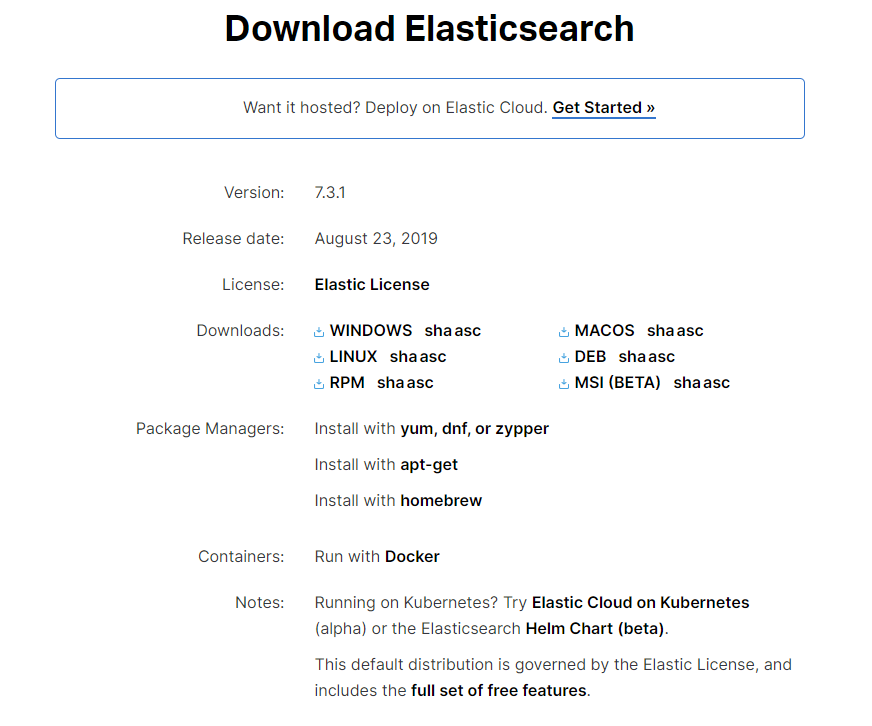
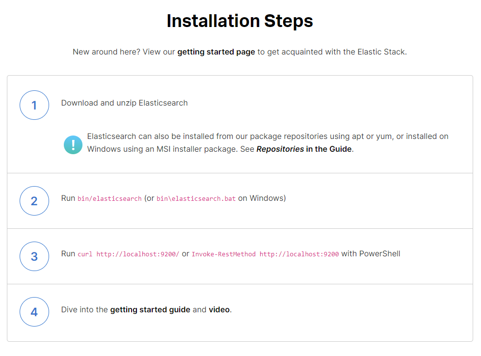
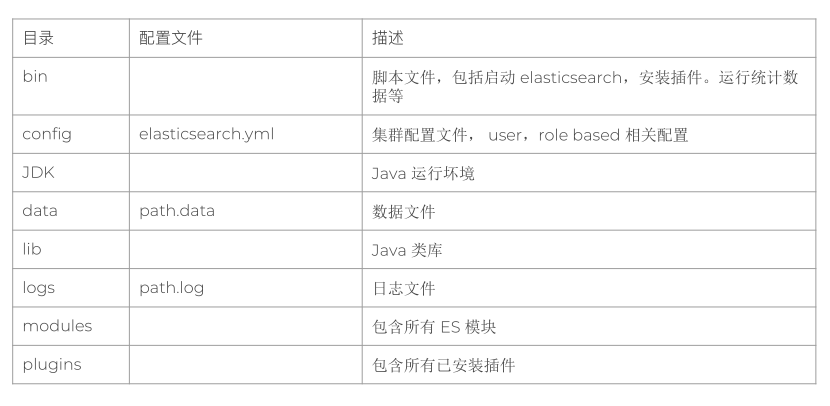

## 安装

### 安装JAVA

* 运维Elasticsearch，需要安装并配置JDK，设置$JAVA_HOME
* 各个版本对Java的依赖
  * Elasticsearch 5 需要Java8以上的版本
  * Elasticsearch 从6.5开始支持Java11
  * 7.0 开始，内置了Java环境

### 安装Elasticsearch

* 下载二进制文件

> https://www.elastic.co/cn/downloads/elasticsearch



安装并运维Elasticsearch



## 配置

### Elasticsearch的文件目录结构



### JVM配置

* 修改JCM - config/jvm.options
  * 7.3 下载的默认设置是1GB
* 配置的建议
  * Xmx和Xms设置成一样
  * Xmx不要超过机器内存的50%
  * 不要超过30GB

## 运行

### 运行单个实例

```bash
bin/elasticsearch -E node.name=node0 -E node.name=node0 -E cluster.name=geektime -E path.data=node0_data
```

### 运行多个实例

```shell
bin/elasticsearch -E node.name=node1 -E cluster.name=geektime -E path.data=node1_data -d
bin/elasticsearch -E node.name=node2 -E cluster.name=geektime -E path.data=node2_data -d
bin/elasticsearch -E node.name=node2 -E cluster.name=geektime -E path.data=node2_data -d
```

* 访问 http://localhost:9200 check cluster health state
* 通过 http://localhost:9200_cat/nodes?v 查看节点

### 安装与查看插件

```shell
bin/elasticsearch-plugin install analysis-icu
bin/elasticsearch-plugin list
```

* Elasticsearch提供插件的机制对系统进行扩展
  * Discovery Plugin
  * Analysis Plugin
  * Security Plugin
  * Management Plugin
  * Ingest Plugin
  * Mapper Plugin
  * Backup Plugin