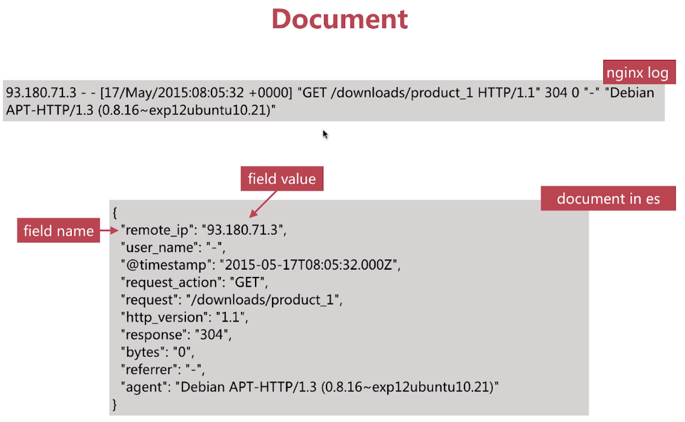
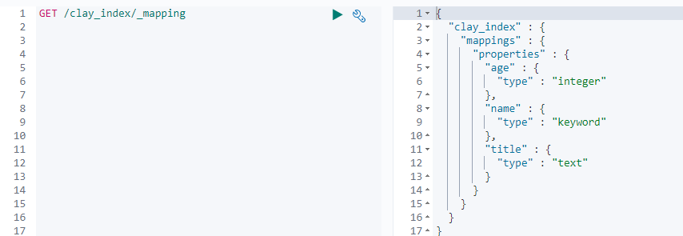
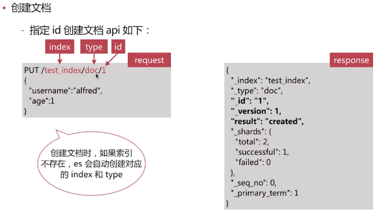
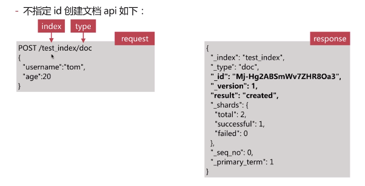
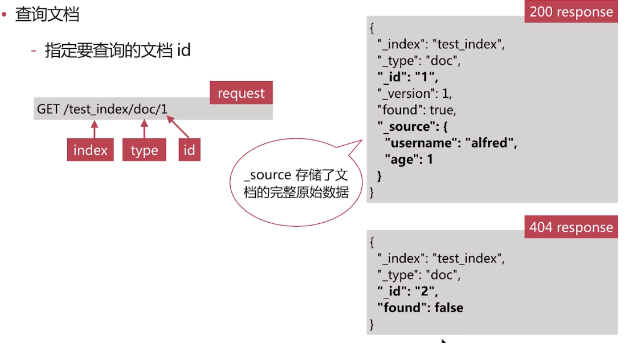
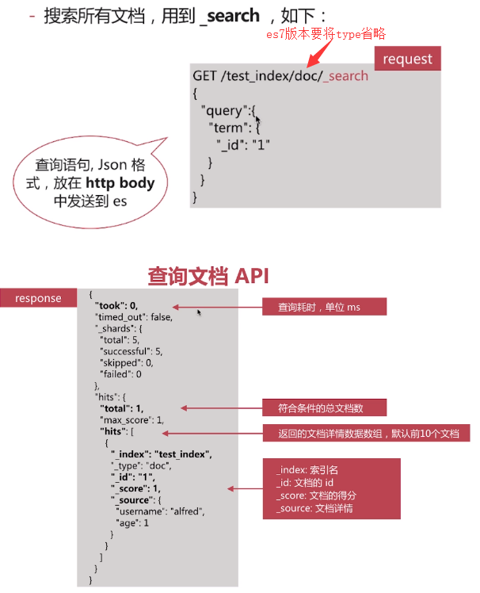
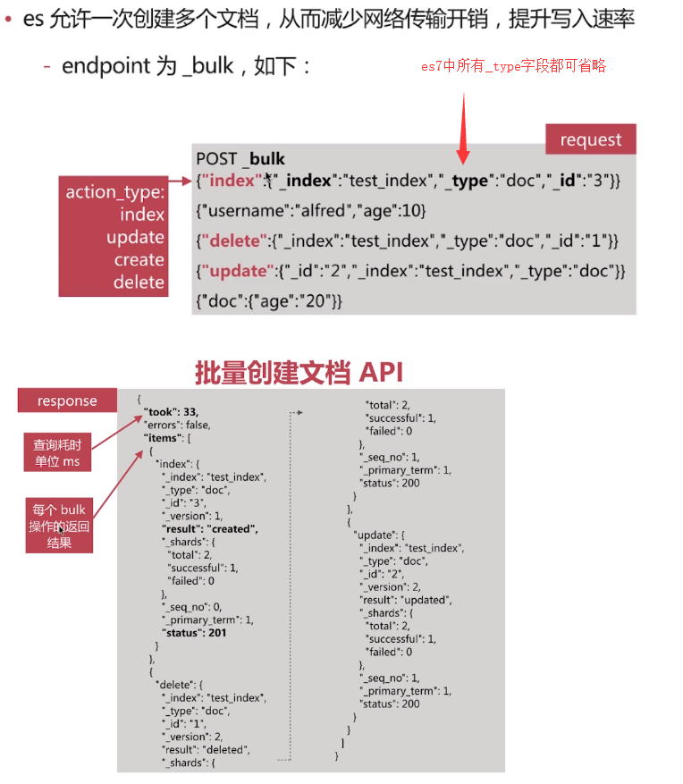

## Elasticsearch基础概念

### Elasticsearch关键概念

* Document（文档）：用户存储在es中的数据文档，它是以JSON格式定义的特定方式的字段集合。每个文档都属于一个类型，并驻留在一个索引中。每个文档都有一个唯一的标识符，称为UID。
* Index（索引）：包含一堆有相似结构的文档数据，比如可以有一个客户索引，商品分类索引，订单索引，索引有一个名称。一个index包含很多document，一个index就代表了一类类似的或者相同的Document。比如说建立一个商品索引，里面可能就存放了所有的商品数据。
* Type/Mapping（类型/映射）：它是共享同一索引中一组公共字段的文档集合。例如，索引包含社交网络应用程序的数据，然后可以有特定类型的用户简档数据、另一种类型的消息数据和另一种类型的评论数据。
* Node（节点）：它指的是ElasticSearch的单个运行实例，是集群的构成单元。单个物理和虚拟服务器可容纳多个节点，具体取决于其物理资源(如内存、存储和处理能力)的能力。
* Cluster（集群）：它是一个或多个节点组成的集合。集群为整个数据提供跨节点的索引和搜索功能。
* Shard（分片）：单台机器无法存储大量数据，ElasticSearch可以将一个索引中的数据切分为多个Shard，分布在多台服务器上存储。有了Shard就可以横向扩展，存储更多数据，让搜索和分析等操作分布到多台服务器上去执行，提升吞吐量和性能。
* Replicas(副本):服务器随时可能故障或宕机，此时Shard可能就会丢失，因此可以为每个Shard创建多个Replica副本。Replica可以在Shard故障时提供备用服务，保证数据不丢失，多个Replica还可以提升搜索操作的吞吐量和性能。

### Document（文档）

document其实就是json object 由字段（Field)组成，常见的类型：

- 字符串：keyword（不分词）,text(分词)

- 数值型：long,integer,short,byte,double,float,half_float,scaled_float
- 布尔：boolean
- 日期：date
- 二进制：binary
- 范围类型：integer_range,float_range,long_range,double_range,date_range

每一个文档有唯一的ID标识

- 自行指定
- es 自动生成

* 元数据，用于标注文档的相关信息
  * _index：文档所在的索引名
  * _type：文档所在的类型名
  * _id：文档唯一id
  * _uid：组合id，由\_type和\_id组成（6.x _type不再起作用，同id一样）
  * _source：文档的原始Json数据，可以从这里获取每个字段的内容
  * _all：整合所有字段内容到该字段，默认禁用

> 注意：元数据不能删除

### Index（索引）

* 索引中存储具有相同结构的文档（Document）
  * 每个索引都有自己的mapping定义，用于定义字段名和类型
* 一个集群可以有多个索引，比如：
  * nginx日志存储的时候可以按照日期每天生产一个索引来存储
    * nginx_log_2019-08-01
    * nginx_log_2019-08-02
    * nginx_log_2019-08-03

### Mapping
#### 作用
- 类似数据库中的表结构定义，主要作用如下：
  - 定义Index下的字段名（Field Name）
  - 定义字段的类型，比如数值型、字符串型、布尔型等
  - 定义倒排索引相关的配置，比如是否索引、记录position等

>  Mapping中的字段类型一旦设定后，禁止直接修改，原因如下：
>
> ​	Lucene实现的倒排索引生成后不允许修改

#### 常用参数

##### Dynamic

* 允许新增字段，通过dynamic参数来控制字段的新增
  * true（默认）允许自动新增字段
  * false不允许自动新增字段，但是文档可以正常写入，但无法对字段进行查询等操作
  * strict文档不能写入，报错

##### copy_to

* 将该字段的值复制到目标字段，实现类似_all的作用
* 不会出现在_source中，只用来搜索

##### index

* 控制当前字段是否索引，默认为true，即记录索引，false不记录，即不可搜索

##### index_options

* 用于控制倒排索引记录的内容，有如下4种配置
  * docs：只记录doc id
  * freqs：记录doc id和term frequencies
  * positions：记录doc id、term frequencies和term position
  * offsets：记录doc id、term frequencies、term position和character offsets
* text类型默认配置为positions，其他默认为docs
* 记录内容越多，占用空间越大

##### null_value

* 当字段遇到null值时的处理策略，默认为null，即控制，此时es会忽略该值。可以通过设定该值设定字段的默认值

### Rest API

* Elasticsearch集群对外提供Restful API

  * REST：REpresentational State Transfer
  * URL指定资源，如Index、Document等
  * Http Method指明资源操作类型，如GET、POST、PUT、DELETE等

#### 创建文档

#### 查询文档

#### 批量创建

#### 批量查询

