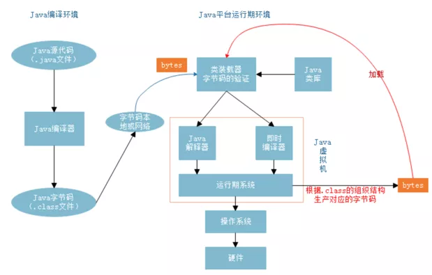
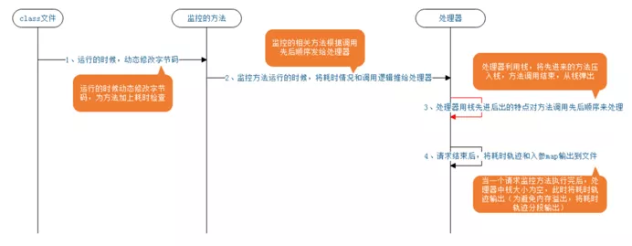
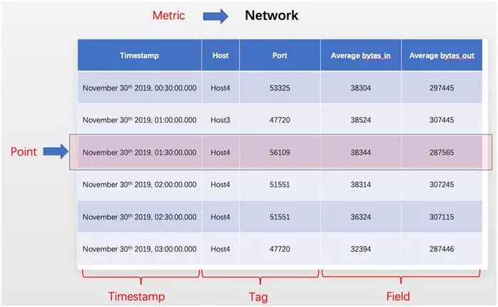
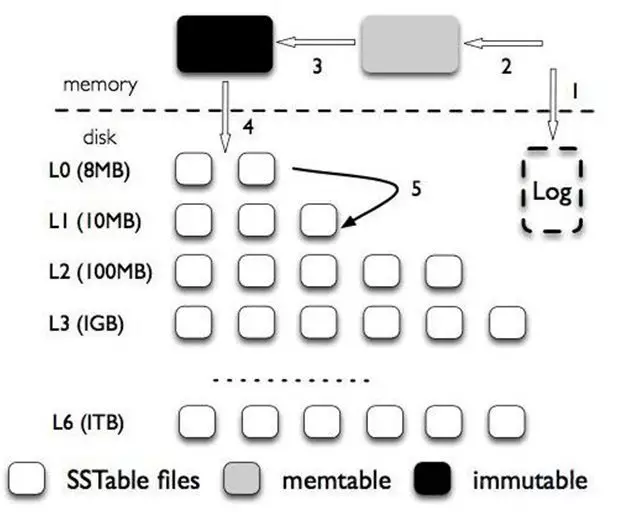
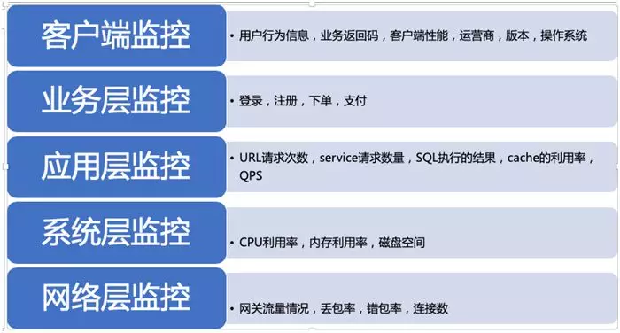
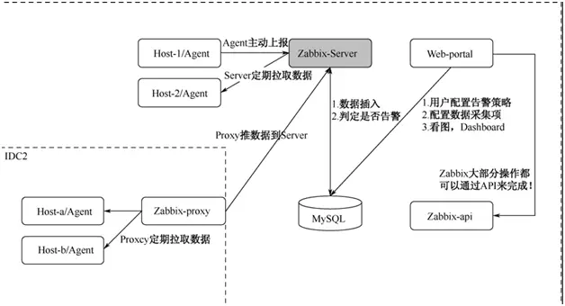
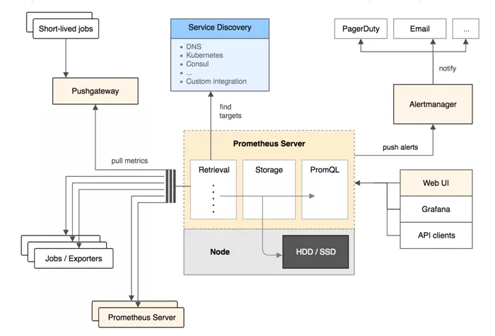
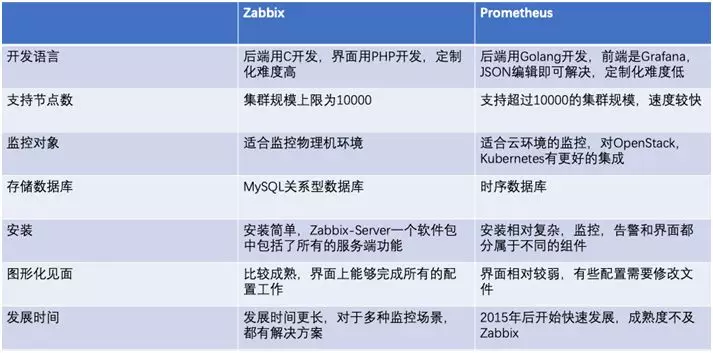
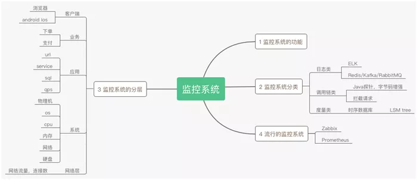

## 聊透监控体系，就这一篇够不够？

经济高速发展的今天，我们处于信息大爆炸的时代。随着经济发展，信息借助互联网的力量在全球自由地流动，于是就催生了各种各样的服务平台和软件系统。

由于业务的多样性，这些平台和系统也变得异常的复杂。如何对其进行监控和维护是我们 IT 人需要面对的重要问题。就在这样一个纷繁复杂地环境下，监控系统粉墨登场了。

今天，我们会对 IT 监控系统进行介绍，包括其功能，分类，分层；同时也会介绍几款流行的监控平台。

## 监控系统的功能

在 IT 运维过程中，常遇到这样的情况：

- 某个业务模块出现问题，运维人员并不知道，发现的时候问题已经很严重了。
- 系统出现瓶颈了，CPU 占用持续升高，内存不足，磁盘被写满；网络请求突增，超出网关承受的压力。

以上这些问题一旦发生，会对我们的业务产生巨大的影响。因此，每个公司或者 IT 团队都会针对此类情况建立自己的 IT 监控系统。

监控系统工作流程图

其功能包括：

- 对服务，系统，平台的运行状态实时监控
- 收集服务，系统，平台的运行信息
- 通过收集信息的分析结果，预知存在的故障风险，并采取行动
- 根据对风险的评估，进行故障预警
- 一旦发生故障，第一时间发出告警信息
- 通过监控数据，定位故障，协助生成解决方案
- 最终保证系统持续、稳定、安全运行
- 监控数据可视化，便于统计，按照一定周期导出、归档，用于数据分析和问题复盘

## 监控系统的分类

既然监控系统我们意义重大，针对不同场景把监控系统分为三类，分别是：

- **日志类**
- **调用链类**
- **度量类**

### 日志类(Logging)

通常我们在系统和业务级别上加入一些日志代码，记录一些日志信息，方便我们在发现问题的时候查找。

这些信息会与事件做相关，例如：用户登录，下订单，用户浏览某件商品，一小时以内的网关流量，用户平均响应时间等等。

这类以日志的记录和查询的解决方案比较多。比如 ELK 方案（Elasticsearch+Logstash+Kibana），使用ELK（Elasticsearch、Logstash、Kibana）+Kafka/Redis/RabbitMQ 来搭建一个日志系统。

ELK 结合 Redis/Kafka/RabbitMQ 实现日志类监控

程序内部通过 Spring AOP 记录日志，Beats 收集日志文件，然后用 Kafka/Redis/RabbitMQ 将其发送给 Logstash，Logstash 再将日志写入 Elasticsearch。

最后，使用 Kibana 将存放在 Elasticsearch 中的日志数据显示出来，形式可以是实时数据图表。

### 调用链类(Tracing)

对于服务较多的系统，特别是微服务系统。一次服务的调用有可能涉及到多个服务。A 调用 B，B 又要调用 C，好像一个链条一样，形成了服务调用链。

调用链就是记录一个请求经过所有服务的过程。请求从开始进入服务，经过不同的服务节点后，再返回给客户端，通过调用链参数来追踪全链路行为。从而知道请求在哪个环节出了故障，系统的瓶颈在哪儿。

调用链监控的实现原理如下：

Java 代码运行原理图

在介绍这种方式之前，我们先来复习一下 Java 代码运行的原理。通常我们会把 Java 源代码，通过“Java 编译器”编译成 Class 文件。再把这个 Class 的字节码文件装载到“类装载器”中进行字节码的验证。

最后，把验证过后的字节码发送到“Java 解释器”和“及时编译器”交给“Java 运行系统”运行。

Java 探针，字节码增强的方式就是利用 Java 代理，这个代理是运行方法之前的拦截器。

在 JVM 加载 Class 二进制文件的时候，利用 ASM 动态的修改加载的 Class 文件，在监控的方法前后添加需要监控的内容。

例如：添加计时语句，用于记录方法耗时。将方法耗时存入处理器，利用栈先特性（先进后出）处理方法调用顺序。

每当请求处理结束后，将耗时方法和入参 map 输出到文件中，然后根据 map 中相应参数，区分出耗时业务。

最后将相应耗时文件取下来，转化为 xml 格式并进行解析，通过浏览器将代码分层结构展示出来。

Java 探针工具原理图

备注：ASM 是一个 Java 字节码操纵框架，它可以动态生成类或者增强既有类的功能。

ASM 可以直接产生二进制 Class 文件，可以在类被载入 Java 虚拟机之前改变类行为。

Java Class 被存储在 .class文件里，文件拥有元数据来解析类中的元素：类名称、方法、属性以及 Java 字节码（指令）。

ASM 从类文件中读入信息后，能够改变类行为，分析类信息，甚至能够生成新类。

**②拦截请求**

获取每次请求服务中的信息来实现跟踪的。这里以 Zipkin+Slueth 为例说明其原理。

Sleuth 提供链路追踪。由于一个请求会涉及到多个服务的互相调用，而这种调用往往成链式结构，经过多次层层调用以后请求才会返回。常常使用 Sleuth 追踪整个调用过程，方便理清服务间的调用关系。

Sleuth 服务调用追踪图例

每次请求都会生成一个 Trace ID，如上图所示这个 Trace ID 在整个 Request 和 Response 过程中都会保持一致，不论经过了多少个服务。这是为了方便记录一次调用的整个生命周期。

再看每次请求的时候都会有一个 Span ID，这里的 Span 是 Sleuth 服务跟踪的最小单元，每经过一个服务，每次 Request 和 Response 这个值都会有所不同，这是为了区分不同的调用动作。

针对每个调用的动作，Sleuth 都做了标示如下：

- Server Received 是服务器接受，也就是服务端接受到请求的意思。
- Client Sent 是客户端发送，也就是这个服务本身不提供响应，需要调用其他的服务提供该响应，所以这个时候是作为客户端发起请求的。
- Server Sent 是服务端发送，看上图SERVICE 3 收到请求后，由于他是最终的服务提供者，所以作为服务端，他需要把请求发送给调用者。
- Client Received 是客户端接受，作为发起调用的客户端接受到服务端返回的请求。

实际上 Sleuth 就是通过上述方式把每次请求记录一个统一的 Trace ID，每个请求的详细步骤记作 Span ID。

每次发起请求或者接受请求的状态分别记录成 Server Received，Client Sent，Server Sent，Client Received 四种状态来完成这个服务调用链路的跟踪的。

在调用服务的链路上每个被调用的服务节点都会通过 Parent ID 来记录发起调用服务的 Span ID，由于 Span ID 是唯一确认最小服务单元的，所以知道了 Parent 的 Span ID 也就知道了谁调用自己了。

### 度量类(Metrics)

实现了时序数据库（TimeSeriesData，TSD）的监控方案。实际上就是记录一串以时间为维度的数据，然后再通过聚合运算，查看指标数据和指标趋势。说白了，就是描述某个被测主体在一段时间内的测量值变化（度量）。

由于 IT 基础设施，运维监控和互联网监控的特性，这种方式被广泛应用。一般对时序数据进行建模分为三个部分，分别是：主体，时间点和测量值。

通过这个例子来看一下，时序数据库的数学模型，例如：需要监控服务器的 In/Out 平均流量：

- 整个监控的数据库称为“Metric”，它包含了所有监控的数据。类似关系型数据库中的 Table。
- 每条监控数据，称为“Point”，类似于关系型数据库中的 Row 的概念。
- 每个“Point”都会定义一个时间戳“Timestamp”，将其作为索引，表明数据采集的时间。
- “Tag”作为维度列，表示监控数据的属性。
- “Field”作为指标列，作为测量值，也就是测量的结果。

时序数据库数据模型图例

时序数据库的存储原理，关系型数据库存储采用的是 B tree，虽然降低了数据查询的磁盘寻道时间，但是无法解决大量数据写入时的磁盘效率。

由于监控系统的应用场景，经常会遇到大批量的数据写入，所以我们会选择 LSMtree（Log Structured Merge Tree）存储时序数据库。

LSMtree（Log Structured Merge Tree），从字面意义上理解，记录的数据按照日志结构（Log Structured）追加到系统中，然后通过合并树（Merge Tree）的方式将其合并。

来看一个 LevelDB 的例子，方便我们理解，LSM-tree 被分成三种文件：

- 接收写入请求的 memtable 文件（内存中）
- 不可修改的 immutable memtable 文件（内存中）
- 磁盘上的 SStable文件（Sorted String Table），有序字符串表，这个有序的字符串就是数据的key。SStable 一共有七层（L0 到 L6）。下一层的总大小限制是上一层的 10 倍。

LSMtree LevelDB 存储示意图

LSMtree 写入流程：

- 将数据追加到日志 WAL（Write Ahead Log）中，写入日志的目的是为了防止内存数据丢失，可以及时恢复。
- 把数据写到 memtable 中。
- 当 memtable 满了（超过一定阀值），就将这个 memtable 转入 immutable memtable 中，用新的 memtable 接收新的数据请求。
- immutablememtable 一旦写满了， 就写入磁盘。并且先存储 L0 层的 SSTable 磁盘文件，此时还不需要做文件的合并。每层的所有文件总大小是有限制的（8MB，10MB，100MB… 1TB）。从 L1 层往后，每下一层容量增大十倍。
- 某一层的数据文件总量超过阈值，就在这一层中选择一个文件和下一层的文件进行合并。
  如此这般上层的数据都是较新的数据，查询可以从上层开始查找，依次往下，并且这些数据都是按照时间序列存放的。

## 监控系统的分层

谈完了监控系统的分类，再来聊聊监控系统的分层。用户请求到数据返回，经历系统中的层层关卡。

一般我们将监控系统分为五层来考虑，当然也有人分成三层，大致的意思都差不多，仅供参考：

- **客户端监控**，用户行为信息，业务返回码，客户端性能，运营商，版本，操作系统等。
- **业务层监控**，核心业务的监控，例如：登录，注册，下单，支付等等。
- **应用层监控**，相关的技术参数，例如：URL 请求次数，Service 请求数量，SQL 执行的结果，Cache 的利用率，QPS 等等。
- **系统层监控**，物理主机，虚拟主机以及操作系统的参数。例如：CPU 利用率，内存利用率，磁盘空间情况。
- **网络层监控**，网络情况参数。例如：网关流量情况，丢包率，错包率，连接数等等。

## 流行的监控系统

前面讲了监控系统的功能，分类，分层，相信大家对 IT 监控系统都有一定的了解了。

接下来，我们来看看有哪些优秀实践。这里介绍两个比较流行的监控系统：

- **Zabbix**
- **Prometheus**

### Zabbix

Zabbix 是一款企业级的分布式开源监控方案。它由 Alexei Vladishev 创建，由 Zabbix SIA 在持续开发和支持。

Zabbix 能够监控网络参数，服务器健康和软件完整性。它提供通知机制，允许用户配置告警，从而快速反馈问题。

基于存储的数据，Zabbix 提供报表和数据可视化，并且支持主动轮询和被动捕获。它的所有报告、统计信息和配置参数都可以通过 Web 页面访问。

Zabbix 的 API 功能，完善度很高，大部分操作都提供了 API 接口，方便和现有系统整合。

例如：通过历史数据查询 API，获取线上服务器使用情况，生成报表；设置条件，对问题服务器和问题业务进行筛选，加入告警。

利用 Zabbix graph 的 API，生成关键指标趋势图，方便运维人员实时了解系统情况。利用告警添加 API，让监控系统和部署系统联动。

比如新部署了一个新实例，那么自动添加所需要的监控策略；反之，下线一个实例，就删除关联的监控策略。

Zabbix 由 Server，Agent，Proxy（可选项）组成：

- Agent 负责收集数据，并且传输给 Server。
- Server 负责接受 Agent 的数据，进行保存或者告警。
- Proxy 负责代理 Server 收集 Agent 传输的数据，并且转发给 Server。Proxy 是安装在被监控的服务器上的，用来和 Server 端进行通信，从而传输数据。

Zabbix 部署模式

Zabbix 的数据采集，主要有两种模式：Server 主动拉取数据和 Agent 主动上报数据。

以 Server 拉取数据为例，用户在 Web-portal 中，设置需要监控的机器，配置监控项，告警策略。Zabbix-Server 会根据策略主动获取 Agent 的数据，然后存储到 MySQL 中。

同时根据用户配置的策略，判定是否需要告警。用户可以在 Web 端，以图表的形式，查看各种指标的历史趋势。

在 Zabbix 中，将 Server 主动拉取数据的方式称之为 Active Check。这种方式配置起来较为方便，但是会对 Zabbix-Server 的性能存在影响。

所以在生产环境中，一般会选择主动推送数据到 Zabbix-Server 的方式，称之为 Trapper。

即用户可以定时生成数据，再按照 Zabbix 定义的数据格式，批量发送给 Zabbix-Server，这样可以大大提高 Server 的处理能力。

Proxy，作为可选项，起到收集 Agent 数据并且转发到 Server 的作用。

当 Server 和 Agent 不在一个网络内，就需要使用 Proxy 做远程监控，特别是远程网络有防火墙的时候。同时它也可以分担 Server 的压力，降低 Server 处理连接数的开销。

### Prometheus（普罗米修斯）

随着这几年云环境的发展，Prometheus 被广泛地认可。它的本质是时间序列数据库，而 Zabbix 采用 MySQL 进行数据存储。

从上面我们对时间序列数据库的分析来看，Prometheus 能够很好地支持大量数据的写入。

它采用拉的模式（Pull）从应用中拉取数据，并通过 Alert 模块实现监控预警。据说单机可以消费百万级时间序列。

一起来看看 Prometheus 的几大组件：

- **Prometheus Server**，用于收集和存储时间序列数据，负责监控数据的获取，存储以及查询。
- **监控目标配置**，Prometheus Server 可以通过静态配置管理监控目标，也可以配合 Service Discovery（K8s，DNS，Consul）实现动态管理监控目标。
- **监控目标存储**，Prometheus Server 本身就是一个时序数据库，将采集到的监控数据按照时间序列存储在本地磁盘中。
- **监控数据查询**，Prometheus Server 对外提供了自定义的 PromQL 语言，实现对数据的查询以及分析。
- **Client Library**，客户端库。为需要监控的服务生成相应的 Metrics 并暴露给 Prometheus Server。
  当 Prometheus Server 来 Pull 时，直接返回实时状态的 Metrics。通常会和 Job 一起合作。
- **Push Gateway**，主要用于短期的 Jobs。由于这类 Jobs 存在时间较短，可能在 Prometheus 来 Pull 之前就消失了。为此，这些 Jobs 可以直接向 Prometheus Server 端推送它们的 Metrics。
- **Exporters**，第三方服务接口。将 Metrics（数据集合）发送给 Prometheus。
  Exporter 将监控数据采集的端点，通过 HTTP 的形式暴露给 Prometheus Server，使其通过 Endpoint 端点获取监控数据。
- **Alertmanager**，从 Prometheus Server 端接收到 Alerts 后，会对数据进行处理。例如：去重，分组，然后根据规则，发出报警。
- **Web UI**，Prometheus Server 内置的 Express Browser UI，通过 PromQL 实现数据的查询以及可视化。

Prometheus 架构图

说完了 Prometheus 的组件，再来看看 Prometheus 的架构：

- Prometheus Server 定期从 Jobs/Exporters 中拉 Metrics。同时也可以接收来自 Pushgateway 发过来的 Metrics。
- Prometheus Server 将接受到的数据存储在本地时序数据库，并运行已定义好的 alert.rules（告警规则），一旦满足告警规则就会向 Alertmanager 推送警报。
- Alertmanager 根据配置文件，对接收到的警报进行处理，例如：发出邮件告警，或者借助第三方组件进行告警。
- WebUI/Grafana/APIclients，可以借助 PromQL 对监控数据进行查询。

最后将两个工具进行比较如下：

Zabbix 和 Prometheus 比较图

从上面的比较可以看出：

- Zabbix 的成熟度更高，上手更快。高集成度导致灵活性较差，在监控复杂度增加后，定制难度会升高。而且使用的关系型数据库，对于大规模的监控数据插入和查询是个问题。
- Prometheus 上手难度大，定制灵活度高，有较多数据聚合的可能，而且有时序数据库的加持。
- 对于监控物理机或者监控环境相对稳定的情况，Zabbix 有明显优势。如果监控场景多是云环境的话，推荐使用 Prometheus。

## 总结

监控系统思维导图

监控系统对 IT 系统运维意义重大，从状态监控到收集/分析数据，到故障报警，以及问题解决，最后归档报表，协助运维复盘。

监控系统分为三大类，日志类，调用链类，度量类，他们有各自的特点，且应用场景各不相同。

因为要对整个 IT 系统进行监控，所以将其分为五层，分别是，客户端，业务层，应用层，系统层，网络层。

Zabbix 和 Prometheus 是当下流行的监控系统，可以根据他们的特点选择使用。

作者：崔皓
简介：十六年开发和架构经验，曾担任过惠普武汉交付中心技术专家，需求分析师，项目经理，后在创业公司担任技术/产品经理。善于学习，乐于分享。目前专注于技术架构与研发管理。

> 来源：本文转自公众号”51CTO技术栈“，经平台授权转载。
>
> 参考其他链接：https://blog.csdn.net/javaforwork/article/details/101093901