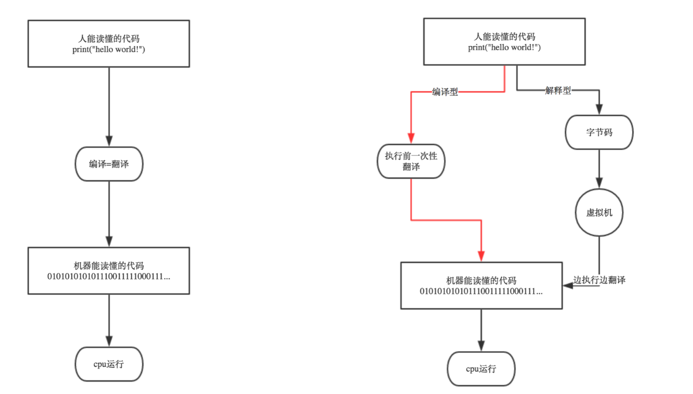

## Python介绍

python的创始人为吉多·范罗苏姆（Guido van Rossum）。1989年的圣诞节期间，吉多·范罗苏姆为了在阿姆斯特丹打发时间，决心开发一个新的脚本解释程序，作为ABC语言的一种继承。  

Python崇尚优美、清晰、简单，是一个优秀并广泛使用的语言。

**目前Python主要应用领域：**

- 云计算：OpenStack
- WEB开发：Django
- 人工智能
- 系统运维
- 金融：量化交易
- 图形GUI

## Python是一门什么样的语言

编程语言主要从以下几个角度为进行分类，编译型和解释型、静态语言和动态语言、强类型定义语言和弱类型定义语言。

### 低级语言与高级语言

低级语言

*最初的计算机程序都是用0和1的序列表示的，程序员直接使用的是机器指令，无需翻译，从纸带打孔输入即可执行得到结果。后来为了方便记忆，就将用0、1序列表示的机器指令都用符号助记，这些与机器指令一一对应的助记符就成了汇编指令，从而诞生了汇编语言。无论是机器指令还是汇编指令都是面向机器的，统称为低级语言。因为是针对特定机器的机器指令的助记符，所以汇编语言是无法独立于机器(特定的CPU体系结构)的。但汇编语言也是要经过翻译成机器指令才能执行的，所以也有将运行在一种机器上的汇编语言翻译成运行在另一种机器上的机器指令的方法，那就是交叉汇编技术。*

高级语言

*高级语言是从人类的逻辑思维角度出发的计算机语言，抽象程度大大提高，需要经过编译成特定机器上的目标代码才能执行，一条高级语言的语句往往需要若干条机器指令来完成。高级语言独立于机器的特性是靠编译器为不同机器生成不同的目标代码(或机器指令)来实现的。那具体的说，要将高级语言编译到什么程度呢，这又跟编译的技术有关了，既可以编译成直接可执行的目标代码，也可以编译成一种中间表示，然后拿到不同的机器和系统上去执行，这种情况通常又需要支撑环境，比如解释器或虚拟机的支持，Java程序编译成bytecode，再由不同平台上的虚拟机执行就是很好的例子。所以，说高级语言不依赖于机器，是指在不同的机器或平台上高级语言的程序本身不变，而通过编译器编译得到的目标代码去适应不同的机器。从这个意义上来说，通过交叉汇编，一些汇编程序也可以获得不同机器之间的可移植性，但这种途径获得的移植性远远不如高级语言来的方便和实用性大。*


**Python为高级语言**

### 编译语言和解释语言

**编译器**是把源程序的每一条语句都编译成机器语言,并保存成二进制文件,这样运行时计算机可以直接以机器语言来运行此程序,速度很快; 

而**解释器**则是只在执行程序时,才一条一条的解释成机器语言给计算机来执行,所以运行速度是不如编译后的程序运行的快的. 

这是因为计算机不能直接认识并执行我们写的语句,它只能认识机器语言(是二进制的形式)



**Python为解释型语言**


#### 编译型vs解释型

**编译型**

优点：编译器一般会有预编译的过程对代码进行优化。因为编译只做一次，运行时不需要编译，所以编译型语言的程序执行效率高。可以脱离语言环境独立运行。
缺点：编译之后如果需要修改就需要整个模块重新编译。编译的时候根据对应的运行环境生成机器码，不同的操作系统之间移植就会有问题，需要根据运行的操作系统环境编译不同的可执行文件。

**解释型**

优点：有良好的平台兼容性，在任何环境中都可以运行，前提是安装了解释器（虚拟机）。灵活，修改代码的时候直接修改就可以，可以快速部署，不用停机维护。

缺点：每次运行的时候都要解释一遍，性能上不如编译型语言。

### 动态语言和静态语言

*通常我们所说的动态语言、静态语言是指动态类型语言和静态类型语言。*

*（1）动态类型语言：动态类型语言是指在运行期间才去做数据类型检查的语言，也就是说，在用动态类型的语言编程时，永远也不用给任何变量指定数据类型，该语言会在你第一次赋值给变量时，在内部将数据类型记录下来。*

*（2）静态类型语言：静态类型语言与动态类型语言刚好相反，它的数据类型是在编译其间检查的，也就是说在写程序时要声明所有变量的数据类型，C/C++是静态类型语言的典型代表，其他的静态类型语言还有C#、JAVA等。*

**Python为动态类型语言**

### 强类型定义语言和弱类型定义语言

*（1）强类型定义语言：强制数据类型定义的语言。也就是说，一旦一个变量被指定了某个数据类型，如果不经过强制转换，那么它就永远是这个数据类型了。举个例子：如果你定义了一个整型变量a,那么程序根本不可能将a当作字符串类型处理。强类型定义语言是类型安全的语言。*

*（2）弱类型定义语言：数据类型可以被忽略的语言。它与强类型定义语言相反, 一个变量可以赋不同数据类型的值。*

*强类型定义语言在速度上可能略逊色于弱类型定义语言，但是强类型定义语言带来的严谨性能够有效的避免许多错误。另外，“这门语言是不是动态语言”与“这门语言是否类型安全”之间是完全没有联系的！*
*例如：Python是动态语言，是强类型定义语言（类型安全的语言）; VBScript是动态语言，是弱类型定义语言（类型不安全的语言）; JAVA是静态语言，是强类型定义语言（类型安全的语言）。*

**Python为强类型定义语言**

> 总结，python是一门动态解释性的强类型定义语言

## Hello World程序

### 指定解释器

```python
#!/usr/bin/env python
```

### 指定字符编码

```python
#_*_coding:utf-8_*_
```

### 注释

　　当行注视：# 被注释内容

　　多行注释：""" 被注释内容 """

参考链接：

> https://www.cnblogs.com/alex3714/articles/5465198.html