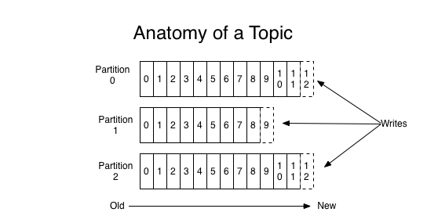
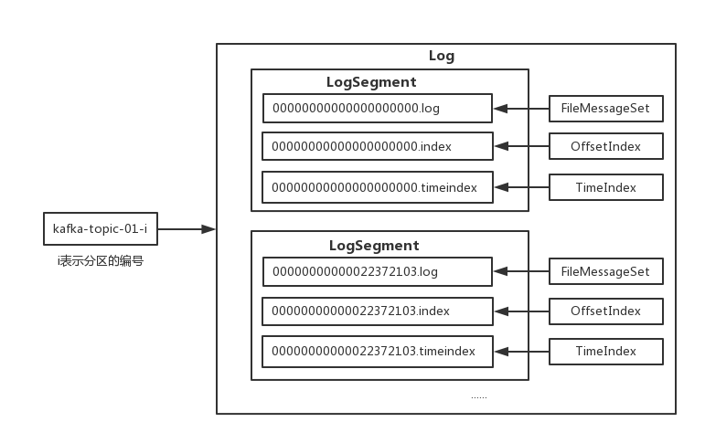
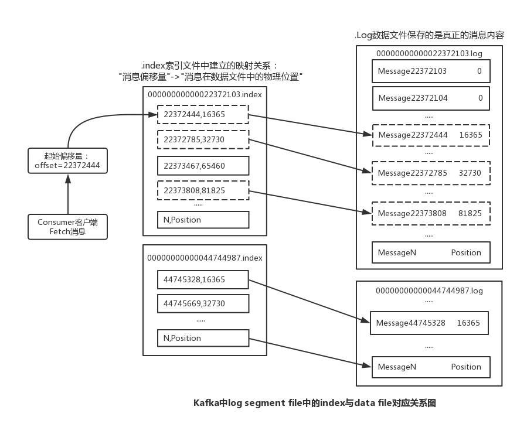

转载自：https://www.jianshu.com/p/3e54a5a39683  作者：癫狂侠

**摘要：消息存储对于每一款消息队列都非常重要，那么Kafka在这方面是如何来设计做到高效的呢？**
 Kafka这款分布式消息队列使用文件系统和操作系统的页缓存（page cache）分别存储和缓存消息，摒弃了Java的堆缓存机制，同时将随机写操作改为顺序写，再结合Zero-Copy的特性极大地改善了IO性能。而提起磁盘的文件系统，相信很多对硬盘存储了解的同学都知道：“**一块SATA RAID-5阵列磁盘的线性写速度可以达到几百M/s，而随机写的速度只能是100多KB/s，线性写的速度是随机写的上千倍**”，由此可以看出对磁盘写消息的速度快慢关键还是取决于我们的使用方法。鉴于此，Kafka的数据存储设计是建立在对文件进行追加的基础上实现的，因为是顺序追加，通过O(1)的磁盘数据结构即可提供消息的持久化，并且这种结构对于即使是数以TB级别的消息存储也能够保持长时间的稳定性能。在理想情况下，只要磁盘空间足够大就一直可以追加消息。此外，Kafka也能够通过配置让用户自己决定已经落盘的持久化消息保存的时间，提供消息处理更为灵活的方式。本文将主要介绍Kafka中数据的存储消息结构、存储方式以及如何通过offset来查找消息等内容。

# 一、 Kafka中几个重要概念介绍

（1）**Broker**：消息中间件处理节点，一个Kafka节点就是一个broker，一个或者多个Broker可以组成一个Kafka集群；
 （2）**Topic**：主题是对一组消息的抽象分类，比如例如page view日志、click日志等都可以以topic的形式进行抽象划分类别。在物理上，不同Topic的消息分开存储，逻辑上一个Topic的消息虽然保存于一个或多个broker上但用户只需指定消息的Topic即可使得数据的生产者或消费者不必关心数据存于何处；
 （3）**Partition**：每个主题又被分成一个或者若干个分区（Partition）。每个分区在本地磁盘上对应一个文件夹，分区命名规则为主题名称后接“—”连接符，之后再接分区编号，分区编号从0开始至分区总数减-1；
 （4）**LogSegment**：每个分区又被划分为多个日志分段（LogSegment）组成，日志段是Kafka日志对象分片的最小单位；LogSegment算是一个逻辑概念，对应一个具体的日志文件（“.log”的数据文件）和两个索引文件（“.index”和“.timeindex”，分别表示偏移量索引文件和消息时间戳索引文件）组成；
 （5）**Offset**：每个partition中都由一系列有序的、不可变的消息组成，这些消息被顺序地追加到partition中。每个消息都有一个连续的序列号称之为offset—偏移量，用于在partition内唯一标识消息（并不表示消息在磁盘上的物理位置）；
 （6）**Message**：消息是Kafka中存储的最小最基本的单位，即为一个commit log，由一个固定长度的消息头和一个可变长度的消息体组成；

# 二、 Kafka的日志结构与数据存储

Kafka中的消息是以主题（Topic）为基本单位进行组织的，各个主题之间相互独立。在这里主题只是一个逻辑上的抽象概念，而在实际数据文件的存储中，Kafka中的消息存储在物理上是以一个或多个分区（Partition）构成，每个分区对应本地磁盘上的一个文件夹，每个文件夹内包含了日志索引文件（“.index”和“.timeindex”）和日志数据文件（“.log”）两部分。分区数量可以在创建主题时指定，也可以在创建Topic后进行修改。（**ps：Topic的Partition数量只能增加而不能减少，这点内容超出本篇幅的减少范围，大家可以先思考下**）。
 在Kafka中正是因为使用了分区（Partition）的设计模型，通过将主题（Topic）的消息打散到多个分区，并分布保存在不同的Kafka Broker节点上实现了消息处理的高吞吐量。其生产者和消费者都可以多线程地并行操作，而每个线程处理的是一个分区的数据。



同时，Kafka为了实现集群的高可用性，在每个Partition中可以设置有一个或者多个副本（Replica），分区的副本分布在不同的Broker节点上。同时，从副本中会选出一个副本作为Leader，Leader副本负责与客户端进行读写操作。而其他副本作为Follower会从Leader副本上进行数据同步。


## 2.1Kafka中分区/副本的日志文件存储分析

在三台虚拟机上搭建完成Kafka的集群后（Kafka Broker节点数量为3个），通过在Kafka Broker节点的/bin下执行以下的命令即可创建主题和指定数量的分区以及副本：

```bash
./kafka-topics.sh --create --zookeeper 10.154.0.73:2181 --replication-factor 3 --partitions  3 --topic kafka-topic-01
```

创建完主题、分区和副本后可以查到出主题的状态（该方式主要列举了主题所有分区对应的副本以及ISR列表信息）：

```bash
./kafka-topics.sh --describe --zookeeper 10.154.0.73:2181 --topic kafka-topic-01
Topic:kafka-topic-01    PartitionCount:3    ReplicationFactor:3 Configs:
    Topic: kafka-topic-01   Partition: 0    Leader: 1   Replicas: 1,2,0 Isr: 1,2,0
    Topic: kafka-topic-01   Partition: 1    Leader: 2   Replicas: 2,0,1 Isr: 2,1,0
    Topic: kafka-topic-01   Partition: 2    Leader: 0   Replicas: 0,1,2 Isr: 1,2,0
```

通过实现一个简单的Kafka Producer的demo，即可完成生产者发送消息给Kafka Broker的功能。在使用Producer产生大量的消息后，可以看到部署集群的三台虚拟机在Kafka的config/server.properties配置文件中**“log.dirs”**指定的日志数据存储目录下存在三个分区目录，同时在每个分区目录下存在很多对应的日志数据文件和日志索引文件文件，具体如下：

```bash
#1、分区目录文件
drwxr-x--- 2 root root 4096 Jul 26 19:35 kafka-topic-01-0
drwxr-x--- 2 root root 4096 Jul 24 20:15 kafka-topic-01-1
drwxr-x--- 2 root root 4096 Jul 24 20:15 kafka-topic-01-2

#2、分区目录中的日志数据文件和日志索引文件
-rw-r----- 1 root root 512K Jul 24 19:51 00000000000000000000.index
-rw-r----- 1 root root 1.0G Jul 24 19:51 00000000000000000000.log
-rw-r----- 1 root root 768K Jul 24 19:51 00000000000000000000.timeindex
-rw-r----- 1 root root 512K Jul 24 20:03 00000000000022372103.index
-rw-r----- 1 root root 1.0G Jul 24 20:03 00000000000022372103.log
-rw-r----- 1 root root 768K Jul 24 20:03 00000000000022372103.timeindex
-rw-r----- 1 root root 512K Jul 24 20:15 00000000000044744987.index
-rw-r----- 1 root root 1.0G Jul 24 20:15 00000000000044744987.log
-rw-r----- 1 root root 767K Jul 24 20:15 00000000000044744987.timeindex
-rw-r----- 1 root root  10M Jul 24 20:21 00000000000067117761.index
-rw-r----- 1 root root 511M Jul 24 20:21 00000000000067117761.log
-rw-r----- 1 root root  10M Jul 24 20:21 00000000000067117761.timeindex

```

由上面可以看出，每个分区在物理上对应一个文件夹，分区的命名规则为主题名后接“—”连接符，之后再接分区编号，分区编号从0开始，编号的最大值为分区总数减1。每个分区又有1至多个副本，分区的副本分布在集群的不同代理上，以提高可用性。从存储的角度上来说，分区的每个副本在逻辑上可以抽象为一个日志（Log）对象，即分区副本与日志对象是相对应的。下图是在三个Kafka Broker节点所组成的集群中分区的主/备份副本的物理分布情况图：


## 2.2Kafka中日志索引和数据文件的存储结构

在Kafka中，每个Log对象又可以划分为多个LogSegment文件，每个LogSegment文件包括一个日志数据文件和两个索引文件（偏移量索引文件和消息时间戳索引文件）。其中，每个LogSegment中的日志数据文件大小均相等（该日志数据文件的大小可以通过在Kafka Broker的config/server.properties配置文件的中的**“log.segment.bytes”**进行设置，默认为1G大小（1073741824字节），在顺序写入消息时如果超出该设定的阈值，将会创建一组新的日志数据和索引文件）。
 Kafka将日志文件封装成一个FileMessageSet对象，将偏移量索引文件和消息时间戳索引文件分别封装成OffsetIndex和TimerIndex对象。Log和LogSegment均为逻辑概念，Log是对副本在Broker上存储文件的抽象，而LogSegment是对副本存储下每个日志分段的抽象，日志与索引文件才与磁盘上的物理存储相对应；下图为Kafka日志存储结构中的对象之间的对应关系图：



为了进一步查看“.index”偏移量索引文件、“.timeindex”时间戳索引文件和“.log”日志数据文件，可以执行下面的命令将二进制分段的索引和日志数据文件内容转换为字符型文件：

```bash
# 1、执行下面命令即可将日志数据文件内容dump出来
./kafka-run-class.sh kafka.tools.DumpLogSegments --files /apps/svr/Kafka/kafkalogs/kafka-topic-01-0/00000000000022372103.log --print-data-log > 00000000000022372103_txt.log

#2、dump出来的具体日志数据内容
Dumping /apps/svr/Kafka/kafkalogs/kafka-topic-01-0/00000000000022372103.log
Starting offset: 22372103
offset: 22372103 position: 0 CreateTime: 1532433067157 isvalid: true keysize: 4 valuesize: 36 magic: 2 compresscodec: NONE producerId: -1 producerEpoch: -1 sequence: -1 isTransactional: false headerKeys: [] key: 1 payload: 5d2697c5-d04a-4018-941d-881ac72ed9fd
offset: 22372104 position: 0 CreateTime: 1532433067159 isvalid: true keysize: 4 valuesize: 36 magic: 2 compresscodec: NONE producerId: -1 producerEpoch: -1 sequence: -1 isTransactional: false headerKeys: [] key: 1 payload: 0ecaae7d-aba5-4dd5-90df-597c8b426b47
offset: 22372105 position: 0 CreateTime: 1532433067159 isvalid: true keysize: 4 valuesize: 36 magic: 2 compresscodec: NONE producerId: -1 producerEpoch: -1 sequence: -1 isTransactional: false headerKeys: [] key: 1 payload: 87709dd9-596b-4cf4-80fa-d1609d1f2087
......
......
offset: 22372444 position: 16365 CreateTime: 1532433067166 isvalid: true keysize: 4 valuesize: 36 magic: 2 compresscodec: NONE producerId: -1 producerEpoch: -1 sequence: -1 isTransactional: false headerKeys: [] key: 1 payload: 8d52ec65-88cf-4afd-adf1-e940ed9a8ff9
offset: 22372445 position: 16365 CreateTime: 1532433067168 isvalid: true keysize: 4 valuesize: 36 magic: 2 compresscodec: NONE producerId: -1 producerEpoch: -1 sequence: -1 isTransactional: false headerKeys: [] key: 1 payload: 5f5f6646-d0f5-4ad1-a257-4e3c38c74a92
offset: 22372446 position: 16365 CreateTime: 1532433067168 isvalid: true keysize: 4 valuesize: 36 magic: 2 compresscodec: NONE producerId: -1 producerEpoch: -1 sequence: -1 isTransactional: false headerKeys: [] key: 1 payload: 51dd1da4-053e-4507-9ef8-68ef09d18cca
offset: 22372447 position: 16365 CreateTime: 1532433067168 isvalid: true keysize: 4 valuesize: 36 magic: 2 compresscodec: NONE producerId: -1 producerEpoch: -1 sequence: -1 isTransactional: false headerKeys: [] key: 1 payload: 80d50a8e-0098-4748-8171-fd22d6af3c9b
......
......
offset: 22372785 position: 32730 CreateTime: 1532433067174 isvalid: true keysize: 4 valuesize: 36 magic: 2 compresscodec: NONE producerId: -1 producerEpoch: -1 sequence: -1 isTransactional: false headerKeys: [] key: 1 payload: db80eb79-8250-42e2-ad26-1b6cfccb5c00
offset: 22372786 position: 32730 CreateTime: 1532433067176 isvalid: true keysize: 4 valuesize: 36 magic: 2 compresscodec: NONE producerId: -1 producerEpoch: -1 sequence: -1 isTransactional: false headerKeys: [] key: 1 payload: 51d95ab0-ab0d-4530-b1d1-05eeb9a6ff00
......
......
#3、同样地，dump出来的具体偏移量索引内容
Dumping /apps/svr/Kafka/kafkalogs/kafka-topic-01-0/00000000000022372103.index
offset: 22372444 position: 16365
offset: 22372785 position: 32730
offset: 22373467 position: 65460
offset: 22373808 position: 81825
offset: 22374149 position: 98190
offset: 22374490 position: 114555
......
......
#4、dump出来的时间戳索引文件内容
Dumping /apps/svr/Kafka/kafkalogs/kafka-topic-01-0/00000000000022372103.timeindex
timestamp: 1532433067174 offset: 22372784
timestamp: 1532433067191 offset: 22373466
timestamp: 1532433067206 offset: 22373807
timestamp: 1532433067214 offset: 22374148
timestamp: 1532433067222 offset: 22374489
timestamp: 1532433067230 offset: 22374830
......
......

```

由上面dump出来的偏移量索引文件和日志数据文件的具体内容可以分析出来，偏移量索引文件中存储着大量的索引元数据，日志数据文件中存储着大量消息结构中的各个字段内容和消息体本身的值。索引文件中的元数据position字段指向对应日志数据文件中message的实际位置（即为物理偏移地址）。
 下面的表格先列举了Kakfa消息体结构中几个主要字段的说明：

| Kafka消息字段 |                各个字段说明                |
| :-----------: | :----------------------------------------: |
|    offset     |                 消息偏移量                 |
| message size  |                 消息总长度                 |
|     CRC32     |              CRC32编码校验和               |
|  attributes   | 表示为独立版本、或标识压缩类型、或编码类型 |
|     magic     |    表示本次发布Kafka服务程序协议版本号     |
|  key length   |               消息Key的长度                |
|      key      |             消息Key的实际数据              |
|   valuesize   |             消息的实际数据长度             |
|   playload    |               消息的实际数据               |

### 1.日志数据文件

Kafka将生产者发送给它的消息数据内容保存至日志数据文件中，该文件以该段的基准偏移量左补齐0命名，文件后缀为“.log”。分区中的每条message由offset来表示它在这个分区中的偏移量，这个offset并不是该Message在分区中实际存储位置，而是逻辑上的一个值（Kafka中用8字节长度来记录这个偏移量），但它却唯一确定了分区中一条Message的逻辑位置，同一个分区下的消息偏移量按照顺序递增（这个可以类比下数据库的自增主键）。另外，从dump出来的日志数据文件的字符值中可以看到消息体的各个字段的内容值。

### 2.偏移量索引文件

如果消息的消费者每次fetch都需要从1G大小（默认值）的日志数据文件中来查找对应偏移量的消息，那么效率一定非常低，在定位到分段后还需要顺序比对才能找到。Kafka在设计数据存储时，为了提高查找消息的效率，故而为分段后的每个日志数据文件均使用稀疏索引的方式建立索引，这样子既节省空间又能通过索引快速定位到日志数据文件中的消息内容。偏移量索引文件和数据文件一样也同样也以该段的基准偏移量左补齐0命名，文件后缀为“.index”。
 从上面dump出来的偏移量索引内容可以看出，索引条目用于将偏移量映射成为消息在日志数据文件中的实际物理位置，每个索引条目由offset和position组成，每个索引条目可以唯一确定在各个分区数据文件的一条消息。其中，Kafka采用稀疏索引存储的方式，每隔一定的字节数建立了一条索引，可以通过**“index.interval.bytes”**设置索引的跨度；
 有了偏移量索引文件，通过它，Kafka就能够根据指定的偏移量快速定位到消息的实际物理位置。具体的做法是，根据指定的偏移量，使用二分法查询定位出该偏移量对应的消息所在的分段索引文件和日志数据文件。然后通过二分查找法，继续查找出小于等于指定偏移量的最大偏移量，同时也得出了对应的position（实际物理位置），根据该物理位置在分段的日志数据文件中顺序扫描查找偏移量与指定偏移量相等的消息。下面是Kafka中分段的日志数据文件和偏移量索引文件的对应映射关系图（其中也说明了如何按照起始偏移量来定位到日志数据文件中的具体消息）。



### 3.时间戳索引文件

从上面一节的分区目录中，我们还可以看到存在一些以“.timeindex”的时间戳索引文件。这种类型的索引文件是Kafka从0.10.1.1版本开始引入的的一个基于时间戳的索引文件，它们的命名方式与对应的日志数据文件和偏移量索引文件名基本一样，唯一不同的就是后缀名。从上面dump出来的该种类型的时间戳索引文件的内容来看，每一条索引条目都对应了一个8字节长度的时间戳字段和一个4字节长度的偏移量字段，其中时间戳字段记录的是该LogSegment到目前为止的最大时间戳，后面对应的偏移量即为此时插入新消息的偏移量。
 另外，时间戳索引文件的时间戳类型与日志数据文件中的时间类型是一致的，索引条目中的时间戳值及偏移量与日志数据文件中对应的字段值相同（ps：Kafka也提供了通过时间戳索引来访问消息的方法）。

# 三、 总结

从全文来看，Kafka高效数据存储设计的特点在于以下几点：
 **（1）**、Kafka把主题中一个分区划分成多个分段的小文件段，通过多个小文件段，就容易根据偏移量查找消息、定期清除和删除已经消费完成的数据文件，减少磁盘容量的占用；
 **（2）**、采用稀疏索引存储的方式构建日志的偏移量索引文件，并将其映射至内存中，提高查找消息的效率，同时减少磁盘IO操作；
 **（3）**、Kafka将消息追加的操作逻辑变成为日志数据文件的顺序写入，极大的提高了磁盘IO的性能；
 任何一位使用Kafka的同学来说，如果能够掌握其数据存储机制，对于大规模Kafka集群的性能调优和问题定位都大有裨益。鉴于篇幅所限，对Kafka的日志管理器、日志加载/恢复和日志清理将在篇幅（二）中进行介绍。
 限于笔者的才疏学浅，对本文内容可能还有理解不到位的地方，如有阐述不合理之处还望留言一起探讨。后续还会根据自己的实践和研发，陆续发布关于Kafka分布式消息队列的其他相关技术文章，敬请关注。