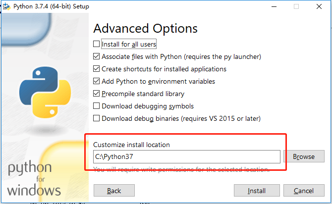
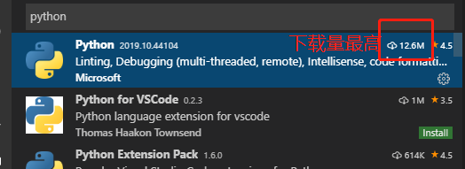
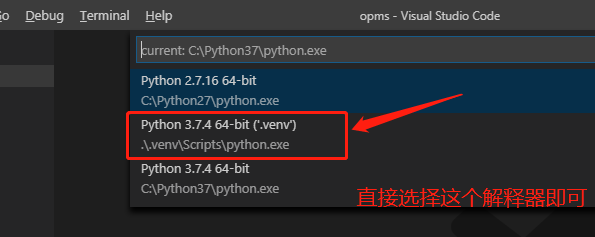
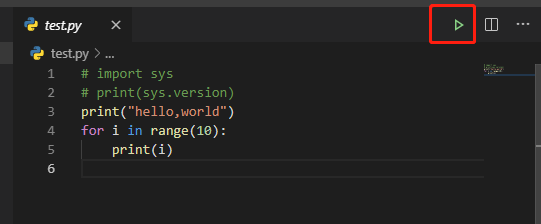
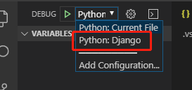
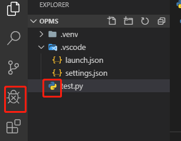
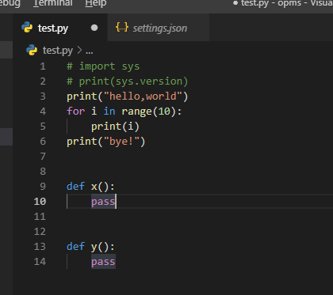
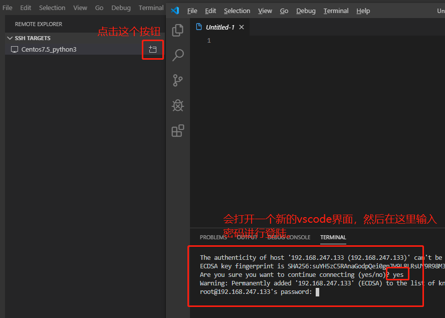
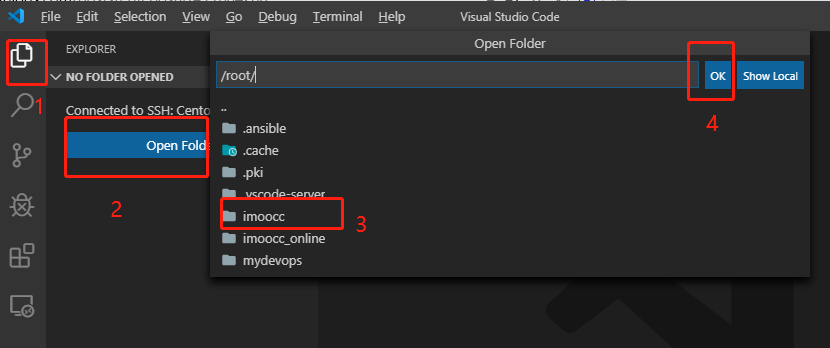

## 安装python解释器，配置好path变量。

下载网址：https://www.python.org/downloads/release/python-374/

注意区分64位还是32位的。

安装python的时候，建议将python添加到path环境变量的复选框勾上，并且使用自定义安装，因为可以自定义安装目录，我是安装在C:\Python37中的


 

## 安装virtualenv

win+R输入cmd后点确定，然后执行：

```
pip install virtualenv
```

##  下载并安装好vscode编辑器

（安装时，将复选框全部勾上）

下载地址：https://code.visualstudio.com/

## 在vscode中安装python插件

按下快捷键Ctrl+Shift+X，进入插件管理页面
在搜索框中搜索python关键字
点击下载量最高的那个进行安装，一般都是第一个。



vscode安装了上面这个插件后，能干什么？

* 这个插件不是python语言的解释器，vscode想要运行python代码，必须另外指定在windows上安装的python解释器路径才可以。

* 这个插件被安装上后，vscode就具有了调用python解释器的功能。其实就是在setting.json和launch.json这两个配置文件中，可以添加python相关的配置了，比如通过python.pythonPath的值找到python解释器的位置等等。
* 可以通过按下ctrl键，点击函数，打开函数的所在文件和定义位置。
* 具有代码提示功能。


## 准备一个项目并用vscode打开

> 第一步：创建一个总项目目录
>
> D:\CodeProjects
>
> 第二步：创建一个python总项目目录
>
> D:\CodeProjects\PythonProjects
>
> 第三步：创建一个测试项目目录
>
> D:\CodeProjects\PythonProjects\opms
>
> 第四步：在指定项目中创建python虚拟环境
>
> win+R输入cmd后点确定，依次执行下面三条命令：（-p后面的参数，可以换成其它python解释器的路径）
>
> ```
> D:
> cd D:\CodeProjects\PythonProjects\opms
> virtualenv .venv -p "C:\Python37\python.exe"
> ```
>
>  
>
> 第五步：右击opms项目目录，使用vscode打开（一般情况下，一个vscode界面只能打开一个项目目录）

## 为项目运行时指定特定的python解释器

第一步：为新打开的项目生成setting.json配置文件

> 按下快捷键ctrl+shift+p，输入interpreter，单击筛选出来的结果“Python: Select Interpreter"，就会跳出windows系统上已经安装的所有python解释器，我们这里随便选择一个即可，因为我们之后会自定义setting.json配置文件中的值，这一步只是为了生成setting.json这个配置文件。
>
> 
>
> 补充：你如果和我一样，在打开项目之前已经在项目中创建了python虚拟环境，那么在选择interpreter时，vscode也会将本项目目录下的虚拟环境中的python解释器也列出来，此时，你可以直接选择这个解释器即可。
>
> 

第二步：修改setting.json配置文件，指定python.pythonPath的值为opms项目目录下python虚拟环境中的python解释器路径

> 

7.为项目运行时指定入口文件和参数

第一步：为新打开的项目生成launch.json配置文件

> 点击Debug，点击Add Configuration，点击Python，然后根据你的项目，在Python File、Django、Flask中选择一个，我这里只是为了说明，选择Python File，你们请根据自己的项目类型的进行选择。
>
> 

第二步：解释launch.json配置文件中configurations列表的作用

> program这个键，用来指定项目运行时的入口文件的，其中\${file}表示当前文件，\${workspaceFolder}表示项目根目录，对于django项目来说，入口文件应该是项目根目录下的manage.py文件，所以可以配置为"program": "\${workspaceFolder}\\manage.py"。
>
> args这个键，用来指定项目运行时，跟在入口文件后面的参数，对于django项目来说，运行参数应该是：runserver 0.0.0.0:8080 --noreload --nothreading ，所以可以配置为：
>
> "args":["runserver","0.0.0.0:8080","--noreload","--nothreading"] 。
>
> name这个键，用来命名配置名称的，因为在configurations列表中可以定义多个配置，不同的配置命名要相互区分。
>
> type和request这两个键是必须项，在不同的配置中都要存在的，而它们的值也是固定的。"type": "python" , "request": "launch"。

8.测试一下

在项目目录中，创建一个test.py文件，写入代码后，点击文件上方的绿色三角形按钮运行当前文件。

> 之所以能够点击按钮就可以运行当前文件，是因为我使用了Python File这个configurations运行配置，参数"program": "${file}"，表示当前文件。
>
> 

有时候vscode会报错如下：

无法加载文件 D:\CodeProjects\PythonProjects\opms\.venv\Scripts\activate.ps1，因为在此系统上禁止运行脚本。


解决办法：

> 第一步：以管理员身份运行powershell
> 第二步：执行：get-ExecutionPolicy，回复Restricted，表示状态是禁止的。
> 第三步：执行：set-ExecutionPolicy RemoteSigned
> 第四步：选择Y，回车。

## 关于python虚拟环境的解释

> python虚拟环境是一个非常好用的东西，以前我以为只有activate激活这个虚拟环境，才可以使用这个虚拟环境中安装的各个模块。现在，我知道之前的认知是局限的。
>
> 其实，你只需要使用虚拟环境中的python.exe解释器的绝对路径就可以使用这个虚拟环境中安装的python模块了，根本不需要激活。不信的话，你试试：
>
> 比如我创建了一个venv虚拟环境：D:\CodeProjects\PythonProjects\opms\.venv\
>
> 然后，我运行下面的命令得到的模块列表和全局解释器中的模块列表是不一样的（此时我并没有激活这个虚拟环境）：
>
> D:\CodeProjects\PythonProjects\opms\.venv\Scripts\pip  list
>
> 当使用activate激活一个虚拟环境时，我们就从cmd或者terminal当前窗口中进入到了一个子窗口中了，在这个子窗口中，PATH这个环境变量被临时更改了，当前这个虚拟环境中的Scripts路径就被加入到PATH环境变量中了，那么我们在这个子窗口中运行的python命令、pip命令等也就通过PATH这个环境变量自动查找，然后指向了虚拟环境Scripts目录中的解释器了，这也就解释了为何激活了这个虚拟环境，在这个窗口中切换到任何一个目录中，执行python或者pip命令都能使用和查看这个虚拟环境的所有模块的原因。

## 配置django项目的运行参数

一般我们运行django项目的命令是：  python manage.py runserver 0.0.0.0:8080

这个命令分为两部分，第一部分是python解释器，我们在settings.json设置，剩下的参数manage.py runserver 0.0.0.0:8080我们需要在launch.json中设置。

我粘贴出我在launch.json文件中设置的内容：

[](javascript:void(0);)

```
    "configurations": [
        {
            "name": "Python: Current File",
            "type": "python",
            "request": "launch",
            "program": "${file}",
            "console": "integratedTerminal"
        },
        {
            "name":"Python: Django",
            "type":"python",
            "request":"launch",
            "program":"${workspaceFolder}\\manage.py",
            "console":"integratedTerminal",
            "args":[
                "runserver",
                "0.0.0.0:8080",
                "--noreload",
                "--nothreading"
            ],
            "django":true
        }
    ] 
```

此时如果要运行django项目的话，方法如下：

> 点击左边栏目中的小乌龟，
>
> 点击齿轮图标旁边的下拉框，选择Python: Django，
>
> 然后点击左边绿色三角形的运行按钮即可。

 

## 配置vscode的文件图标和主题美化

> 按下快捷键Ctrl+Shift+X，进入插件管理页面
> 在搜索框中搜索这两个插件并安装：Material Icon Theme 和 Son of Obsidian Theme
> 然后点击左下角的齿轮图标，选择并点击File Icon Theme,在出现的展示中，选择并点击Material Icon Theme即可。
>
> 
>
>  此时，我们就会发现我们的python文件的图标已经变成了经典的头尾相接的两条蟒蛇了。
>
> 


 13.启用自动格式化代码工具yapf（我用的是推荐的autopep8）

> 第一步：在项目指定的python解释器中安装yapf模块
>
> ```
> cd D:\CodeProjects\PythonProjects\opms\.venv\Scripts
> activate
> pip install yapf
> deactivate.bat
> ```
>
> 第二步：在项目中的settings.json配置文件中，添加："python.formatting.provider": "yapf"，如下：
>
> 
>
> 第三步：按Alt+Shift+F即可自动格式化代码

 测试一下：

未经代码格式化之前的代码如下：


 按Alt+Shift+F后，代码如下：



14.启用pylint进行代码编写时格式规范检查

> 第一步：在项目指定的python解释器中安装pylint模块
>
> ```
> cd D:\CodeProjects\PythonProjects\opms\.venv\Scripts
> activate
> pip install pylint
> deactivate.bat
> ```
>
> 第二步：启用pylint功能，在settings.json文件中添加："python.linting.pylintEnabled": true，如下：
>
> 
>
> 第三步：关于pylint检查项的一些定制
>
> "python.linting.pylintArgs": ["--disable=C,broad-except,unused-variable",],
>
> 
>
>  
>
> 检查项按大类分，大约有四个：C、R、E、W，C类应该是与变量、函数名等命名有关的规范，我们把C类检查全部禁用，E类应该是检查模块、类、函数等是否存在，这个是最有用的，W类应该是与声明的变量是否被使用、使用的异常捕捉类是否细化等检查相关，这个可以根据具体的情况具体禁用。R类还不太清楚。
>
>  
>
> 那么如何禁用具体的检查项呢？
>
> 首先，我们将鼠标停留在报出异常的代码上，如下：
>
> 
>
>  然后，就可以看到异常是unused-variable了，我们将这个异常检查项在settings.json中禁用掉即可。其它的异常检查项也是这么查看和禁用。
>
>  
>
> 第四步：Django项目需要安装额外的规范检查模块
>
> ```
> pip install pylint_django
> ```
>
> 第五步：在settings.json配置文件中为django项目添加加载检查模块
>
> "python.linting.pylintArgs": [
> "--load-plugins",
> "pylint_django",
> ],
>
> 

## 记录一下vscode中的一些快捷键

* 终止程序运行：ctrl + `

* 侧边栏显示和隐藏：ctrl + B

* 格式化代码：Alt+Shift+F

* 格式化选中部分的代码：Ctrl + K Ctrl + F

* 打开Git可视管理：Ctrl + Shift + G

补充：

格式化代码的快捷键用起来太麻烦了，将它更改为常用的ctrl+alt+l（L的小写）的方式。

按ctrl+k ctrl+s打开快捷键修改的界面，搜索框中搜索shift+alt+f，快速定位到要修改的快捷键：


修改完成后，如下所示，记得更换搜索关键词：


##  新建python文件时自动添加头部信息

第一步：

点击File，点击Preferences，点击User Snippets，输入python，点击跳出来的"python.json(Python)"，在打开的python.json文件中，先清空文件原内容，然后添加：

请看：下面的内容，适合python2，在python3中，请将#!/usr/bin/python3(或者用虚拟环境中的python解释器）和#encoding:utf-8替换对应位置的内容。

```
{
    "HEADER":{
        "prefix": "header",
        "body": [
        "#!/usr/bin/python",
        "# -*- encoding: utf-8 -*-",
        "'''",
        "@File    :   $TM_FILENAME",
        "@Time    :   $CURRENT_YEAR/$CURRENT_MONTH/$CURRENT_DATE $CURRENT_HOUR:$CURRENT_MINUTE:$CURRENT_SECOND",
        "@Author  :   DesignerA ",
        "@Version :   1.0",
        "@Contact :   DesignerA@qq.com",
        "@WebSite :   www.cnblogs.com/DesignerA",
        "'''",
        "# Start typing your code from here",
        "$0"
    ],
    }   
} 
```

第二步：

在新建的python文件开头输入header，然后回车，就会自动出现上面定义的头部信息了(我已经替换对应位置的内容为python3了），如下：


 

17.vscode配置git管理代码

第一步：先到git官网下载并安装windows 64位版的git，git官网下载地址：https://git-scm.com/downloads，注意，安装Git的过程中，选择VS Code作为git的默认编辑器，其它都默认即可，如下图：


第二步：为git配置环境变量，默认情况下，git被安装在C:\Program Files\Git\目录下，我们需要将这个目录下的bin目录添加到Path环境变量中。如下图

 

第三步：设置vscode与git关联，依次打开：File -> Preferences -> Settings -> Extensions -> Git ->Path (Edit in settings.json)

在打开的settings.json文件中，配置git的可执行文件路径，如下：

```
//启用git
"git.enabled": true, 
//启用自动刷新
"git.autorefresh": true,
//启用自动提取
"git.autofetch": true,
//同步前进行确认
"git.confirmSync": true,
//配置git可执行文件路径
"git.path":"C:\\Program Files\\Git\bin\\git.exe",
"terminal.integrated.shell.windows": "C:\\Program Files\\Git\\bin\\bash.exe",
```


第四步：配置git用户名与邮箱（git暂存时需要用到它们）

```
git config --global user.name "xxxxxxx"
git config --global user.email "xxxxxxx@qq.com"
```

第五步：在github上新建一个仓库，然后使用命令git clone "仓库地址" ，将仓库克隆到本地目录中。 如果是私有仓库，这步执行后，会要求你输入github账户密码。

第六步：让git记住密码，这样不用每次都填写

```
git config --global credential.helper store
```

第七步：找到git下来的仓库目录，然后右击目录，选择使用vscode打开

第八步：你编辑这个项目中的文件后，你要先点击小勾暂存所有更改，输入你的提交消息（随便输点你本次提交的说明信息）

说明：这里的commit并不是提交到github，而是提交到本地的暂存区，而且必须要先提交到本地的暂存区，之后才可以使用push将暂存区中的内容推送到github仓库中。


 第九步：将更改提交到github仓库中，从图中可以看到第八步执行完后，本次的更改已经写入到暂存区了。点击Push后，可以到github仓库中看下仓库中的内容是否已经更改


 

## vscode添加浏览器预览html代码功能

 第一步：按下快捷键Ctrl+Shift+X，进入插件管理页面，搜索并安装插件open in browser


 第二步：修改vscode预览html文件默认使用的浏览器，不修改的话，默认使用IE。当然，这一步可以不执行，因为右击html文件的时候可以选择Open In Other Browers

​        依次打开：File -> Preferences -> Settings -> Extensions -> plugin open-in-brower ->Auto Complete: Extra Paths (Edit in settings.json)然后在打开的settings.json配置文件中添加：

```
//如果是火狐，就设置firefox
"open-in-browser.default": "chrome",
```


## vscode利用远程服务器环境调试项目（五星推荐）

这个还是很好用的，可以不需要在windows服务器上安装python执行环境了。而且，python中的一些与系统操作相关的模块，windows上安装起来也非常麻烦。

第一步：按下快捷键Ctrl+Shift+X，进入插件管理页面，搜索并安装插件Remote Development


第二步：windows上安装openssh客户端，这里提供一个使用powershell安装的方法

首先，以管理员身份打开powershell

然后，输入命令在线查询可获取的安装包 Get-WindowsCapability -Online | ? Name -like 'OpenSSH*'


最后，如果状态显示NotPresent的话，可以使用命令进行安装，命令为Add-WindowsCapability -Online -Name OpenSSH.Client~~~~0.0.1.0

提示：随着 Windows 10 2018 年 4 月更新的发布，OpenSSH 客户端已正式推出并在 Windows 10 中默认安装。

补充：有些人的电脑系统可能是windows7的，这里再提供一个在windows7上安装openssh客户端的方法

首先，下载cygwin，下载网址为: https://www.cygwin.com/


 

然后，安装它，安装过程中，当出现选择要安装的包时，我们将View切换为Full，并在搜索框中搜索openssh，在出现的搜索结果中，我们将openssh中的skip改为8.1p1-1，然后再点击下一步完成安装。如下图，下图中因为我已经安装过了，所以openssh这里没有显示skip：


 

 再然后，我们需要将Cygwin安装目录下的bin目录的绝对路径添加到Path环境变量中。Cygwin默认的安装路径为：C:\cygwin64，所以我们需要将C:\cygwin64\bin添加到Path环境变量中，如下图所示：


 

 最后，验证一下。我们打开cmd，输入ssh回车看看是否有输出，有输出信息就表示openssh客户端安装成功了：


备注：这个Cygwin软件被安装上后，不但可以使用ssh客户端了，另外很多linux上的命令我们也都可以在cmd中使用了，比如ls和pwd等。原因就是这些命令工具都被提供在C:\cygwin64\bin目录下。你可以到这个目录下看看。挺好的软件，给个大大的赞。

第三步：准备一台centos虚拟机或者ubuntu虚拟机，确保虚拟机上的ssh server服务已经开启，并允许远程连接。比如我准备的是centos7虚拟机，IP地址为192.168.247.133

第四步：按下快捷键ctrl+shift+p 搜索Remote-SSH:Settings，在打开的页面中，点击Edit in settings.json，在其中添加"remote.SSH.showLoginTerminal": true,如下图:


 第五步：点击左下角的绿色图标，选择Remote-SSH：Connect to Host 然后点击 Configure SSH Hosts 然后选择点第一个config，默认应该是一个空白的文件，在其中添加如下的配置：

```
Host Centos7.5_python3
    HostName 192.168.247.133
    Port 22
    User root
```


备注：其中Host后面的名称，可以随便命名，HostName后面的IP地址是准备的虚拟机IP地址，Port后跟的是ssh server服务监听的端口号，默认是22，User后跟的是远程连接的用户名，我这里使用超级用户连接。

这里补充一点：

每次连接远程服务器，打开项目都要输入一次密码，是否很烦？（当然我并没有觉得烦）如果有人觉得烦的话，可以先在本地windows系统和远程服务器之间做好ssh免密登陆，然后在上面这个config文件中，在User配置下一行（缩进和User要一致），添加IdentityFile C:\Users\...\.ssh\id_rsa即可，其中IdentityFile参数后面跟的是windows上的rsa私钥文件。

第六步：点击vscode左边栏的远程连接图标，如下：


第七步：点击配置后的远程虚拟机名称旁边的那个按钮，输入密码进行登陆到服务器上，如下：



备注，如果vscode初次连接这台虚拟机的话，那么需要等待几分钟，因为vscode要做一些初始化工作。

第八步：连上虚拟机后，可以通过下图中标识的顺序打开远程服务器上的项目，当然每次打开项目都是需要再次输入密码的。这也是为了安全考虑。

在打开的项目中新建文件，删除文件，修改文件等操作，不需要再次输入密码。



第九步：运行项目或测试脚本的方法

感觉这个功能，在一定程度上，都可以代替secure crt或xshell远程连接工具和ftp上传下载客户端了。很强大。


补充：

没有语法检查，代码自动提示和补全功能，开发真的是一个很难受的事情，那么怎么在远程服务器上使用这些功能呢？下面就是补全这一点的方法：

首先：按下快捷键Ctrl+Shift+X，进入插件管理页面，搜索python，然后，点击Install in SSH:Centos7.5_python3，如下图：


然后：在打开的项目中，生成launch.json和settings.json这两个配置文件，方法在最上面，和配置windows本地开发环境一样，我们在settings.json中配置一个远程服务器上的python解释器，如下图：


最后：运行python文件的方法


第十步：重新打开远程服务器上项目的方法

点击File，点击Close Folder，这个操作，会重新连接服务器。

也没找到其它的方法，就这么做吧。

> 转载链接：https://www.cnblogs.com/DesignerA/p/11604200.html